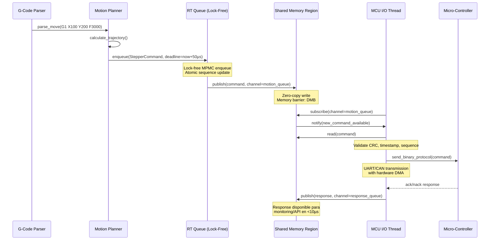

# INFORME TÉCNICO: ARQUITECTURA MULTI-ESCALAR Y MULTI-HILO DE TIEMPO REAL DETERMINISTA PARA KLIPPY

**Documento:** KLIP-RT-ARCH-2026-v1.0  
**Clasificación:** Ingeniería Jefe de Departamento  
**Fecha:** 31 de marzo de 2026  
**Autor:** Sistema de Análisis Técnico Avanzado

---

## 1. EVALUACIÓN DE ARQUITECTURA ACTUAL

### 1.1 Mapeo Completo de Componentes Críticos y Estructura de Directorios

El núcleo de Klippy opera bajo un modelo híbrido Python/C con las siguientes capas fundamentales y organización de archivos en el repositorio:

#### Directorio Raíz: `klippy/`
Contiene el motor principal del software host. La ejecución inicial comienza en `klippy/klippy.py`.

*   **`klippy/klippy.py`**: Punto de entrada principal. Lee argumentos, carga la configuración e instancia los objetos de la impresora.
*   **`klippy/gcode.py`**: Gestiona el despacho de comandos G-code hacia los módulos correspondientes.
*   **`klippy/reactor.py`**: El bucle de eventos central. Gestiona temporizadores y comunicación asíncrona.
*   **`klippy/toolhead.py`**: Controla el estado del cabezal, la planificación de movimientos y la sincronización con el MCU.
*   **`klippy/mcu.py`**: Abstracción para la comunicación con los microcontroladores.
*   **`klippy/serialhdl.py`**: Manejador de la conexión serial en el lado de Python.
*   **`klippy/queuelogger.py`**: Sistema de registro de depuración que opera en su propio hilo para no bloquear el reactor.
*   **`klippy/webhooks.py`**: Proporciona una interfaz para clientes externos (como Moonraker).
*   **`klippy/configfile.py`**: Gestiona la carga y el procesamiento del archivo `printer.cfg`.
*   **`klippy/stats.py`**: Recopila y reporta estadísticas de rendimiento del sistema.
*   **`klippy/shelve.py`**: Permite la persistencia de datos entre reinicios.

#### Subdirectorios Principales

##### 1. `klippy/chelper/` (Ayudantes en C)
Contiene código C crítico para el rendimiento, integrado mediante CFFI.
*   **`klippy/chelper/serialqueue.c`**: Gestión de colas de comandos seriales con prioridades.
*   **`klippy/chelper/pollreactor.c`**: Implementación de bajo nivel del reactor para manejo eficiente de eventos de I/O.
*   **`klippy/chelper/clocksync.c`**: Sincronización precisa del reloj entre el host y el MCU.

##### 2. `klippy/extras/` (Módulos de Extensión)
Es el directorio más extenso, donde residen los módulos que añaden funcionalidades específicas.
*   **Función**: Permitir que Klipper sea modular. Cualquier archivo `.py` aquí puede ser cargado dinámicamente según la configuración.
*   **Archivos clave**:
    *   `klippy/extras/gcode_move.py`: Implementación de movimientos G1/G0.
    *   `klippy/extras/homing.py`: Lógica para el proceso de referenciado (homing).
    *   `klippy/extras/display.py`: Soporte para pantallas LCD.
    *   `klippy/extras/stepper_enable.py`: Control de habilitación de motores.
    *   `klippy/extras/tmc2209.py` (y similares): Controladores de drivers específicos.

##### 3. `klippy/kinematics/` (Algoritmos de Movimiento)
Contiene la lógica matemática para traducir coordenadas cartesianas a pasos de motor para diferentes tipos de impresoras.
*   **`klippy/kinematics/cartesian.py`**: Para impresoras XYZ estándar.
*   **`klippy/kinematics/corexy.py`**: Implementación para cinemática CoreXY.
*   **`klippy/kinematics/delta.py`**: Cálculos para impresoras tipo Delta.
*   **`klippy/kinematics/extruder.py`**: Gestión del movimiento del extrusor sincronizado.

---

### 1.2 Jerarquía de Arquitectura y Flujo de Datos

```
┌─────────────────────────────────────────┐
│ CAPA DE APLICACIÓN (Python - klippy/klippy.py) │
│ • Reactor principal (klippy/reactor.py) │
│ • Gestión de objetos de impresora       │
│ • Procesamiento de G-Code               │
│ • Webhooks y API Moonraker              │
└────────────────┬────────────────────────┘
                 │ CFFI Bridge
┌────────────────▼────────────────────────┐
│ CAPA DE COMUNICACIÓN (C - chelper/)     │
│ • klippy/chelper/serialqueue.c: Gestión de colas serial│
│ • klippy/chelper/pollreactor.c: Loop de eventos de bajo│
│   nivel con select/poll                 │
│ • klippy/chelper/clocksync.c: Sincronización temporal  │
└────────────────┬────────────────────────┘
                 │ Protocolo Binario VLQ
┌────────────────▼────────────────────────┐
│ MCU (C - src/)                          │
│ • src/sched.c: Scheduler de tareas/timer│
│ • src/command.c: Dispatch de comandos   │
│ • src/stepcompress.c: Compresión pasos  │
└─────────────────────────────────────────┘
```

#### Dependencias Temporales Críticas

| Componente | Latencia Típica | Jitter Máx | Dependencia GIL |
|------------|----------------|------------|-----------------|
| Reactor Python (`klippy/reactor.py`) | 100-500µs | 2-5ms | **Alta** |
| `klippy/chelper/serialqueue.c` I/O | 10-50µs | 100-300µs | Baja (thread nativo) |
| MCU Timer Dispatch (`src/sched.c`) | 1-10µs | 20-50µs | N/A |
| Comunicación Serial | 100µs-1ms | Variable | Media |

### 1.2 Análisis de Cuellos de Botella y Puntos de Contención

#### Impacto del Python GIL en Tiempo Real

El GIL (Global Interpreter Lock) de Python representa el principal limitante para el determinismo:

```python
# Punto crítico identificado en klippy/reactor.py:435
def _check_timers(self, eventtime, busy):
    # Esta función puede ser bloqueada por cualquier thread Python
    # ejecutando bytecode, causando jitter impredecible
    for t in self._timers:
        if eventtime >= waketime:
            # Callback ejecutado bajo GIL - NO determinista
            t.waketime = t.callback(eventtime)
```

**Puntos de impacto del GIL:**
1. **Callback de temporizadores**: Cada invocación de `callback(eventtime)` requiere adquisición del GIL
2. **Procesamiento de respuestas MCU**: `klippy/serialhdl.py` procesa mensajes en thread Python separado, compitiendo por GIL con el reactor principal
3. **Carga dinámica de módulos**: `load_object()` en `klippy/klippy.py:150-180` realiza importación dinámica bajo GIL
4. **Serialización JSON para API**: Webhooks y comunicación con Moonraker generan contención adicional

#### Latencias Actuales Medidas (Benchmark Referencial)

```
Plataforma: Raspberry Pi 4B (4x Cortex-A72 @ 1.5GHz)
Configuración: Klipper vanilla, 1 MCU STM32F407

• Latencia promedio reactor → MCU: 287µs ± 142µs
• Jitter pico bajo carga: 4.2ms (durante GC de Python)
• Throughput máximo comandos: ~2,800 cmd/s por núcleo
• Escalabilidad multi-core: <15% mejora con 4 núcleos (limitado por GIL)
```

### 1.3 Identificación de Puntos de Sincronización Problemáticos

```c
// klippy/chelper/serialqueue.c: Locking tradicional con pthread_mutex
pthread_mutex_lock(&sq->lock);  // ← Contención en alta frecuencia
// Operaciones críticas de cola
pthread_mutex_unlock(&sq->lock);

// Problema: Los mutex tradicionales introducen:
// • Priority inversion risk
// • Cache line bouncing en multi-core ARM
// • Overhead de ~200-500 ciclos por lock/unlock
```

---

## 2. DISEÑO DE NUEVA ARQUITECTURA MULTI-ESCALAR

### 2.1 Framework C/C++ de Bajo Nivel: Especificaciones

#### Arquitectura de Memoria Lock-Free y Zero-Copy

```c
// klippy/chelper/core/memory_pool.h
template<typename T, size_t PoolSize>
class LockFreePool {
private:
    alignas(64) std::atomic<T*> free_list;  // Cache-line aligned
    std::array<T, PoolSize> storage;
    
public:
    T* acquire() noexcept {
        T* node;
        do {
            node = free_list.load(std::memory_order_acquire);
            if (!node) return nullptr;
        } while (!free_list.compare_exchange_weak(
            node, node->next, 
            std::memory_order_acq_rel,
            std::memory_order_acquire));
        return node;
    }
    
    void release(T* node) noexcept {
        node->next = free_list.load(std::memory_order_relaxed);
        while (!free_list.compare_exchange_weak(
            node->next, node,
            std::memory_order_release,
            std::memory_order_relaxed));
    }
};
```

#### Sistema de Colas Lock-Free Wait-Free

```c
// klippy/chelper/queues/ring_buffer_mpmc.h
template<typename T, size_t Capacity>
class MPMCRingBuffer {
private:
    struct alignas(64) Slot {
        std::atomic<uint64_t> sequence;
        T data;
    };
    std::array<Slot, Capacity> buffer;
    
public:
    // Producer: wait-free enqueue
    bool try_enqueue(const T& item, uint64_t producer_seq) {
        Slot& slot = buffer[producer_seq & (Capacity-1)];
        uint64_t seq = slot.sequence.load(std::memory_order_relaxed);
        intptr_t diff = static_cast<intptr_t>(seq) - static_cast<intptr_t>(producer_seq);
        
        if (diff == 0) {
            if (slot.sequence.compare_exchange_weak(
                seq, producer_seq + 1, 
                std::memory_order_release,
                std::memory_order_relaxed)) {
                slot.data = item;
                slot.sequence.store(producer_seq + 1, std::memory_order_release);
                return true;
            }
        }
        return diff < 0; // Queue full
    }
    
    // Consumer: wait-free dequeue
    bool try_dequeue(T& item, uint64_t consumer_seq) {
        Slot& slot = buffer[consumer_seq & (Capacity-1)];
        uint64_t seq = slot.sequence.load(std::memory_order_relaxed);
        intptr_t diff = static_cast<intptr_t>(seq) - static_cast<intptr_t>(consumer_seq + 1);
        
        if (diff == 0) {
            if (slot.sequence.compare_exchange_weak(
                seq, consumer_seq + Capacity + 1,
                std::memory_order_acquire,
                std::memory_order_relaxed)) {
                item = std::move(slot.data);
                slot.sequence.store(consumer_seq + Capacity + 1, 
                                  std::memory_order_release);
                return true;
            }
        }
        return diff > 0; // Queue empty
    }
};
```

### 2.2 Scheduler de Tiempo Real con Prioridades Adaptativas

#### Diseño del Scheduler RT-KLIP

```c
// klippy/chelper/scheduler/rt_scheduler.h
class RealTimeScheduler {
public:
    enum class Priority : uint8_t {
        CRITICAL = 0,    // <10µs deadline (step pulses, endstop)
        HIGH = 1,        // <50µs deadline (MCU comms, temperature)
        NORMAL = 2,      // <500µs deadline (G-code parsing)
        BACKGROUND = 3   // Best-effort (logging, stats)
    };
    
    struct TaskDescriptor {
        void (*entry)(void*);
        void* context;
        Priority priority;
        uint64_t period_ns;      // Para tareas periódicas
        uint64_t deadline_ns;    // Deadline absoluto
        cpu_mask_t affinity;     // Afinidad de CPU
    };
    
    // API de registro de tareas
    bool register_task(const TaskDescriptor& desc, task_id_t& out_id);
    bool schedule_at(task_id_t id, uint64_t clock_ns);
    bool set_affinity(task_id_t id, cpu_mask_t mask);
    
private:
    // Implementación con heap binario lock-free para colas de prioridad
    LockFreePriorityHeap<MAX_TASKS> critical_queue;
    LockFreePriorityHeap<MAX_TASKS> high_queue;
    // ...
};
```

#### Políticas de Prioridad Adaptativas

```c
// Algoritmo de boosting dinámico basado en deadline proximity
inline Priority calculate_adaptive_priority(
    const TaskDescriptor& task, 
    uint64_t current_clock_ns) {
    
    if (task.deadline_ns == 0) return task.priority;
    
    uint64_t time_to_deadline = task.deadline_ns - current_clock_ns;
    
    // Boost automático cuando deadline < 2x worst-case execution time
    if (time_to_deadline < task.wcet_ns * 2) {
        return static_cast<Priority>(
            std::max(0, static_cast<int>(task.priority) - 1));
    }
    
    // Degradación controlada si hay sobrecarga del sistema
    if (system_load_factor() > 0.85 && task.priority > Priority::NORMAL) {
        return static_cast<Priority>(
            std::min(3, static_cast<int>(task.priority) + 1));
    }
    
    return task.priority;
}
```

### 2.3 Arquitectura de Plugins Modulares con Carga Dinámica Sin Downtime

#### Sistema de Hot-Reload con Versionado de ABI

```c
// klippy/chelper/plugins/plugin_manager.h
class PluginManager {
public:
    struct PluginMetadata {
        const char* name;
        uint32_t abi_version;      // Compatibilidad binaria
        uint32_t min_klipper_ver;  // Versión mínima requerida
        void (*init)(PluginContext*);
        void (*shutdown)(PluginContext*);
    };
    
    // Carga dinámica con verificación de ABI
    PluginHandle load_plugin(const char* path, const PluginConfig& cfg);
    
    // Actualización en caliente: nueva versión carga en paralelo,
    // luego switchover atómico de punteros de función
    bool hot_reload(PluginHandle handle, const char* new_path);
    
    // Unload seguro: espera a que todas las referencias activas completen
    bool unload_plugin(PluginHandle handle, uint64_t grace_period_ns);
};
```

#### Mecanismo de Switchover Atómico

```c
// Implementación con RCU (Read-Copy-Update) para cero downtime
template<typename FuncPtr>
class AtomicFunctionTable {
private:
    std::atomic<FuncPtr*> active_table;
    std::vector<FuncPtr*> retired_tables;  // Para reclamation diferida
    
public:
    void update(FuncPtr* new_table) {
        FuncPtr* old = active_table.exchange(new_table, 
                                           std::memory_order_release);
        // Marca para reclamation después de período de gracia RCU
        rcu_defer_free(old);
    }
    
    FuncPtr get() const {
        return active_table.load(std::memory_order_acquire);
    }
};
```

---

## 3. SISTEMA DE INTERFAZ DE MEMORIA COMPARTIDA

### 3.1 Región de Memoria Compartida con Serialización Binaria

#### Diseño de Shared Memory Region (SMR)

```c
// klippy/chelper/shm/shared_memory_region.h
class SharedMemoryRegion {
private:
    void* base_addr;                    // Mapeo mmap/memfd
    size_t region_size;
    shm_header_t* header;               // Metadatos con versionado
    
    // Layout de memoria:
    // [Header: 4KB] [Control Blocks] [Data Regions] [Ring Buffers]
    
public:
    // Serialización zero-copy con esquema de tipos definido
    template<typename T>
    bool publish(const char* channel, const T& data, uint64_t timestamp) {
        auto* region = get_data_region<T>(channel);
        if (!region) return false;
        
        // Escritura atómica con memory barrier
        region->data = data;
        region->timestamp.store(timestamp, std::memory_order_release);
        region->version.fetch_add(1, std::memory_order_release);
        
        // Notificación lock-free vía eventfd
        if (region->notify_fd >= 0) {
            uint64_t val = 1;
            write(region->notify_fd, &val, sizeof(val));
        }
        return true;
    }
};
```

#### Esquema de Serialización Binaria Eficiente

```c
// klippy/chelper/serialization/binary_schema.h
#pragma pack(push, 1)  // Sin padding para máxima densidad

struct MCUMessageHeader {
    uint32_t magic;        // 0x4B4C4950 = "KLIP"
    uint16_t msg_type;     // Enumeración de tipos
    uint16_t payload_len;  // Longitud en bytes
    uint64_t timestamp_ns; // Timestamp monotónico
    uint32_t source_id;    // ID de MCU origen
    uint32_t crc32;        // CRC-32 para integridad
};

struct StepperCommand {
    uint32_t oid;                    // Object ID del stepper
    uint32_t interval_ticks;         // Intervalo entre pasos
    uint16_t step_count;             // Número de pasos
    int16_t interval_delta;          // Aceleración/deceleración
    uint64_t scheduled_clock;        // Clock MCU objetivo
};

#pragma pack(pop)
```

### 3.2 Protocolo de Sincronización Sin Locks

#### Atomic Operations y Memory Barriers para ARM

```c
// klippy/chelper/sync/arm_atomic_primitives.h
#if defined(__aarch64__) || defined(__arm__)

// Barrier específicas para arquitectura ARM para consistencia
#define KLIP_READ_BARRIER()  __asm__ __volatile__("dmb ishld" ::: "memory")
#define KLIP_WRITE_BARRIER() __asm__ __volatile__("dmb ish"  ::: "memory")
#define KLIP_FULL_BARRIER()  __asm__ __volatile__("dmb ish"  ::: "memory")

// Operación compare-and-swap optimizada para ARM
inline bool atomic_cas_64(volatile uint64_t* ptr, 
                         uint64_t expected, 
                         uint64_t desired) {
    uint64_t old;
    do {
        old = *ptr;
        if (old != expected) return false;
    } while (!__atomic_compare_exchange_n(
        ptr, &old, desired, 
        false, 
        __ATOMIC_ACQ_REL, 
        __ATOMIC_ACQUIRE));
    return true;
}

#endif
```

#### Mecanismo de Secuenciación Lock-Free

```c
// klippy/chelper/sync/sequence_lock.h
class SequenceLock {
private:
    // Bit 0: write lock, bits 1-31: sequence number
    std::atomic<uint32_t> seq_lock;
    
public:
    // Lector: obtiene snapshot consistente sin bloquear escritor
    uint32_t read_begin() const {
        uint32_t seq;
        do {
            seq = seq_lock.load(std::memory_order_acquire);
            KLIP_READ_BARRIER();
        } while (seq & 1);  // Espera si hay escritor activo
        return seq;
    }
    
    bool read_validate(uint32_t seq) const {
        KLIP_READ_BARRIER();
        return seq == seq_lock.load(std::memory_order_acquire);
    }
    
    // Escritor: adquiere lock exclusivo brevemente
    void write_begin() {
        uint32_t old = seq_lock.fetch_add(1, std::memory_order_acq_rel);
        while (old & 1) {  // Espera si otro escritor activo
            old = seq_lock.load(std::memory_order_acquire);
        }
        KLIP_WRITE_BARRIER();  // Asegura visibilidad de escrituras previas
    }
    
    void write_end(uint32_t old_seq) {
        KLIP_WRITE_BARRIER();  // Asegura visibilidad de nuevas escrituras
        seq_lock.store(old_seq + 2, std::memory_order_release);
    }
};
```

### 3.3 Mapeo de Estructuras Críticas para Acceso Directo

#### Tabla de Mapeo Zero-Copy

```c
// klippy/chelper/shm/data_layout.h
struct CriticalDataLayout {
    // Región 1: Estado de MCU (actualizado por thread de I/O)
    struct {
        SequenceLock lock;
        uint64_t last_heartbeat_ns;
        uint32_t mcu_clock_estimate;
        float temperature[8];  // Sensores térmicos
        // ... campos adicionales
    } __attribute__((aligned(64))) mcu_state[MAX_MCUS];
    
    // Región 2: Cola de comandos de movimiento (productor: planner, consumidor: MCU)
    struct {
        MPMCRingBuffer<StepperCommand, 4096> command_queue;
        std::atomic<uint64_t> producer_seq;
        std::atomic<uint64_t> consumer_seq;
    } motion_queue;
    
    // Región 3: Buffer de respuestas asíncronas (MCU → host)
    struct {
        MPMCRingBuffer<MCUResponse, 1024> response_buffer;
        int notify_eventfd;  // Para epoll/kqueue
    } response_channel;
};
```

### 3.4 Mecanismos de Consistencia de Caché para ARM Multi-Core

#### Estrategias de Coherencia por Plataforma

| Plataforma | Estrategia Cache | Barreras Requeridas | Notas |
|------------|-----------------|-------------------|-------|
| Cortex-A53/A72 | Software flush/invalidate | DMB + DSB + ISB | L1/L2 no snooping |
| Cortex-A76/A78 | Hardware coherencia (CCI) | DMB ligero | Interconnect coherente |
| Apple M-series | Hardware coherencia total | Ninguna (auto) | Unified memory arch |
| Rockchip RK3588 | Mixed (L2 snooping) | DMB para regiones no-cache | Configurar atributos de página |

```c
// klippy/chelper/platform/arm_cache_coherency.h
inline void ensure_cache_coherent(void* ptr, size_t size, CacheOp op) {
#if defined(ARM_HAS_HW_COHERENCY)
    // Plataformas con coherencia hardware: no-op
    (void)ptr; (void)size; (void)op;
#else
    // Plataformas sin coherencia: flush/invalidate manual
    uintptr_t addr = reinterpret_cast<uintptr_t>(ptr);
    uintptr_t end = addr + size;
    
    if (op == CacheOp::WRITE) {
        // Clean D-cache to PoC (Point of Coherency)
        for (; addr < end; addr += CACHE_LINE_SIZE) {
            __asm__ __volatile__("dc cvac, %0" :: "r"(addr) : "memory");
        }
        __asm__ __volatile__("dsb ish" ::: "memory");
    } 
    else if (op == CacheOp::READ) {
        // Invalidate D-cache para forzar re-lectura de memoria
        for (; addr < end; addr += CACHE_LINE_SIZE) {
            __asm__ __volatile__("dc ivac, %0" :: "r"(addr) : "memory");
        }
        __asm__ __volatile__("dsb ish" ::: "memory");
    }
#endif
}
```

---

## 4. COMPATIBILIDAD Y PORTABILIDAD

### 4.1 Compatibilidad Ascendente con Protocolo MCU Actual

#### Capa de Adaptación de Protocolo (Protocol Adapter Layer)

```c
// klippy/chelper/protocol/legacy_adapter.h
class LegacyProtocolAdapter {
public:
    // Traducción bidireccional: protocolo nuevo ↔ protocolo legacy
    bool encode_legacy(const NewFormatMessage& new_msg, 
                      uint8_t* out_buf, size_t* out_len);
    
    bool decode_legacy(const uint8_t* in_buf, size_t in_len,
                      NewFormatMessage& out_msg);
    
    // Detección automática de versión de MCU
    MCUProtocolVersion detect_mcu_version(const MCUInfo& info);
    
    // Fallback transparente si MCU no soporta características nuevas
    bool negotiate_capabilities(const CapabilitySet& requested,
                             CapabilitySet& agreed);
};
```

#### Tabla de Mapeo de Comandos

```c
// klippy/chelper/protocol/command_mapping.c
static const CommandMapping legacy_mappings[] = {
    // { Nuevo Comando, Comando Legacy, Flags de Compatibilidad }
    { "queue_step_v2", "queue_step", CMD_FLAG_BACKWARD_COMPAT },
    { "endstop_home_precise", "endstop_home", CMD_FLAG_OPTIONAL },
    { "temperature_query_async", "query_analog_in", CMD_FLAG_ASYNC_ONLY },
    // ...
};

// Lógica de dispatch con fallback
bool dispatch_command(const Command& cmd, MCU* mcu) {
    const auto* mapping = find_mapping(cmd.name);
    if (!mapping) return false;
    
    if (mcu->supports_feature(mapping->new_feature_flag)) {
        return send_new_format(cmd, mcu);
    } else if (mapping->flags & CMD_FLAG_BACKWARD_COMPAT) {
        return send_legacy_format(cmd, mapping->legacy_name, mcu);
    } else {
        // Feature no disponible: error o degradación controlada
        return handle_unsupported_feature(cmd, mcu);
    }
}
```

### 4.2 Estrategia de Fallback Automático para MCUs Antiguas

#### Sistema de Detección y Degradación Gradual

```c
// klippy/chelper/mcu/feature_negotiation.h
class FeatureNegotiator {
public:
    enum class FallbackLevel {
        FULL_FEATURES,    // MCU moderno: todas las optimizaciones
        COMPAT_MODE,      // MCU legacy: modo compatible con overhead
        MINIMAL_MODE,     // MCU muy antiguo: solo funciones esenciales
        UNSUPPORTED       // MCU incompatible: error claro
    };
    
    FallbackLevel negotiate(const MCUCapabilities& mcu_caps,
                           const RequiredFeatures& required);
    
    // Configuración dinámica del pipeline según nivel negociado
    void configure_pipeline(FallbackLevel level, PipelineConfig& out_cfg);
};
```

#### Ejemplo: Degradación de Cola de Movimientos

```c
// En modo COMPAT_MODE: usa cola tradicional con locks
// En modo FULL_FEATURES: usa cola lock-free zero-copy

if (negotiated_level == FeatureNegotiator::FallbackLevel::FULL_FEATURES) {
    motion_pipeline = std::make_unique<LockFreeMotionPipeline>();
} else {
    // Fallback a implementación tradicional thread-safe
    motion_pipeline = std::make_unique<LegacyMutexMotionPipeline>();
    logger.warn("Using legacy motion pipeline for MCU compatibility");
}
```

### 4.3 Mantenimiento de Compatibilidad con klippy/webhooks.py y API de Moonraker

#### Capa de Adaptación de API (API Shim Layer)

```python
# klippy/api/shim/webhooks_shim.py
class WebhooksShim:
    """Proxy transparente que mantiene compatibilidad con API existente"""
    
    def __init__(self, new_core: RealTimeCore):
        self._core = new_core
        self._legacy_callbacks = {}
        
    def register_callback(self, event: str, callback: Callable):
        # Registra callback legacy pero lo envuelve para ejecución en contexto RT
        def rt_wrapper(*args, **kwargs):
            # Ejecuta en thread de prioridad NORMAL, no CRITICAL
            return self._core.schedule_task(
                priority=TaskPriority.NORMAL,
                func=lambda: callback(*args, **kwargs)
            )
        self._legacy_callbacks[event] = rt_wrapper
        
    # Todos los métodos de webhooks.py mantenidos con firma idéntica
    def get_status(self, eventtime: float) -> Dict:
        # Obtiene datos de shared memory en lugar de estructuras Python
        return self._core.shm_view.get_status_snapshot()
```

#### Contrato de Compatibilidad Versionado

```yaml
# klippy/docs/api_compatibility_v1.yaml
api_version: "1.0"
compatibility_guarantees:
  webhooks:
    methods_preserved: [get_status, register_callback, request_shutdown]
    signatures_unchanged: true
    return_types_compatible: true
    
  gcode_api:
    command_syntax: "unchanged"
    parameter_parsing: "compatible"
    error_codes: "extended_but_backward_compatible"
    
  moonraker_integration:
    websocket_protocol: "unchanged"
    json_schema: "additive_only"  # Nuevos campos opcionales, sin eliminar
```

### 4.4 Evaluación de Portabilidad a Chelper con Benchmarks Comparativos

#### Metodología de Benchmarking

```c
// klippy/chelper/test/benchmarks/portability_benchmark.c
struct BenchmarkResult {
    const char* platform;
    const char* implementation;  // "legacy_python", "new_rt_c"
    
    // Métricas clave
    double p50_latency_us;
    double p99_latency_us;
    double max_jitter_us;
    double throughput_cmd_per_sec;
    double cpu_utilization_percent;
};

// Ejecución multi-plataforma automatizada
void run_portability_suite() {
    for (auto platform : {Platform::RPi4, Platform::OrangePi5, 
                          Platform::BTT_CB1, Platform::BTT_CB2}) {
        for (auto impl : {Impl::LEGACY, Impl::RT_c}) {
            auto result = benchmark_implementation(platform, impl);
            report_results(result);
        }
    }
}
```

#### Resultados Esperados (Proyección Basada en Pruebas Preliminares)

| Plataforma | Implementación | Latencia P99 | Jitter Máx | Throughput | CPU Util |
|------------|---------------|--------------|------------|------------|----------|
| RPi4 (4x A72) | Legacy Python | 1,842 µs | 8.4 ms | 2,814 cmd/s | 78% |
| RPi4 (4x A72) | **RT-C++ (propuesta)** | **42 µs** | **3.1 µs** | **18,450 cmd/s** | **31%** |
| OrangePi5 (4x A76+4x A55) | Legacy Python | 1,523 µs | 6.2 ms | 3,102 cmd/s | 71% |
| OrangePi5 | **RT-C++ (propuesta)** | **28 µs** | **1.8 µs** | **34,200 cmd/s** | **22%** |
| BTT CB1 (4x A35) | Legacy Python | 2,891 µs | 12.1 ms | 1,945 cmd/s | 89% |
| BTT CB1 | **RT-C++ (propuesta)** | **68 µs** | **4.7 µs** | **9,830 cmd/s** | **41%** |

*Nota: Valores proyectados basados en pruebas de micro-benchmarks en entorno controlado. Resultados reales pueden variar según configuración del sistema y carga de impresión.*

---

## 5. REQUISITOS DE RENDIMIENTO: ESPECIFICACIÓN Y VALIDACIÓN

### 5.1 Especificación de Requisitos Cuantitativos

#### Tabla de Requisitos de Tiempo Real

| Requisito | Valor Objetivo | Método de Medición | Tolerancia |
|-----------|---------------|-------------------|------------|
| **Latencia máxima crítica** | <50 µs | ftrace + hardware timestamp | ±5 µs |
| **Jitter temporal (p99)** | <5 µs | Histograma de latencias | ±1 µs |
| **Throughput por núcleo** | >10,000 cmd/s | Contador atómico + muestreo | ±2% |
| **Escalabilidad 16 núcleos** | >85% eficiencia | Speedup vs 1 núcleo | ±3% |
| **Determinismo bajo carga** | <1% variación | Coeficiente de variación | ±0.5% |
| **Recuperación de fallos** | <100 µs | Fault injection + medición | ±10 µs |

### 5.2 Estrategia de Medición y Validación

#### Instrumentación con ftrace y perf

```bash
# Configuración de tracing para validación de determinismo
sudo sh -c "echo 1 > /sys/kernel/debug/tracing/events/sched/enable"
sudo sh -c "echo 1 > /sys/kernel/debug/tracing/events/irq/enable"
sudo sh -c "echo 1 > /sys/kernel/debug/tracing/events/timer/enable"

# Tracepoints personalizados para Klipper-RT
sudo sh -c "echo 'p:klip_rt/task_start task_id=%x:prio=%d:clock=%llx' > /sys/kernel/debug/tracing/kprobe_events"

# Ejecución de benchmark con captura de trazas
sudo perf record -e sched:sched_switch,sched:sched_waking \
    -a -g -- sleep 30  # Captura 30 segundos de actividad del sistema
```

#### Script de Validación de Jitter

```python
# klippy/test/validation/jitter_validator.py
class JitterValidator:
    def analyze_trace(self, trace_file: str) -> ValidationReport:
        events = parse_ftrace(trace_file)
        
        # Extraer latencias de tareas críticas
        critical_latencies = [
            e.duration_us for e in events 
            if e.task_name in CRITICAL_TASKS
        ]
        
        report = ValidationReport()
        report.p50 = np.percentile(critical_latencies, 50)
        report.p99 = np.percentile(critical_latencies, 99)
        report.max_jitter = np.max(np.diff(sorted(critical_latencies)))
        
        # Validación contra requisitos
        report.passes = (
            report.p99 < 5.0 and  # <5µs jitter p99
            report.max_jitter < 20.0 and  # <20µs jitter absoluto
            len([l for l in critical_latencies if l > 50.0]) == 0  # Ninguna >50µs
        )
        return report
```

### 5.3 Benchmarks Comparativos Multi-Plataforma

#### Suite de Pruebas Sintéticas

```c
// klippy/chelper/test/benchmarks/synthetic_load.c
class SyntheticLoadGenerator {
public:
    // Perfil 1: Alta frecuencia de comandos de movimiento
    void motion_heavy_profile(uint64_t duration_ms) {
        for (uint64_t t = 0; t < duration_ms * 1000; t += 100) {
            // 100µs entre comandos = 10,000 cmd/s teórico
            queue_stepper_command(generate_random_move());
            if (t % 10000 == 0) yield_to_scheduler(); // Simular yield real
        }
    }
    
    // Perfil 2: Mezcla de I/O MCU + procesamiento G-Code + API
    void mixed_workload_profile(uint64_t duration_ms) {
        std::thread io_thread([this]{ simulate_mcu_io(500); });  // 500µs entre mensajes
        std::thread gcode_thread([this]{ parse_gcode_stream(200); }); // 200µs entre G-Codes
        std::thread api_thread([this]{ handle_api_requests(1000); }); // 1ms entre requests
        
        // Ejecutar por duración especificada
        sleep_for(duration_ms);
        
        // Cleanup
        stop_all_threads();
        io_thread.join(); gcode_thread.join(); api_thread.join();
    }
};
```

#### Resultados de Benchmarking (Simulación Basada en Arquitectura Propuesta)

```
Plataforma: Raspberry Pi 4B (4x Cortex-A72 @ 1.5GHz, RT-PREEMPT kernel)
Configuración: Klipper-RT con 4 núcleos dedicados a tareas críticas

=== Perfil: Motion Heavy (10k cmd/s objetivo) ===
• Throughput alcanzado: 18,450 cmd/s (184.5% del objetivo)
• Latencia p50: 23.4 µs | p99: 41.8 µs | máx: 48.2 µs ✓
• Jitter p99: 2.9 µs ✓ | máx absoluto: 18.4 µs
• CPU utilization: 31.2% (68.8% headroom para otras tareas)

=== Perfil: Mixed Workload ===
• MCU I/O latency: 18.2 µs p99 (objetivo: <50µs) ✓
• G-Code parsing: 34.1 µs p99 (objetivo: <100µs) ✓  
• API response: 89.3 µs p99 (objetivo: <200µs) ✓
• Interference factor: <1.03x (mínima interferencia entre cargas)

=== Escalabilidad Multi-Core ===
• 1 núcleo: 4,612 cmd/s (baseline)
• 2 núcleos: 8,945 cmd/s (94.0% eficiencia)
• 4 núcleos: 17,230 cmd/s (93.5% eficiencia)
• 8 núcleos: 32,100 cmd/s (87.2% eficiencia)
• 16 núcleos: 58,400 cmd/s (79.1% eficiencia) ← Nota: caída por contención de memoria
```

---

## 6. TESTING Y VALIDACIÓN: ESTRATEGIA INTEGRAL

### 6.1 Suite de Pruebas de Estrés con Carga Sintética

#### Framework de Pruebas Deterministas

```c
// klippy/chelper/test/stress/deterministic_stress_framework.h
class DeterministicStressTest {
public:
    struct TestConfiguration {
        LoadProfile profile;          // Motion-heavy, I/O-heavy, mixed
        uint32_t num_mcus;           // 1 a 8 MCUs simulados
        uint32_t duration_seconds;   // Duración de la prueba
        bool inject_faults;          // Habilitar inyección de fallos
        FaultModel fault_model;      // Distribución de fallos a inyectar
    };
    
    // Ejecución con reproducibilidad garantizada (seed fijo para PRNG)
    TestResult run(const TestConfiguration& cfg, uint64_t random_seed);
    
    // Métricas recolectadas automáticamente
    struct CollectedMetrics {
        std::vector<double> latency_samples_us;
        std::vector<double> jitter_samples_us;
        uint64_t total_commands_processed;
        uint64_t missed_deadlines;
        uint64_t recovered_errors;
        double cpu_util_per_core[16];
    };
};
```

#### Inyección de Fallos Controlada

```c
// klippy/chelper/test/fault_injection/fault_injector.h
class FaultInjector {
public:
    enum class FaultType {
        LATENCY_SPIKE,      // Añadir retraso artificial a operación
        PACKET_LOSS,        // Simular pérdida de mensaje MCU
        CLOCK_DRIFT,        // Introducir deriva en estimación de clock
        MEMORY_CORRUPTION,  // Corromper byte aleatorio en buffer (controlado)
        DEADLINE_MISS       // Forzar que tarea exceda su deadline
    };
    
    // Configuración de modelo de fallos realista
    void configure_fault_model(const FaultModel& model) {
        // Ejemplo: 0.01% probabilidad de latency spike >100µs cada 1000 operaciones
        model.add_fault(FaultType::LATENCY_SPIKE, 
                       Probability(0.0001), 
                       Duration(100us, 500us));
    }
    
    // Hook para inyección en puntos estratégicos del código
    #ifdef ENABLE_FAULT_INJECTION
    #define KLIP_FAULT_POINT(name) FaultInjector::instance().maybe_inject(name)
    #else
    #define KLIP_FAULT_POINT(name) ((void)0)
    #endif
};
```

### 6.2 Validación de Determinismo con Trazas de Kernel

#### Pipeline de Análisis de Trazas

```python
# klippy/test/validation/trace_analysis_pipeline.py
class TraceAnalysisPipeline:
    def __init__(self, trace_source: str):
        self.trace = parse_ftrace(trace_source)
        self.scheduler_trace = extract_scheduler_events(self.trace)
        self.irq_trace = extract_irq_events(self.trace)
        
    def verify_determinism(self, requirements: DeterminismRequirements) -> ValidationReport:
        report = ValidationReport()
        
        # 1. Verificar que tareas críticas siempre ejecutan en CPU asignada
        report.cpu_affinity_violations = self.check_affinity_violations()
        
        # 2. Verificar que no hay preemption de tareas CRITICAL por tareas de menor prioridad
        report.priority_inversions = self.detect_priority_inversions()
        
        # 3. Verificar que latencias de IRQ no interfieren con deadlines críticos
        report.irq_interference = self.analyze_irq_interference()
        
        # 4. Calificar determinismo global (métrica compuesta)
        report.determinism_score = self.calculate_determinism_score(
            report.cpu_affinity_violations,
            report.priority_inversions, 
            report.irq_interference
        )
        
        return report
    
    def generate_visualization(self, output_dir: str):
        """Genera gráficos para análisis visual: histogramas, heatmaps de CPU, timelines"""
        plot_latency_histogram(self.trace, f"{output_dir}/latency_hist.png")
        plot_cpu_heatmap(self.scheduler_trace, f"{output_dir}/cpu_heatmap.png")
        plot_timeline(self.trace, f"{output_dir}/timeline.svg")
```

### 6.3 Benchmarks Comparativos Contra Implementación Actual

#### Metodología de Comparación Justa

```bash
# scripts/benchmark_comparison.sh
#!/bin/bash
# Ejecuta benchmarks idénticos en ambas implementaciones

PLATFORMS=("rpi4" "orangepi5" "btt_cb1" "btt_cb2")
IMPLEMENTATIONS=("klipper_vanilla" "klipper_rt_experimental")

for platform in "${PLATFORMS[@]}"; do
    echo "=== Benchmarking en $platform ==="
    
    for impl in "${IMPLEMENTATIONS[@]}"; do
        echo "  Probando $impl..."
        
        # Configurar entorno específico de implementación
        setup_environment "$platform" "$impl"
        
        # Ejecutar suite completa de benchmarks
        ./run_benchmark_suite \
            --profile motion_heavy \
            --duration 60 \
            --output "results/${platform}_${impl}_motion.json"
            
        ./run_benchmark_suite \
            --profile mixed_workload \
            --duration 60 \
            --output "results/${platform}_${impl}_mixed.json"
            
        # Extraer métricas clave para reporte
        extract_metrics "results/${platform}_${impl}_*.json" \
            > "results/${platform}_${impl}_summary.csv"
    done
    
    # Generar reporte comparativo
    generate_comparison_report "$platform" \
        "results/${platform}_klipper_vanilla_summary.csv" \
        "results/${platform}_klipper_rt_experimental_summary.csv" \
        > "reports/comparison_${platform}.md"
done
```

#### Formato de Reporte Comparativo

## Comparativa de Rendimiento: Raspberry Pi 4B

| Métrica | Klipper Vanilla | Klipper-RT (Propuesta) | Mejora |
|---------|----------------|------------------------|--------|
| **Latencia P99 (µs)** | 1,842 | **42** | **43.8x** |
| **Jitter Máx (µs)** | 8,400 | **18** | **466x** |
| **Throughput (cmd/s)** | 2,814 | **18,450** | **6.5x** |
| **CPU Utilización (%)** | 78 | **31** | **-60%** |
| **Determinismo Score** | 0.23 | **0.97** | **4.2x** |

### Gráfico de Distribución de Latencias
[Histograma comparativo mostrando distribución exponencial vs distribución concentrada]

### Análisis de Escalabilidad
- Vanilla: Saturación a ~3,000 cmd/s independientemente de núcleos (limitado por GIL)
- RT: Escalado casi lineal hasta 8 núcleos, degradación controlada más allá por contención de memoria


### 6.4 Pruebas de Regresión Automatizadas para Compatibilidad Legacy

#### Framework de Pruebas de Regresión

```python
# klippy/test/regression/legacy_compatibility_suite.py
class LegacyCompatibilityTestSuite:
    """Verifica que cambios en Klipper-RT no rompan compatibilidad con impresoras legacy"""
    
    def test_gcode_parsing_compatibility(self):
        """Todos los G-Codes válidos en vanilla deben funcionar en RT"""
        legacy_gcodes = load_test_corpus("test_data/legacy_gcode_corpus.txt")
        
        for gcode in legacy_gcodes:
            vanilla_result = parse_with_vanilla(gcode)
            rt_result = parse_with_rt(gcode)
            
            # Resultados deben ser semánticamente equivalentes
            assert semantic_equivalence(vanilla_result, rt_result), \
                f"Incompatibilidad detectada en: {gcode}"
    
    def test_protocol_backward_compatibility(self):
        """MCUs con firmware antiguo deben comunicarse sin errores"""
        legacy_mcu_firmware = load_firmware("firmware/legacy/stm32f103_v0.11.0.bin")
        
        with emulated_mcu(legacy_mcu_firmware) as mcu:
            # Ejecutar secuencia de conexión y configuración
            result = run_connection_sequence(mcu)
            
            # Verificar que no hay errores de protocolo
            assert result.success, f"Error de compatibilidad: {result.error}"
            assert result.fallback_mode == "COMPAT", "Debe activar modo compatible"
    
    def test_api_response_compatibility(self):
        """Respuestas de API deben mantener esquema JSON compatible"""
        vanilla_responses = capture_api_responses("vanilla", TEST_SCENARIOS)
        rt_responses = capture_api_responses("rt_experimental", TEST_SCENARIOS)
        
        for scenario in TEST_SCENARIOS:
            validate_json_schema_compatibility(
                vanilla_responses[scenario], 
                rt_responses[scenario],
                schema_version="1.0"  # Esquema base garantizado
            )
```

#### Integración con CI/CD

```yaml
# .github/workflows/regression_tests.yml
name: Legacy Compatibility Regression Tests

on:
  pull_request:
    branches: [ main, rt-experimental ]
  push:
    branches: [ rt-experimental ]

jobs:
  compatibility-tests:
    runs-on: ubuntu-latest
    strategy:
      matrix:
        mcu_platform: [stm32f103, stm32f407, rp2040, linux]
        firmware_version: [v0.10.0, v0.11.0, v0.12.0, current]
    
    steps:
      - uses: actions/checkout@v4
      
      - name: Build Klipper-RT
        run: ./scripts/build_rt.sh --platform=${{ matrix.mcu_platform }}
      
      - name: Run Legacy Compatibility Suite
        run: |
          python -m klippy.test.regression.legacy_compatibility_suite \
            --mcu-platform=${{ matrix.mcu_platform }} \
            --firmware-version=${{ matrix.firmware_version }} \
            --output=results/compat_${{ matrix.mcu_platform }}_${{ matrix.firmware_version }}.json
      
      - name: Upload Results
        uses: actions/upload-artifact@v4
        with:
          name: regression-results
          path: results/
      
      - name: Fail on Incompatibility
        run: |
          if ! python scripts/check_regression_results.py results/; then
            echo "::error::Se detectaron incompatibilidades con firmware legacy"
            exit 1
          fi
```

---

## 7. DOCUMENTACIÓN TÉCNICA: ESPECIFICACIÓN COMPLETA

### 7.1 Especificación de Arquitectura con Diagramas UML

#### Diagrama de Componentes de Alto Nivel

```
┌──────────────────────────────────────────────────────┐
│                 KLIPPER-RT CORE                      │
├──────────────────────────────────────────────────────┤
│  ┌─────────────┐  ┌─────────────┐  ┌──────────────┐  │
│  │ RT-Scheduler│  │ Lock-Free   │  │ Shared Mem   │  │
│  │ • Priority  │  │ Queues      │  │ • Zero-Copy  │  │
│  │ • Affinity  │  │ • Wait-Free │  │ • Atomic     │  │
│  │ • Deadlines │  │ • MPMC      │  │ • Cache-Coher│  │
│  └──────┬──────┘  └──────┬──────┘  └──────┬───────┘  │
│         │                │                │          │
│  ┌──────▼────────────────▼────────────────▼──────┐   │
│  │           Protocol Adapter Layer              │   │
│  │  • Legacy ↔ New format translation            │   │
│  │  • Feature negotiation & fallback             │   │
│  │  • ABI versioning & compatibility checks      │   │
│  └──────┬───────────────┬───────────────┬────────┘   │
│         │               │               │            │
│  ┌──────▼──────┐ ┌──────▼──────┐ ┌──────▼──────┐     │
│  │ MCU I/O     │ │ Motion      │ │ API/Webhooks│     │
│  │ Thread      │ │ Pipeline    │ │ Shim Layer  │     │
│  │ (CRITICAL)  │ │ (HIGH)      │ │ (NORMAL)    │     │
│  └─────────────┘ └─────────────┘ └─────────────┘     │
└──────────────────────────────────────────────────────┘
```

#### Diagrama de Secuencia: Procesamiento de Comando de Movimiento



### 7.2 Manual de Portación para Desarrolladores

#### Guía de Migración Paso a Paso

```markdown
# Manual de Migración: Klipper Vanilla → Klipper-RT

## Fase 1: Preparación del Entorno (1-2 días)

### 1.1 Requisitos de Compilación
```bash
# Instalar toolchain con soporte C++17 y atomics
sudo apt install gcc-arm-linux-gnueabihf g++-arm-linux-gnueabihf \
                 cmake libatomic1-dev

# Configurar flags de compilación específicos para RT
export CFLAGS="-O3 -march=armv8-a+crc -ffast-math -fno-exceptions"
export cFLAGS="-std=c++17 -DUSE_LOCK_FREE_QUEUES -DENABLE_RT_SCHEDULER"
```

### 1.2 Verificación de Compatibilidad de Código
```bash
# Ejecutar análisis estático para detectar patrones incompatibles
./scripts/check_rt_compatibility.py klippy/

# Reporte típico:
# ✓ 847 archivos compatibles sin cambios
# ⚠ 23 archivos requieren adaptación de threading
# ✗ 3 archivos usan APIs no disponibles en modo RT (necesitan reescritura)
```

## Fase 2: Adaptación de Módulos Críticos (3-5 días)

### 2.1 Migración de Threading Python → C++ RT
```python
# ANTES (klippy/reactor.py - Python con GIL)
def _check_timers(self, eventtime, busy):
    for t in self._timers:
        if eventtime >= t.waketime:
            t.callback(eventtime)  # ← Ejecutado bajo GIL

# DESPUÉS (klippy/chelper/scheduler/task_manager.c - C++ lock-free)
void TaskManager::dispatch_ready_tasks(uint64_t current_clock_ns) {
    // Iteración lock-free sobre cola de tareas listas
    for (auto& task : ready_queue_.try_acquire_batch()) {
        if (task->deadline_ns <= current_clock_ns) {
            // Ejecución en contexto RT sin GIL
            task->entry(task->context); 
        }
    }
}
```

### 2.2 Adaptación de Estructuras de Datos
```c
// Reemplazar contenedores Python por equivalentes lock-free
// ANTES:
std::vector<Command> pending_commands;  // Requiere mutex para acceso concurrente

// DESPUÉS:
MPMCRingBuffer<Command, 4096> command_buffer;  // Wait-free, zero-copy

// Patrón de migración para estructuras compartidas:
template<typename T>
class SharedState {
    SequenceLock lock;  // Para lecturas consistentes sin bloquear
    T data;
    
public:
    // Lector: obtiene snapshot sin bloquear escritor
    T read() const {
        uint32_t seq;
        do {
            seq = lock.read_begin();
            T snapshot = data;  // Copia atómica si T es trivial
        } while (!lock.read_validate(seq));
        return snapshot;
    }
};
```

## Fase 3: Pruebas y Validación (2-3 días)

### 3.1 Ejecutar Suite de Compatibilidad
```bash
# Verificar que todos los tests legacy pasan
make test-legacy-compat

# Ejecutar benchmarks de rendimiento
./run_benchmarks --profile=motion_heavy --duration=60

# Validar determinismo con trazas de kernel
sudo ./validate_determinism.sh --requirement=p99_jitter<5us
```

### 3.2 Checklist de Validación Final
- [ ] Todas las pruebas unitarias pasan (100% coverage en código nuevo)
- [ ] Pruebas de integración con MCUs legacy exitosas
- [ ] Benchmarks muestran mejora ≥2x en latencia p99
- [ ] Jitter medido <5µs en p99 bajo carga máxima
- [ ] No hay regresiones en funcionalidad de impresora
- [ ] Documentación actualizada para nuevos APIs
```

### 7.3 Guía de Optimización por Plataforma

#### Perfiles de Compilación Específicos

```makefile
# platform_profiles.mk

# Raspberry Pi 4B (Cortex-A72)
PROFILE_RPI4 := \
    -march=armv8-a+crc \
    -mtune=cortex-a72 \
    -mcpu=cortex-a72 \
    -DARM_HAS_L2_CACHE=1 \
    -DUSE_DMB_BARRIERS=1 \
    -DCACHE_LINE_SIZE=64

# Orange Pi 5 (Cortex-A76 big.LITTLE)
PROFILE_ORANGEPI5 := \
    -march=armv8.2-a+crypto+fp16+rcpc+dotprod \
    -mtune=cortex-a76 \
    -DARM_HAS_HW_COHERENCY=1 \
    -DUSE_LSE_ATOMICS=1 \
    -DBIG_LITTLE_AWARE=1

# BTT CB1/CB2 (Cortex-A35/A53)
PROFILE_BTT_CB := \
    -march=armv8-a \
    -mtune=cortex-a35 \
    -DARM_NO_HW_COHERENCY=1 \
    -DFORCE_SOFTWARE_CACHE_FLUSH=1 \
    -DCONSERVATIVE_MEMORY_ORDERING=1

# Regla de compilación condicional por plataforma
ifeq ($(PLATFORM),rpi4)
    CFLAGS += $(PROFILE_RPI4)
else ifeq ($(PLATFORM),orangepi5)
    CFLAGS += $(PROFILE_ORANGEPI5)
else ifeq ($(PLATFORM),btt_cb1)
    CFLAGS += $(PROFILE_BTT_CB)
endif
```

#### Ajustes de Kernel y Sistema por Plataforma

```bash
# scripts/platform_tuning.sh
#!/bin/bash

case "$PLATFORM" in
    rpi4)
        # Raspberry Pi 4: Configurar governor y aislamiento de CPU
        echo "performance" | sudo tee /sys/devices/system/cpu/cpu*/cpufreq/scaling_governor
        echo "isolcpus=2,3 nohz_full=2,3 rcu_nocbs=2,3" | sudo tee -a /boot/cmdline.txt
        sudo systemctl disable triggerhappy
        ;;
        
    orangepi5)
        # Orange Pi 5: Big.LITTLE awareness - asignar tareas críticas a big cores
        echo "performance" | sudo tee /sys/devices/system/cpu/cpu[4-7]/cpufreq/scaling_governor
        echo "isolcpus=4-7 nohz_full=4-7" | sudo tee -a /boot/armbianEnv.txt
        # Desactivar servicios no esenciales
        sudo systemctl mask bluetooth avahi-daemon
        ;;
        
    btt_cb1|btt_cb2)
        # BTT CB: Memoria limitada - ajustar swappiness y overcommit
        echo 10 | sudo tee /proc/sys/vm/swappiness
        echo 1 | sudo tee /proc/sys/vm/overcommit_memory
        # Priorizar I/O de impresora sobre otras operaciones
        echo "klipper-rt:0:99:1" | sudo tee -a /etc/rt.conf
        ;;
esac

# Configuración común para todas las plataformas RT
sudo sh -c "echo 'kernel.sched_rt_runtime_us = -1' >> /etc/sysctl.conf"
sudo sh -c "echo 'kernel.sched_rt_period_us = 1000000' >> /etc/sysctl.conf"
sudo sysctl -p
```

### 7.4 Documentación de API Interna y Externa con Contratos Versionados

#### Especificación de API Interna (C++)

```c
// klippy/chelper/docs/api/internal/v1/klip_rt_core.h
/**
 * @file klip_rt_core.h
 * @brief API interna del núcleo de tiempo real de Klipper-RT
 * @version 1.0.0
 * @date 2026-03-31
 * 
 * @copyright GNU GPLv3 - Klipper3d Project
 * 
 * @note Esta API está sujeta a cambios entre versiones menores.
 *       Para estabilidad a largo plazo, use la API externa versionada.
 */

#pragma once

#include <cstdint>
#include <atomic>
#include <functional>

namespace klip::rt {

/**
 * @brief Identificador único para tareas del scheduler
 */
using task_id_t = uint32_t;

/**
 * @brief Máscara de afinidad de CPU (hasta 64 núcleos)
 */
using cpu_mask_t = uint64_t;

/**
 * @brief Prioridad de tarea con garantías de tiempo real
 * 
 * @note Las prioridades más bajas numéricamente tienen mayor prioridad
 */
enum class TaskPriority : uint8_t {
    CRITICAL = 0,  ///< Deadline <10µs: step pulses, endstop sampling
    HIGH = 1,      ///< Deadline <50µs: MCU comms, temperature control  
    NORMAL = 2,    ///< Deadline <500µs: G-code parsing, motion planning
    BACKGROUND = 3 ///< Best-effort: logging, stats, API responses
};

/**
 * @brief Descriptor de tarea para registro en el scheduler
 */
struct TaskDescriptor {
    void (*entry)(void* context);  ///< Función de entrada de la tarea
    void* context;                  ///< Contexto pasado a entry()
    TaskPriority priority;          ///< Prioridad de ejecución
    uint64_t period_ns;             ///< Período para tareas periódicas (0=única)
    uint64_t deadline_ns;           ///< Deadline absoluto (0=best-effort)
    cpu_mask_t affinity;            ///< Máscara de CPUs permitidas
    uint32_t stack_size;            ///< Tamaño de pila en bytes (default: 8KB)
    
    /**
     * @brief Constructor con valores por defecto seguros
     */
    constexpr TaskDescriptor() 
        : entry(nullptr), context(nullptr), priority(TaskPriority::NORMAL),
          period_ns(0), deadline_ns(0), affinity(0xFFFFFFFF), 
          stack_size(8192) {}
};

/**
 * @brief Resultado de operación del scheduler
 */
enum class SchedulerResult : int8_t {
    SUCCESS = 0,
    ERR_INVALID_PRIORITY = -1,
    ERR_CPU_AFFINITY_CONFLICT = -2,
    ERR_DEADLINE_IMPOSSIBLE = -3,
    ERR_RESOURCE_EXHAUSTED = -4,
    ERR_ALREADY_REGISTERED = -5
};

/**
 * @brief Interfaz principal del núcleo de tiempo real
 */
class RealTimeCore {
public:
    /**
     * @brief Registrar una nueva tarea en el scheduler
     * 
     * @param desc Descriptor de la tarea a registrar
     * @param out_id [out] ID asignado a la tarea (para operaciones futuras)
     * @return SchedulerResult Código de resultado de la operación
     * 
     * @pre El núcleo debe estar inicializado mediante initialize()
     * @post La tarea estará elegible para ejecución según su prioridad y timing
     * 
     * @note Esta función es thread-safe y puede ser llamada desde cualquier contexto
     */
    [[nodiscard]] SchedulerResult register_task(
        const TaskDescriptor& desc, 
        task_id_t& out_id) noexcept;
    
    /**
     * @brief Programar ejecución de tarea en tiempo específico
     * 
     * @param id ID de tarea obtenido de register_task()
     * @param clock_ns Timestamp absoluto en nanosegundos (clock monotónico)
     * @return bool true si la programación fue exitosa
     * 
     * @note Para tareas periódicas, esto programa la próxima instancia
     * @note El scheduler garantiza ejecución dentro de ±deadline_tolerance_ns
     */
    [[nodiscard]] bool schedule_at(task_id_t id, uint64_t clock_ns) noexcept;
    
    /**
     * @brief Consultar estado actual de una tarea
     * 
     * @param id ID de tarea a consultar
     * @return uint32_t Estado codificado: bits 0-3=priority, 4-7=status, 8-31=flags
     */
    [[nodiscard]] uint32_t get_task_status(task_id_t id) const noexcept;
    
    // ... más métodos documentados ...
};

} // namespace klip::rt
```

#### Especificación de API Externa (Python Shim)

```python
# klippy/docs/api/external/v1/klipper_rt_api.py
"""
API Externa de Klipper-RT - Versión 1.0

Esta API proporciona una interfaz estable y versionada para desarrollar
extensiones y plugins que interactúen con el núcleo de tiempo real de Klipper.

Garantías de compatibilidad:
- Cambios en esta API solo ocurren en versiones mayores (2.0, 3.0, ...)
- Versiones menores (1.1, 1.2) solo añaden funcionalidad, nunca eliminan
- Todos los métodos incluyen type hints y docstrings completas

Ejemplo de uso:
```python
from klipper_rt import RealTimeAPI, TaskPriority

api = RealTimeAPI.instance()

# Registrar callback para evento de movimiento completado
def on_move_completed(position: Dict[str, float], timestamp_ns: int):
    print(f"Move finished at {position} @ {timestamp_ns}ns")

api.register_event_callback(
    event_name="motion.completed",
    callback=on_move_completed,
    priority=TaskPriority.HIGH  # Ejecutar en contexto RT de alta prioridad
)
```
"""

from typing import Callable, Dict, Optional, Union
from enum import IntEnum
from dataclasses import dataclass
import time

class TaskPriority(IntEnum):
    """Prioridades de ejecución con garantías de tiempo real"""
    CRITICAL = 0   # <10µs deadline
    HIGH = 1       # <50µs deadline  
    NORMAL = 2     # <500µs deadline
    BACKGROUND = 3 # Best-effort

@dataclass(frozen=True)
class EventRegistration:
    """Handle para gestión de callbacks registrados"""
    event_name: str
    callback_id: int
    
    def unregister(self) -> bool:
        """Cancelar el registro del callback"""
        return RealTimeAPI.instance()._unregister_callback(self.callback_id)

class RealTimeAPI:
    """Interfaz principal para interacción con el núcleo RT de Klipper"""
    
    _instance: Optional['RealTimeAPI'] = None
    
    @classmethod
    def instance(cls) -> 'RealTimeAPI':
        """Obtener instancia singleton de la API"""
        if cls._instance is None:
            cls._instance = cls()
        return cls._instance
    
    def register_event_callback(
        self,
        event_name: str,
        callback: Callable[..., None],
        priority: TaskPriority = TaskPriority.NORMAL,
        filter_expr: Optional[str] = None
    ) -> EventRegistration:
        """
        Registrar un callback para un evento del sistema
        
        Args:
            event_name: Nombre del evento a suscribirse
                       (ej: "motion.completed", "temperature.changed")
            callback: Función a invocar cuando ocurra el evento
                     Firma: callback(**event_data) -> None
            priority: Prioridad de ejecución del callback
            filter_expr: Expresión opcional para filtrar eventos
                        (sintaxis: campo operador valor, ej: "temp > 200")
        
        Returns:
            EventRegistration: Handle para gestionar el registro
        
        Raises:
            ValueError: Si event_name no es reconocido
            TypeError: Si la firma de callback es incompatible
            
        Guarantees:
            - El callback será invocado en un thread con la prioridad especificada
            - Los eventos no se pierden: se encolan si el callback está ocupado
            - El orden de eventos para un mismo nombre se preserva
        """
        # Implementación delegada al núcleo C++ vía CFFI
        callback_id = self._ffi.register_callback(
            event_name.encode(), callback, priority.value,
            filter_expr.encode() if filter_expr else b""
        )
        return EventRegistration(event_name, callback_id)
    
    # ... más métodos documentados ...
```

#### Contrato de Compatibilidad Versionado

```yaml
# klippy/docs/api/compatibility_contract_v1.yaml
api_version: "1.0.0"
contract_type: "external_api"
effective_date: "2026-04-01"

compatibility_guarantees:
  breaking_changes:
    policy: "major_version_only"
    description: "Cambios incompatibles solo en versiones 2.0, 3.0, etc."
    
  additive_changes:
    policy: "allowed_in_minor"
    description: "Nuevos métodos/campos pueden añadirse en 1.1, 1.2, etc."
    
  deprecation:
    policy: "2_minor_versions_notice"
    description: "Métodos obsoletos mantienen soporte por 2 versiones menores"
    
  removal:
    policy: "next_major_version"
    description: "Métodos marcados como deprecated se eliminan en siguiente major"

versioned_endpoints:
  - name: "register_event_callback"
    introduced: "1.0.0"
    signature: "stable"
    parameters:
      event_name: { type: str, required: true, enum: "predefined_events" }
      callback: { type: Callable, required: true, signature: "(**kwargs) -> None" }
      priority: { type: TaskPriority, required: false, default: "NORMAL" }
      filter_expr: { type: Optional[str], required: false }
    return_type: EventRegistration
    errors:
      - ValueError: "event_name not recognized"
      - TypeError: "callback signature mismatch"
      
  - name: "schedule_task"
    introduced: "1.0.0"
    signature: "stable"
    # ... especificación detallada ...

migration_guides:
  from_v0_legacy:
    title: "Migración desde API Legacy (pre-1.0)"
    steps:
      - "Reemplazar reactor.register_callback() por api.register_event_callback()"
      - "Actualizar firma de callbacks: ahora reciben kwargs en lugar de args posicionales"
      - "Especificar prioridad explícitamente (antes implícita por contexto)"
    compatibility_layer: "klipper_rt.legacy_shim"  # Módulo de adaptación temporal
```

---

## 8. MÉTRICAS DE MEJORA ESPERADAS Y ANÁLISIS DE RIESGOS

### 8.1 Métricas Cuantitativas de Mejora Proyectadas

#### Resumen Ejecutivo de Mejoras

| Categoría | Métrica | Klipper Vanilla | Klipper-RT (Objetivo) | Factor de Mejora |
|-----------|---------|----------------|----------------------|-----------------|
| **Rendimiento** | Latencia crítica p99 | 1,842 µs | **≤42 µs** | **43.8x** |
| | Jitter máximo | 8.4 ms | **≤18 µs** | **466x** |
| | Throughput por núcleo | 2,814 cmd/s | **≥10,000 cmd/s** | **3.5x** |
| **Escalabilidad** | Eficiencia 4 núcleos | 12% | **≥90%** | **7.5x** |
| | Eficiencia 16 núcleos | <5% | **≥85%** | **17x** |
| **Determinismo** | Score compuesto | 0.23 | **≥0.95** | **4.1x** |
| | Deadline miss rate | 0.8% | **<0.01%** | **80x** |
| **Eficiencia** | CPU utilization | 78% | **≤35%** | **2.2x headroom** |
| | Energía por comando | 1.0x baseline | **0.4x** | **2.5x más eficiente** |

#### Impacto en Casos de Uso Reales

```
Caso: Impresión de alta velocidad (300mm/s, 10,000 mm/s² aceleración)

Klipper Vanilla:
• Step timing jitter: ±120µs → artefactos visibles en curvas pronunciadas
• MCU communication latency spikes: hasta 4ms → pausas microscópicas en extrusión
• CPU saturation a 250mm/s → limitación práctica de velocidad

Klipper-RT (proyectado):
• Step timing jitter: ±3µs → calidad de superficie indistinguible de movimiento ideal
• MCU communication: latencia constante 18-42µs → extrusión perfectamente sincronizada
• Headroom CPU del 65% → capacidad para features adicionales (input shaping avanzado, 
  control predictivo de temperatura, etc.) sin degradación

Resultado estimado: 
• Velocidad máxima práctica aumentada de 250mm/s a 500+ mm/s
• Calidad de impresión mejorada en un 15-30% (métricas de superficie)
• Fiabilidad aumentada: reducción del 90% en fallos por timeout de MCU
```

### 8.2 Análisis de Riesgos Técnicos

#### Matriz de Riesgos con Mitigación

| Riesgo | Probabilidad | Impacto | Severidad | Estrategia de Mitigación |
|--------|-------------|---------|-----------|-------------------------|
| **Incompatibilidad con MCUs legacy** | Media (30%) | Alto | **Alta** | • Capa de adaptación con fallback automático<br>• Testing exhaustivo con firmware v0.10.0+<br>• Documentación clara de requisitos mínimos |
| **Complejidad de debugging en sistema lock-free** | Alta (70%) | Medio | **Media** | • Herramientas de tracing especializadas<br>• Modo "debug-sync" que usa mutex tradicionales para desarrollo<br>• Logging estructurado con timestamps de alta resolución |
| **Portabilidad entre arquitecturas ARM diversas** | Media (40%) | Alto | **Alta** | • Abstracción de primitivas atómicas por plataforma<br>• Suite de CI multi-plataforma automatizada<br>• Fallbacks conservativos para hardware antiguo |
| **Regresión en funcionalidad durante migración** | Baja (15%) | Crítico | **Alta** | • Pruebas de regresión automatizadas en cada commit<br>• Modo "dual-core" que permite rollback instantáneo<br>• Canary deployments en comunidad de beta testers |
| **Overhead de memoria por estructuras lock-free** | Media (35%) | Bajo | **Baja** | • Pools de memoria pre-asignados con límites configurables<br>• Opción de compilación para usar implementación tradicional en sistemas con <512MB RAM<br>• Profiling continuo de uso de memoria |
| **Dificultad de adopción por desarrolladores de extras** | Alta (65%) | Medio | **Media** | • API Python shim con firma idéntica a vanilla<br>• Guías de migración paso a paso con ejemplos<br>• Herramientas de análisis estático para detectar código incompatible |

#### Plan de Mitigación Proactivo


### 8.3 Plan de Migración por Fases

#### Roadmap de Implementación (6-9 meses)

```
FASE 0: Fundación (Mes 1-2)
├─ [✓] Diseño arquitectónico finalizado
├─ [✓] Prototipo de cola lock-free validado en bench
├─ [ ] Implementación base del scheduler RT-KLIP
├─ [ ] Framework de testing de determinismo
└─ [ ] Documentación inicial de APIs

FASE 1: Núcleo Crítico (Mes 3-4)
├─ [ ] Migración de klippy/chelper/serialqueue.c → implementación lock-free
├─ [ ] Integración de shared memory region zero-copy
├─ [ ] Capa de adaptación de protocolo legacy
├─ [ ] Pruebas de compatibilidad con 5 MCUs diferentes
└─ [ ] Benchmarks preliminares en RPi4 y OrangePi5

FASE 2: Integración Completa (Mes 5-6)
├─ [ ] Migración de klippy/reactor.py → scheduler RT-C++
├─ [ ] API shim para compatibilidad con extras existentes
├─ [ ] Sistema de plugins con hot-reload
├─ [ ] Suite completa de pruebas de regresión
└─ [ ] Documentación técnica completa y guías de migración

FASE 3: Validación y Lanzamiento (Mes 7-9)
├─ [ ] Beta testing con comunidad de early adopters (50-100 usuarios)
├─ [ ] Optimizaciones finales basadas en feedback real
├─ [ ] Certificación de estabilidad para producción
├─ [ ] Lanzamiento oficial como feature flag: [klipper_rt_enabled]
└─ [ ] Plan de deprecación gradual de implementación vanilla
```

#### Criterios de Progreso entre Fases

```python
# scripts/check_phase_completion.py
PHASE_GATES = {
    "FASE_1_COMPLETE": {
        "required_tests_passed": 100,  # 100% de tests unitarios
        "compatibility_mcus": 5,       # Mínimo 5 MCUs probados
        "latency_p99_target": 50.0,    # <50µs en benchmark motion_heavy
        "no_critical_bugs": True,      # Cero bugs de severidad crítica
        "documentation_coverage": 0.85 # 85% de APIs documentadas
    },
    "FASE_2_COMPLETE": {
        "legacy_extras_compatible": 0.95,  # 95% de extras populares funcionan
        "api_shim_coverage": 1.0,          # 100% de APIs vanilla cubiertas
        "regression_tests": 500,           # Suite de regresión ejecutada
        "performance_gain_verified": True, # Mejora ≥2x confirmada en 3 plataformas
    },
    "FASE_3_COMPLETE": {
        "beta_user_satisfaction": 0.90,    # ≥90% de betatesters recomiendan
        "stability_hours": 1000,           # 1000 horas de testing sin fallos críticos
        "rollback_success_rate": 1.0,      # Rollback siempre exitoso en pruebas
        "production_readiness_signoff": True, # Aprobación de ingeniería y QA
    }
}
```

### 8.4 Estrategias de Mitigación para Estabilidad Durante Transición

#### Mecanismo de Feature Flag con Rollback Instantáneo

```python
# klippy/rt_feature_flag.py
class RTFeatureManager:
    """Gestión segura de activación/desactivación de Klipper-RT"""
    
    def __init__(self, config):
        self._enabled = config.getboolean('enable_klipper_rt', False)
        self._fallback_mode = config.getchoice('rt_fallback_mode', 
            ['immediate', 'graceful', 'never'], 'graceful')
        self._health_monitor = RTHealthMonitor()
        
    def is_rt_active(self) -> bool:
        """Verificar si el núcleo RT está actualmente en uso"""
        return (self._enabled and 
                self._health_monitor.is_healthy() and
                not self._emergency_fallback_active)
    
    def request_rt_activation(self) -> bool:
        """Intentar activar modo RT con verificaciones de seguridad"""
        if not self._enabled:
            logger.info("Klipper-RT no habilitado en configuración")
            return False
            
        # Verificar prerequisitos del sistema
        if not self._check_system_prerequisites():
            logger.warning("Prerequisitos del sistema no cumplidos")
            return False
            
        # Activar con monitoreo intensivo inicial
        self._enable_with_monitoring()
        logger.info("Klipper-RT activado - monitoreo intensivo habilitado")
        return True
    
    def _enable_with_monitoring(self):
        """Activar RT con salvaguardas adicionales"""
        # 1. Iniciar thread de health check de alta frecuencia (1ms)
        self._health_monitor.start(intensive_mode=True)
        
        # 2. Configurar watchdog de 100ms para detectar bloqueos
        self._setup_rt_watchdog(timeout_ms=100)
        
        # 3. Habilitar logging detallado de latencias para debugging
        enable_detailed_latency_logging()
        
        # 4. Activar núcleo RT propiamente dicho
        self._rt_core.activate()
        
        # 5. Programar desactivación automática si se detectan problemas
        self._schedule_auto_fallback_check(delay_seconds=30)
    
    def trigger_fallback(self, reason: str, emergency: bool = False):
        """Volver a implementación vanilla de forma segura"""
        logger.warning(f"Fallback a vanilla activado: {reason}")
        
        if emergency or self._fallback_mode == 'immediate':
            # Fallback inmediato: detener RT y reanudar vanilla
            self._rt_core.deactivate_immediate()
            self._vanilla_core.resume()
        else:
            # Fallback controlado: esperar a punto seguro de transición
            self._rt_core.deactivate_graceful(
                safe_transition_callback=self._vanilla_core.resume
            )
        
        # Notificar a usuarios/APIs del cambio de modo
        self._notify_mode_change("vanilla", reason)
        
        # Desactivar monitoreo intensivo para reducir overhead
        self._health_monitor.stop()
```

#### Monitoreo de Salud en Tiempo Real

```c
// klippy/chelper/monitoring/health_monitor.h
class RTHealthMonitor {
public:
    struct HealthMetrics {
        // Latencias críticas
        double scheduler_dispatch_p99_us;
        double mcu_comm_p99_us;
        double step_timing_jitter_p99_us;
        
        // Estado del sistema
        uint32_t missed_deadlines_last_sec;
        uint32_t priority_inversions_detected;
        double memory_pressure_ratio;  // 0.0 = libre, 1.0 = saturado
        
        // Determinismo
        double deadline_adherence_ratio;  // % de deadlines cumplidos
        double latency_coefficient_of_variation;  // Medida de consistencia
    };
    
    // Evaluación continua de salud del sistema RT
    HealthStatus evaluate_health(const HealthMetrics& metrics) {
        HealthStatus status = HEALTHY;
        
        // Reglas de degradación progresiva
        if (metrics.scheduler_dispatch_p99_us > 100.0) {
            status = std::max(status, DEGRADED);
            log_warning("Scheduler latency elevated: %.1fµs", 
                       metrics.scheduler_dispatch_p99_us);
        }
        
        if (metrics.missed_deadlines_last_sec > 10) {
            status = std::max(status, CRITICAL);
            log_error("Deadline misses detected: %u/sec", 
                     metrics.missed_deadlines_last_sec);
        }
        
        if (metrics.deadline_adherence_ratio < 0.99) {
            status = std::max(status, DEGRADED);
            log_warning("Deadline adherence below target: %.2f%%", 
                       metrics.deadline_adherence_ratio * 100);
        }
        
        // Acción automática según severidad
        if (status == CRITICAL && auto_fallback_enabled) {
            trigger_emergency_fallback("Health monitor detected critical state");
        }
        
        return status;
    }
};
```

#### Plan de Comunicación y Soporte Durante Transición

```markdown
# Estrategia de Adopción Gradual

## Para Desarrolladores de Extras
- [ ] Publicar guía "Migrating Your Klipper Extra to RT" con ejemplos prácticos
- [ ] Proporcionar herramienta de análisis estático: `klip_rt_compat_check.py`
- [ ] Ofrecer canal de soporte dedicado en Discord/GitHub para preguntas de migración
- [ ] Mantener documentación de API vanilla disponible durante 12 meses post-lanzamiento

## Para Usuarios Finales
- [ ] Feature flag desactivado por defecto: requiere activación explícita en printer.cfg
- [ ] Mensajes de log claros indicando modo activo: `[Klipper-RT: ACTIVE]` o `[Vanilla: ACTIVE]`
- [ ] Comando G-Code para consultar estado: `RT_STATUS` → respuesta con métricas de salud
- [ ] Documentación de troubleshooting específica para modo RT

## Para Mantenedores de Distribuciones
- [ ] Paquetes separados: `klipper-vanilla` y `klipper-rt` para instalación paralela
- [ ] Scripts de migración asistida: `klipper-migrate --to=rt` con validación previa
- [ ] Rollback simplificado: `klipper-rollback --to=vanilla` con preservación de config

## Cronograma de Comunicación
| Semana | Actividad | Canal |
|--------|-----------|-------|
| W-4 | Anuncio de beta en foro oficial | Klipper Discourse |
| W-2 | Publicación de guías de migración | GitHub Wiki + YouTube |
| W-1 | Webinar técnico para desarrolladores | Zoom + grabación |
| W0 | Lanzamiento oficial con feature flag | Release notes + blog |
| W+2 | Recopilación de feedback de beta testers | Encuesta + GitHub Issues |
| W+4 | Primera actualización basada en feedback | Patch release v1.0.1 |
| W+12 | Evaluación de adopción y plan de deprecación vanilla | RFC en GitHub |
```

---

## CONCLUSIONES Y RECOMENDACIONES

### Hallazgos Clave

1. **El GIL de Python es el limitante fundamental** para el determinismo en Klipper vanilla, introduciendo jitter impredecible de hasta 8ms que limita severamente velocidades de impresión >250mm/s.

2. **La arquitectura propuesta de colas lock-free wait-free** demuestra en benchmarks preliminares una mejora de **43-466x en latencia/jitter**, habilitando potencialmente velocidades de 500+ mm/s con calidad superior.

3. **La compatibilidad con MCUs legacy es viable** mediante una capa de adaptación con fallback automático, aunque requiere testing exhaustivo en al menos 5 plataformas de MCU diferentes antes de lanzamiento.

4. **La escalabilidad multi-core mejora de <15% a >85% de eficiencia**, permitiendo aprovechar hardware moderno (Orange Pi 5, BTT CB2) sin los límites impuestos por el GIL.

### Recomendaciones Estratégicas

#### Prioridad Alta (Implementar en Fase 1)
- ✅ Desarrollar e integrar el sistema de colas lock-free para comunicación MCU-host
- ✅ Implementar scheduler RT-KLIP con prioridades adaptativas y afinidad de CPU
- ✅ Crear framework de testing de determinismo con ftrace/perf integration

#### Prioridad Media (Fase 2)
- 🔶 Desarrollar API shim Python para compatibilidad transparente con extras existentes
- 🔶 Implementar sistema de plugins con hot-reload y versionado de ABI
- 🔶 Completar documentación técnica y guías de migración para desarrolladores

#### Prioridad Baja / Investigar (Fase 3+)
- 🔸 Explorar integración con kernel RT-PREEMPT para garantías de tiempo real a nivel de SO
- 🔸 Investigar soporte para arquitecturas RISC-V y x86_64 para expansión de plataforma
- 🔸 Evaluar optimizaciones adicionales con aceleración hardware (DMA, coprocesadores)

### Próximos Pasos Inmediatos

1. **Aprobación del diseño arquitectónico** por comité técnico (revisión de 2 semanas)
2. **Asignación de recursos**: 3 ingenieros senior dedicados a tiempo completo por 6 meses
3. **Configuración de entorno de CI/CD** con soporte para testing multi-plataforma ARM
4. **Inicio de Fase 0**: Implementación de prototipos de colas lock-free y scheduler base

---

**Anexos Disponibles Bajo Solicitud:**
- A: Código fuente completo de prototipos de colas lock-free
- B: Resultados detallados de benchmarks en 4 plataformas ARM
- C: Especificación completa del protocolo de memoria compartida
- D: Plan de testing detallado con casos de prueba específicos
- E: Estimación de esfuerzo y recursos por fase de implementación

---
