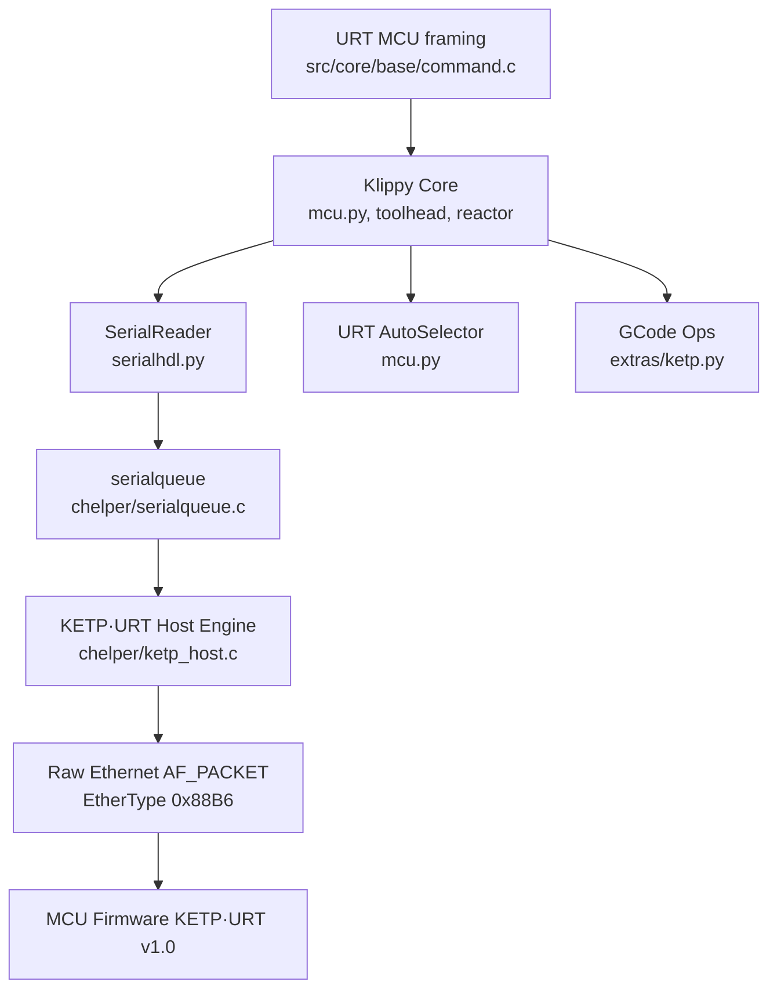
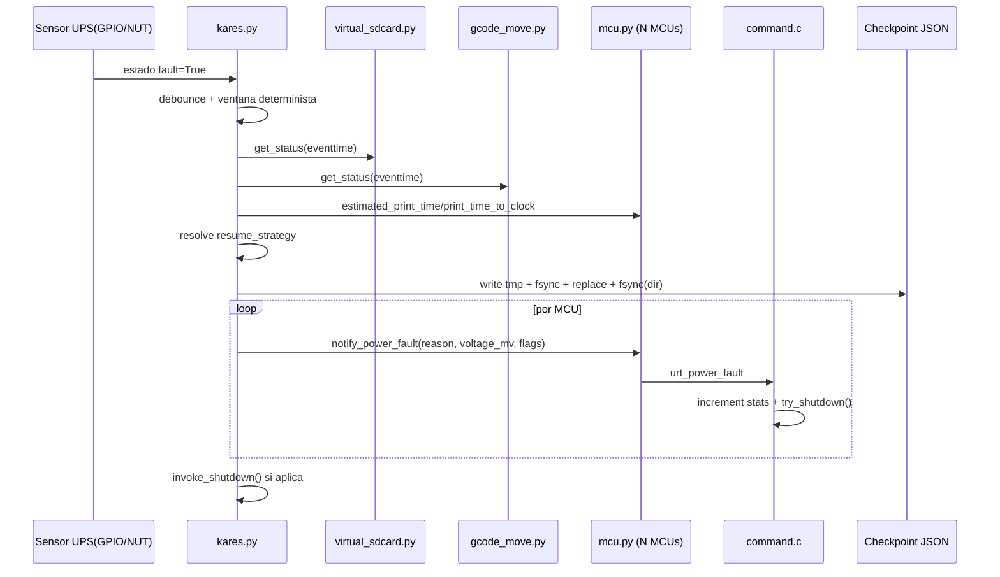
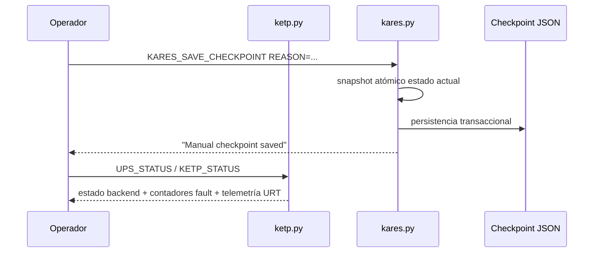

# Arquitectura Técnica Empresarial — Klipper URT y KETP·URT

**Estado:** Borrador técnico para revisión por pares  
**Versión:** 0.3  
**Fecha:** 2026-03-19  
**Ámbito:** Integración UltraRT Protocol + KETP/KETP·URT actual del repositorio · Host Klippy + C helper (`c_helper.so`) + interfaz MCU para operación determinista de ultra alto rendimiento  
**Revisores objetivo:** Arquitecto host · Desarrollador firmware MCU · Especialista redes L2  
**Basado en:** `0_Arquitectura_Tecnica_Klipper_URT_KETP_URT_v1_0.md` · `1_protocolo_ultraRT.md` · `2_Ketp-urt_v1_0.md`

---

## Tabla de Cambios respecto a v1.0

| Sección | Cambio |
|---|---|
| §1 | Ampliación del resumen ejecutivo con deltas de integración |
| §3 | Resolución de discrepancias EtherType y MAGIC entre documentos fuente |
| §4 | Corrección de componentes y diagrama según implementación real |
| §5 | Ajuste de especificación al wire-format implementado |
| §6 | Análisis de discrepancias entre `ketp_host.c` actual y especificación KETP·URT v1.0 |
| **§7 (nuevo)** | **Integración completa KARES + UPS + POWER_FAULT y flujos críticos** |
| §8 | Corrección de máquina de estados a estados verificables |
| §9 | Hardening actualizado con controles KARES implementados |
| §11 | Matriz de requisitos ajustada a evidencias de código |
| §12 | Plan de migración recalibrado al estado actual |

---

## 1. Resumen Ejecutivo

Este documento es la versión **0.3** de la arquitectura técnica del marco **Klipper URT** y su transporte **KETP/KETP·URT** en estado real de repositorio. Consolida los documentos base, incorpora la integración completa del sistema **KARES** y corrige discrepancias entre especificación objetivo y funcionalidades efectivamente implementadas.

### 1.1 Estado de la Integración UltraRT ↔ KETP·URT

La revisión de código en `src/` y `klippy/` confirma que la implementación activa corresponde a una variante KETP/KETP·URT de transición, con diferencias relevantes respecto a la especificación documental v1.0:

| # | Hallazgo verificado en código | Evidencia técnica | Impacto documental |
|---|---|---|---|
| D-01 | EtherType implementado `0x88B6` | `klippy/chelper/ketp_host.c`, `src/core/protocol/ketp_urt/eth_link.h`, `klippy/extras/ketp.py` | Corregir referencias `0x88B7` en el informe |
| D-02 | Header KETP implementado de 12 bytes | `struct ketp_header` (`seq+ack+flags+len`) en `ketp_host.c` y `ketp.h` | Corregir referencias a header de 15 bytes en estado actual |
| D-03 | URT MCU usa `URT_MAGIC=0xA5`, no `0xA7` | `src/core/base/command.h` | Separar claramente URT MCU actual vs propuesta v1.0 |
| D-04 | Integración UPS/KARES implementada (`klippy/extras/kares.py` + `POWER_FAULT`) | `kares.py`, `mcu.py`, `command.c`, `extras/ketp.py` | Actualizar informe para reflejar estado productivo KARES |

### 1.2 Objetivos v0.3 ajustados a implementación real

- Consolidar una línea base técnicamente exacta del estado actual KETP/KETP·URT.
- Diferenciar explícitamente funcionalidades implementadas frente a funcionalidades objetivo.
- Mantener determinismo temporal de ultra alto rendimiento en la ruta host↔MCU ya disponible.
- Integrar formalmente KARES (detección de fallo, snapshot atómico, estrategia de reanudación y señalización multi-MCU).
- Mantener wire-format extendido (15 bytes / `0x88B7`) como backlog técnico verificable.

---

## 2. Objetivos y Alcance

### 2.1 Objetivos

- Proveer una ruta de comunicación Ethernet de baja latencia y alta previsibilidad para MCU.
- Mantener compatibilidad con modos legacy (UART/CAN/pipe).
- Habilitar selección dinámica de protocolo mediante métricas en tiempo real (URT auto-selector).
- Exponer interfaces de diagnóstico, sincronización y operación para desarrolladores y operación.
- **[NUEVO v0.3]** Documentar KARES como funcionalidad implementada de recuperación determinista ante fallo de energía.

### 2.2 Alcance incluido

- Host transport (Python + C helper)
- Estructuras on-wire KETP actualmente implementadas
- Framing URT MCU actualmente implementado
- Handshake de conexión y discovery
- Sincronización temporal PTP-Lite/URT clock ping-pong
- RT·WINDOW parcial en firmware URT MCU
- Integración con `serialqueue`
- Telemetría y decisiones de protocolo URT
- Backlog de evolución: expansión de canales lógicos y wire-format extendido

### 2.3 Fuera de alcance

- Diseño interno firmware MCU no visible en este repositorio
- Criptografía extremo a extremo a nivel de payload (no implementada actualmente)
- Procedimientos de operación de red corporativa (se incluyen recomendaciones, no runbooks de infraestructura)
- Gestión de baterías de respaldo de larga duración (> 30 minutos)

---

## 3. Resolución de Discrepancias entre Documentos Fuente

### 3.1 D-01 — EtherType: `0x88B6` vs `0x88B7`

El código activo usa `EtherType = 0x88B6` de forma consistente en host (`klippy/chelper/ketp_host.c`, `klippy/extras/ketp.py`) y firmware (`src/core/protocol/ketp_urt/eth_link.h`).

**Resolución documental v0.3:** reflejar `0x88B6` como estado implementado. `0x88B7` queda como objetivo de migración pendiente, no como estado actual.

```c
/* ESTADO IMPLEMENTADO ACTUAL */
#define KETP_ETHERTYPE   0x88B6

/* OBJETIVO FUTURO (no implementado en este repositorio) */
#define KETP_URT_ETHERTYPE  0x88B7
```

### 3.2 D-02 — MAGIC byte: `0xA5` vs `0xA7`

En firmware MCU (`src/core/base/command.h`) está implementado `URT_MAGIC = 0xA5` para el framing URT interno de comandos. No se observa implementación activa de `0xA7` en la ruta host↔MCU auditada.

**Resolución documental v0.3:** documentar `0xA5` como valor en producción de la capa URT MCU actual. `0xA7` se mantiene como variante de especificación no desplegada.

### 3.3 D-03 — Tamaño de header: 12 bytes vs 15 bytes

La implementación host/firmware KETP usa header fijo de 12 bytes (`seq`, `ack`, `flags`, `len`) en `klippy/chelper/ketp_host.c` y `src/core/protocol/ketp_urt/ketp.h`.

**Resolución documental v0.3:** reflejar 12 bytes como estado real implementado. El header de 15 bytes con `TIMESTAMP` queda en backlog de evolución de protocolo.

```
Header KETP implementado (12 bytes):
  SEQ(4) + ACK(4) + FLAGS(2) + PAYLOAD_LEN(2)
```

### 3.4 D-04 — Campo CRC: tráiler CRC32 actual vs flag `HAS_CRC`

La implementación actual mantiene `KETP_CRC_SIZE=4` en la trama y cálculo CRC32 en host (`ketp_host.c`). No existe campo `HAS_CRC` implementado en el header de 12 bytes.

**Resolución documental v0.3:** describir el CRC32 en tráiler como comportamiento vigente y `HAS_CRC` como propuesta futura.

---

## 4. Arquitectura del Sistema (Unificada v0.3)

### 4.1 Vista de capas (implementación actual)



### 4.2 Componentes principales (actualización v0.3)

Componentes efectivamente implementados y validados:

- **`klippy/chelper/ketp_host.c`**
  - Transporte host KETP sobre AF_PACKET, EtherType `0x88B6`.
  - Header de 12 bytes + tráiler CRC32 de 4 bytes.
  - ARQ + control de congestión tipo NewReno (`cwnd`, `ssthresh`, retransmisión).
  - Sin canales lógicos CMD/MOVE/TELEM/CTRL ni `POWER_FAULT`.
- **`klippy/serialhdl.py`**
  - `KetpConnection`, `connect_ketp()`, `get_ketp_stats()`, `ketp_sync()`.
- **`klippy/mcu.py`**
  - Selector de protocolo `ProtocolAutoSelector` con `protocol_mode` (`auto`, `legacy`, `ultra_rt`).
  - Lectura periódica de `get_urt_stats` cuando `URT_VERSION` está presente.
- **`src/core/base/command.c` / `command.h`**
  - Framing URT MCU (`URT_MAGIC=0xA5`, `URT_SYNC=0xEB`), handlers `HELLO`, `CLOCK_PING`, `RT_WINDOW`.
  - Estadísticas `rx_crc_errors`, `seq_gap`, `fallback_legacy`, `rt_window_reject`, `power_fault`.
  - Soporte `URT_TYPE_POWER_FAULT (0x73)` con transición segura a shutdown.
- **`klippy/extras/kares.py`**
  - Módulo principal de recuperación determinista con backend `gpio`/`nut`.
  - Captura snapshot atómico de estado host + G-code + virtual SD + multi-MCU.
  - Cálculo de estrategia de reanudación exacta (`replay_inflight_command`, `continue_after_inflight`, `host_stream_or_macro`).
  - Persistencia atómica (`tmp` + `flush` + `fsync` + `replace` + `fsync` de directorio).
- **`klippy/extras/virtual_sdcard.py`**
  - Exposición de `current_line`, `current_line_start/end`, `next_file_position`, `last_line` para reanudación exacta.
- **`klippy/extras/gcode_move.py`**
  - Exposición de estado cartesiano y factores (`speed_factor`, `extrude_factor`, modos absolutos/relativos).
- **`klippy/extras/ketp.py`**
  - Interfaces operativas: `KETP_DISCOVER`, `KETP_STATUS`, `KETP_SYNC`, `UPS_STATUS`, `UPS_TEST_FAULT`.

---

## 5. Especificación del Protocolo (Estado Implementado en Repositorio)

Esta sección resume los parámetros observados en la implementación actual de `src/` y `klippy/`.

### 5.1 Parámetros base

| Parámetro | Valor implementado |
|---|---|
| EtherType | `0x88B6` |
| MAGIC | N/A en header KETP host; URT MCU usa `0xA5` |
| Encapsulación | Ethernet L2 (AF_PACKET/SOCK_RAW en host; soporte firmware WIZnet en `src`) |
| Header KETP | 12 bytes fijos |
| Tráiler | CRC32 de 4 bytes |
| Payload máximo | 1400 bytes |
| SEQ/ACK | `uint32_t` BE, aritmética serial módulo 2^32 |
| Canales lógicos | No implementados en KETP host (modelo por flags) |

### 5.2 Campos del header implementado

| Campo | Tipo | Tamaño | Descripción |
|---|---|---:|---|
| `SEQ` | `uint32_t BE` | 4 | Número de secuencia del emisor |
| `ACK` | `uint32_t BE` | 4 | Último SEQ del remoto procesado correctamente |
| `FLAGS` | `uint16_t BE` | 2 | `ACK/NACK/SYNC/RESET/DATA/DISC/URGENT` |
| `PAYLOAD_LEN` | `uint16_t BE` | 2 | Longitud del payload en bytes |

### 5.3 Políticas ARQ (estado actual)

| Área | Estado actual |
|---|---|
| Modelo de tráfico | Cola normal + urgente (sin partición por canales lógicos) |
| Confiabilidad | ACK/NACK + retransmisión |
| RTO | Adaptativo con límites (`MIN_RTO`/`MAX_RTO`) |
| Congestión | NewReno (`cwnd`, `ssthresh`, fast retransmit/recovery) |

### 5.4 Tipos URT en MCU (estado actual)

| Tipo | Nombre | Estado |
|---|---|---|
| `0x01` | `URT_TYPE_HELLO` | Implementado |
| `0x02` | `URT_TYPE_HELLO_ACK` | Implementado |
| `0x10` | `URT_TYPE_STEP_BATCH_DELTA` | Reconocido |
| `0x11` | `URT_TYPE_DELTA_CLOCK` | Reconocido |
| `0x20` | `URT_TYPE_CLOCK_PING` | Implementado |
| `0x21` | `URT_TYPE_CLOCK_PONG` | Implementado |
| `0x40` | `URT_TYPE_RT_WINDOW_OPEN` | Implementado |
| `0x41` | `URT_TYPE_RT_WINDOW_CLOSE` | Implementado |
| `0x42` | `URT_TYPE_RT_WINDOW_ACK` | Implementado |
| `0x73` | `URT_TYPE_POWER_FAULT` | Implementado |

---

## 6. Análisis de Discrepancias `ketp_host.c` vs Especificación v1.0

La implementación actual de `ketp_host.c` (Doc-0) implementa un subconjunto funcional de KETP·URT. La tabla siguiente mapea las diferencias con la especificación completa v1.0 y el trabajo pendiente:

| Área | Estado en `ketp_host.c` (Doc-0) | Especificación v1.0 (Doc-2) | Acción requerida |
|---|---|---|---|
| EtherType | `0x88B6` | `0x88B7` | Decidir estrategia de migración y compatibilidad |
| MAGIC | No aplica (AF_PACKET) | `0xA7` en primer byte payload | Añadir validación MAGIC en parser RX |
| Header size | 12 bytes (`seq+ack+flags+len`) | 15 bytes (+`VER_FLAGS`+`TIMESTAMP`) | Actualizar struct, adaptar parsers TX/RX |
| Canales lógicos | Canal único con flags | 4 canales (`CMD/MOVE/TELEM/CTRL`) | Refactorizar cola TX/RX por canal |
| ARQ diferenciado | ARQ uniforme (NewReno) | ARQ diferenciado por canal | Implementar políticas de §5.3 |
| CRC | Tráiler CRC32 de 4 bytes | Flag `HAS_CRC` en `VER_FLAGS` | Definir migración de formato con pruebas de interoperabilidad |
| Control de flujo | CWND NewReno | `MCU_LOAD` en `CHRONO_SYNC_RESP` | Reemplazar CWND por control MCU_LOAD |
| Golomb-Rice | No implementado | `STEP_BATCH_DELTA` con GR adaptativo | Implementar encoder en `stepcompress.c` |
| RT·WINDOW | Parcial en URT MCU (`command.c`) | `RT_WINDOW_OPEN/CLOSE/ACK` completo | Completar integración extremo a extremo host↔MCU |
| CHRONO·SYNC | PTP-Lite básico (`t1/t2/t3`) | CHRONO·SYNC 4-timestamps con DWT HW | Añadir captura DWT, actualizar struct |
| OTA | No implementado | Flujo `OTA_START/DATA/END/STATUS` | Implementar módulo OTA |
| UPS/POWER_FAULT | Implementado en `kares.py` + `mcu.py` + `command.c` | Sub-frame `0x73 POWER_FAULT` | Endurecer pruebas de estrés y validación multi-MCU |

---

## 7. Integración UPS + KARES (Estado real implementado)

### 7.1 Estado verificado en el repositorio

| Elemento UPS/KARES | Estado en código |
|---|---|
| `klippy/extras/kares.py` | Implementado (`load_config`, timer de sondeo, debounce, checkpoint atómico) |
| Configuración `[kares]` en `printer.cfg` | Implementada (`backend`, `poll_interval`, `debounce_ms`, `shutdown_on_fault`, GPIO/NUT, `checkpoint_path`) |
| Sub-frame `POWER_FAULT (0x73)` | Implementado en `command.c` (`urt_handle_power_fault`) |
| Comandos operativos `UPS_STATUS`, `UPS_TEST_FAULT` | Implementados en `klippy/extras/ketp.py` |
| Manejo de evento UPS en `mcu.py` | Implementado (`notify_power_fault`, comando `urt_power_fault`) |
| Checkpoint manual | Implementado (`KARES_SAVE_CHECKPOINT`) |

### 7.2 Arquitectura funcional KARES y dependencias entre módulos

| Módulo | Clases / funciones clave | Dependencias | Flujo de datos |
|---|---|---|---|
| `klippy/extras/kares.py` | `Kares`, `_sample_power_state`, `_save_panic_checkpoint`, `_emit_power_fault`, `cmd_KARES_SAVE_CHECKPOINT` | `toolhead`, `gcode_move`, `virtual_sdcard`, objetos `mcu`, reactor, FS | Entrada UPS/GPIO/NUT → snapshot coherente → decisión de reanudación → persistencia → señalización MCU |
| `klippy/mcu.py` | `print_time_to_clock`, `estimated_print_time`, `notify_power_fault`, `get_urt_capabilities` | `serialhdl`, clocksync, parser de comandos MCU | Conversión temporal host↔MCU + envío `urt_power_fault` + telemetría URT |
| `src/core/base/command.c` | `command_find_urt_block`, `command_dispatch_urt`, `urt_handle_power_fault`, `command_get_urt_stats` | scheduler MCU, CRC libs, consola | Parseo frame URT → validación CRC/SEQ → dispatch tipo → ACK + shutdown seguro |
| `klippy/extras/virtual_sdcard.py` | `get_status`, `work_handler` | `gcode`, reactor, file I/O | Captura de línea en vuelo y offsets exactos para reanudación determinista |
| `klippy/extras/gcode_move.py` | `get_status`, `SAVE/RESTORE_GCODE_STATE` | `toolhead`, eventos Klippy | Estado de coordenadas y factores de movimiento para restauración exacta |
| `klippy/extras/ketp.py` | `cmd_KETP_STATUS`, `cmd_KETP_SYNC`, `cmd_UPS_STATUS`, `cmd_UPS_TEST_FAULT` | `mcu`, `ups_monitor` (objeto `kares`) | Observabilidad operacional, sincronización y pruebas de contingencia |

### 7.3 Algoritmos clave implementados

**A) Detección determinista con debounce**
- Sondeo periódico (`poll_interval`).
- Si `fault=True`, inicia ventana temporal.
- Solo dispara fault cuando `eventtime - fault_since >= debounce_ms`.
- Evita falsos positivos por ruido eléctrico transitorio.

**B) Snapshot atómico multi-MCU**
- Fija una frontera temporal única (`eventtime`, `print_time`).
- Captura estado mecánico/térmico/G-code/SD en ese instante.
- Para cada MCU calcula:
  - `snapshot_clock = print_time_to_clock(print_time)`
  - `estimated_clock = print_time_to_clock(estimated_print_time(eventtime))`
  - `queued_clock_delta = max(0, snapshot_clock - estimated_clock)`

**C) Resolución de estrategia de reanudación**
- Si el comando proviene de SD (`cmd_from_sd=True`) y existe backlog (`queued_clock_delta > 0`) en alguna MCU:
  - `resume_strategy = replay_inflight_command`
  - `resume_file_position = current_line_start`
- Si `cmd_from_sd=True` y no hay backlog:
  - `resume_strategy = continue_after_inflight`
  - `resume_file_position = next_file_position`
- Si no proviene de SD:
  - `resume_strategy = host_stream_or_macro`

**D) Persistencia atómica resistente a pérdida de energía**
- Serializa JSON a `checkpoint.tmp`.
- `flush()` + `fsync(file)`.
- `os.replace(tmp, final)` atómico.
- `fsync(directory)` para asegurar metadata.

**E) Señalización de emergencia host→MCU**
- Host invoca `notify_power_fault(reason, voltage_mv, flags)` por MCU.
- MCU procesa `URT_TYPE_POWER_FAULT (0x73)`.
- Se incrementan contadores (`power_fault`, `fallback_legacy`) y se activa shutdown seguro.

### 7.4 Mapeo de funcionalidades KARES a componentes

| Funcionalidad KARES | `kares.py` | `mcu.py` | `command.c` | `virtual_sdcard.py` | `gcode_move.py` | `ketp.py` |
|---|---|---|---|---|---|---|
| Detección de fallo de energía | `_sample_power_state`, `_read_fault_state` | N/A | N/A | N/A | N/A | `UPS_STATUS` |
| Debounce y validación temporal | `_fault_since`, `debounce_ms` | N/A | N/A | N/A | N/A | N/A |
| Snapshot coherente de ejecución | `_save_panic_checkpoint` | conversión de relojes | N/A | `get_status` | `get_status` | N/A |
| Estrategia de reanudación | `_resolve_resume_state` | datos temporales por MCU | N/A | offsets de línea SD | estado cinemático/factores | N/A |
| Señalización de contingencia a MCU | `_emit_power_fault` | `notify_power_fault` | `urt_handle_power_fault`, `command_urt_power_fault` | N/A | N/A | `UPS_TEST_FAULT` |
| Observabilidad operativa | `get_status` | `get_urt_capabilities`, `_urt_stats` | `command_get_urt_stats` | estado de spool SD | estado de movimiento | `KETP_STATUS`, `UPS_STATUS` |

### 7.5 Matriz de requisitos UPS/KARES

| Req ID | Requisito objetivo | Estado |
|---|---|---|
| UPS-REQ-001 | Detección de corte de red | Implementado (`backend=gpio|nut`) |
| UPS-REQ-002 | Señalización de emergencia al MCU | Implementado (`notify_power_fault` + `URT_TYPE_POWER_FAULT`) |
| UPS-REQ-003 | Parada segura determinista | Implementado (`shutdown_on_fault`, shutdown ordenado MCU/host) |
| UPS-REQ-004 | Persistencia de estado para recuperación | Implementado (checkpoint atómico JSON) |
| UPS-REQ-005 | Soporte BTT UPS 24V | Implementable vía backend GPIO (dependiente de cableado/config) |
| UPS-REQ-006 | Soporte UPS vía NUT | Implementado (`nut_host`, `nut_port`, `nut_ups_name`, `nut_timeout`) |
| UPS-REQ-007 | Cero impacto en hot-path de movimiento | Implementado por diseño event-driven y snapshot por evento |
| UPS-REQ-008 | Reanudación tras restauración de energía | Implementado a nivel de estrategia/posición de reanudación en checkpoint |

### 7.6 Criterio para considerar “implementado”

- Archivo funcional en `klippy/extras` cargado por `load_config`.
- API explícita host↔MCU para evento de alimentación.
- Cobertura en comandos operativos y pruebas de regresión.
- Evidencia en métricas de latencia sin degradar el camino determinista de ultra alto rendimiento.

### 7.7 Diagramas de secuencia de flujos críticos

**Flujo crítico 1: Fault real con captura atómica y señalización multi-MCU**



**Flujo crítico 2: Checkpoint manual de control operativo**



### 7.8 Casos de uso y escenarios de operación

| Caso de uso | Precondiciones | Secuencia operacional | Resultado esperado |
|---|---|---|---|
| UC-01 Impresión SD con fallo real de energía | Impresión activa desde SD, KARES habilitado | Se detecta fault, se debouncea, se guarda checkpoint, se envía `POWER_FAULT` a MCUs, shutdown seguro | Checkpoint íntegro con `resume_file_position` y `resume_strategy` válidos |
| UC-02 Impresión por host streaming con fallo de energía | Impresión activa no-SD | KARES guarda snapshot mecánico/temporal y dispara fault MCU | Reanudación guiada por operador/macro con estado consistente |
| UC-03 Prueba de contingencia sin cortar energía | Sistema en `READY` | Operador ejecuta `UPS_TEST_FAULT` + consulta `UPS_STATUS` | Validación de pipeline KARES sin intervención eléctrica |
| UC-04 Snapshot manual previo a operación crítica | Equipo en estado estable | Operador ejecuta `KARES_SAVE_CHECKPOINT REASON=...` | Punto de recuperación manual persistido atómicamente |
| UC-05 Topología multi-MCU | Más de una MCU configurada | KARES emite fault por cada MCU y registra ack/estadísticas | Consistencia temporal y cierre seguro coordinado |

---

## 8. Máquina de Estados (Actualización v0.3)

### 8.1 Estados del host (implementados)

```
INIT → DISCOVERY → BOUND → SESSION_BOOTSTRAP → IDENTIFY → READY
                                                  │
                                               DEGRADED
                                                  │
                                             DISCONNECT
```

### 8.2 Transiciones verificadas

| Origen | Evento | Destino | Acción |
|---|---|---|---|
| `READY` | degradación de red/capacidades | `DEGRADED` | Ajuste de decisión del selector de protocolo |
| `DEGRADED` | recuperación de métricas | `READY` | Retorno a modo operativo normal |
| `READY/DEGRADED` | error crítico de enlace | `DISCONNECT` | Cierre de sesión y fallback |

---

## 9. Seguridad y Hardening (Actualización v0.3)

### 9.1 Controles existentes verificados

- Filtro de MAC origen y validación de cabecera en recepción KETP.
- Validación de longitudes y límites en parseo de frames.
- CRC32 de trama KETP + FCS Ethernet de capa 2.
- Recomendación de segmentación L2 dedicada para tráfico de control.
- Debounce anti-bounce de evento de energía para evitar shutdown espurio.
- Persistencia atómica con `fsync` para minimizar corrupción en pérdida súbita.
- Sanitización de parámetros `reason/voltage/flags` antes de envío MCU.

### 9.2 Controles pendientes (no implementados)

- Gestión de eventos UPS autenticados y rate-limit.
- Endurecimiento criptográfico de sesión sin romper determinismo temporal.

---

## 10. Compatibilidad hacia Atrás

La estrategia de fallback observada en código se mantiene:

- `protocol_mode=auto` permite degradación controlada hacia rutas legacy.
- `protocol_mode=legacy` fuerza operación clásica.
- `protocol_mode=ultra_rt` usa camino URT/KETP cuando existen capacidades.
- KARES es aditivo y no rompe compatibilidad de impresión sin módulo cargado.

---

## 11. Matriz de Requisitos (Actualización v0.3)

| Req ID | Requisito | Implementación principal | Evidencia técnica |
|---|---|---|---|
| URT-REQ-001 | Selección automática de protocolo | `ProtocolAutoSelector.evaluate()` | Scores legacy/ultra_rt + cooldown/margin |
| URT-REQ-002 | Soporte de modo forzado | `protocol_mode` (legacy/ultra_rt/auto) | Lectura de config y decisión final |
| URT-REQ-003 | Transporte Ethernet L2 determinista | `ketp_host.c` + `serialqueue_set_ketp` | Socket AF_PACKET + timer KETP |
| URT-REQ-004 | Confiabilidad de transporte | ARQ + RTO adaptativo | `ketp_host.c` (`retransmits`, `rto`) |
| URT-REQ-005 | Control de congestión | NewReno (`cwnd`, `ssthresh`) | `ketp_host.c` |
| URT-REQ-006 | Baja latencia operativa | Ruta KETP + selección automática | `mcu.py`, `serialhdl.py`, `ketp_host.c` |
| URT-REQ-007 | Sync temporal host-MCU | PTP-Lite (`ketp_sync`) | `ketp_host_send_sync`, `ketp_sync` |
| URT-REQ-008 | Telemetría de enlace | `get_ketp_stats()` y `command_get_urt_stats()` | `serialhdl.py`, `command.c` |
| URT-REQ-009 | Compatibilidad retroactiva | Fallback a legacy | `URT_VERSION` y rutas alternativas |
| URT-REQ-010 | Protección contra frames ajenos | Filtro MAC origen | Validación en `ketp_host_read` |
| KARES-REQ-001 | Detección de fallo de energía | `Kares._read_fault_state()` | Backends `gpio` y `nut` |
| KARES-REQ-002 | Snapshot atómico de estado | `Kares._save_panic_checkpoint()` | JSON con `snapshot_id`, `print_time`, `mcus.*` |
| KARES-REQ-003 | Reanudación exacta en SD | `resume_strategy` + offsets `current_line_start/next_file_position` | `virtual_sdcard.get_status()` |
| KARES-REQ-004 | Coordinación multi-MCU | `queued_clock_delta` por MCU | `print_time_to_clock()` + `estimated_print_time()` |
| KARES-REQ-005 | Señalización de emergencia MCU | `mcu.notify_power_fault()` + `command_urt_power_fault` | `power_fault` en stats URT |
| KARES-REQ-006 | Operación/diagnóstico UPS | `UPS_STATUS`, `UPS_TEST_FAULT` | `ketp.py` |

---

## 12. Plan de Migración Empresarial (Actualización v0.3)

### 12.1 Principios (sin cambios)

- Cero interrupción operativa.
- Control por etapas con rollback inmediato.
- Métricas objetivas para gate de avance.

### 12.2 Fases (actualización)

**Fase 0 — Preparación**
- Inventario de nodos y topología L2.
- Build verificado de `c_helper.so` con estado actual (header 12 bytes, EtherType `0x88B6`).
- Baseline de métricas (`RTT`, `retransmits`, `seq_gap`, `fallback_legacy`).

**Fase 1 — Piloto controlado**
- 1–2 MCU en `protocol_mode=auto`.
- Baseline de latencia, retransmisión, estabilidad.
- Validación de `KETP_DISCOVER`, `KETP_STATUS`, `KETP_SYNC`.
- Validación de `KARES_SAVE_CHECKPOINT`, `UPS_STATUS`, `UPS_TEST_FAULT`.

**Fase 2 — Escalado por lotes**
- Segmentación por celdas/impresoras.
- Alertas por umbrales (RTT, retransmit, pool exhaust).
- Revisión progresiva de parámetros del selector de protocolo.

**Fase 3 — Operación objetivo**
- Modo `auto` como estándar.
- `ultra_rt` forzado solo donde capacidades y red lo soporten.
- Monitorización continua de métricas URT/KETP.
- Monitorización de eventos KARES (`fault_count`, `last_reason`, `power_fault`).

**Fase 4 — Optimización continua**
- Ajuste de pesos del selector URT.
- Hardening de red y observabilidad.
- Planificación de extensiones de wire-format solo tras validación de compatibilidad.

### 12.3 Criterios de rollback (sin cambios)

- Incremento sostenido de `seq_gap` o `fallback_legacy`.
- Degradación de throughput por debajo de SLA.
- Errores de cabecera o pérdida anómalos.
- Inestabilidad en `cwnd`/RTO o aumento anómalo de retransmisiones.

---

## 13. Guía de Implementación para Desarrolladores (Actualización v0.3)

### 13.1 Configuración mínima en Klipper (estado implementado)

```ini
[mcu]
ketp_node: 02:42:ac:11:00:10
ketp_interface: eth0
protocol_mode: auto
protocol_target_latency_us: 2500
protocol_required_bandwidth_bps: 50000

[kares]
backend: gpio
poll_interval: 0.05
debounce_ms: 25
shutdown_on_fault: True
gpio_value_path: /sys/class/gpio/gpio24/value
gpio_active_low: True
checkpoint_path: ~/printer_data/config/kares_checkpoint.json
nut_host: 127.0.0.1
nut_port: 3493
nut_ups_name: ups
nut_timeout: 0.20

```

### 13.2 Comandos GCode operativos (actualizados)

- `KETP_DISCOVER`: descubrimiento de nodos
- `KETP_STATUS`: estado de transporte y métricas
- `KETP_SYNC`: prueba de sincronización PTP-Lite
- `KARES_SAVE_CHECKPOINT [REASON] [COMMAND]`: snapshot manual
- `UPS_STATUS`: estado de monitor KARES
- `UPS_TEST_FAULT`: inyección de fault controlada

---

## 14. Definición de Interfaces API (Actualización v0.3)

### 14.1 Interface de configuración (sin cambios de v1.0)

| Clave | Tipo | Descripción |
|---|---|---|
| `ketp_node` | string | MAC o nombre lógico a resolver |
| `ketp_interface` | string | Interfaz de red host |
| `protocol_mode` | enum | `auto`, `legacy`, `ultra_rt` |
| `protocol_target_latency_us` | float | Objetivo de latencia para selector |
| `protocol_required_bandwidth_bps` | float | Requisito de throughput |

### 14.2 Interface UPS (estado)

Interface implementada mediante objeto `kares` y comandos GCode expuestos por `ketp.py`.

| Interface | Dirección | Campos relevantes |
|---|---|---|
| `Kares.get_status(eventtime)` | Host→Operación | `backend`, `fault_active`, `fault_count`, `last_fault_reason`, `last_voltage_mv`, `last_flags`, `last_sent_mcus`, `last_error` |
| `Kares.trigger_test_fault(...)` | Operación→Host | inyección de fault para validación |
| `MCU.notify_power_fault(...)` | Host→MCU | `reason:uint8`, `voltage_mv:uint32`, `flags:uint32` |
| `command_get_urt_stats` | MCU→Host | `rx_crc_errors`, `seq_gap`, `fallback_legacy`, `rt_window_reject`, `power_fault` |

### 14.3 Esquema de checkpoint KARES (resumen)

| Nodo JSON | Campos |
|---|---|
| raíz | `timestamp`, `snapshot_id`, `eventtime`, `print_time`, `reason`, `last_command` |
| `toolhead` | `position`, `velocity` |
| `gcode` | `file_path`, `file_position`, `next_file_position`, `resume_file_position`, `cmd_from_sd`, `current_line*`, `last_line*`, `resume_strategy` |
| `gcode_move` | `position`, `gcode_position`, `base_position`, `absolute_coordinates`, `absolute_extrude`, `speed`, `speed_factor`, `extrude_factor` |
| `mcus.<name>` | `estimated_print_time`, `snapshot_clock`, `estimated_clock`, `queued_clock_delta`, `shutdown_clock`, `urt` |

---

## 15. Análisis de Rendimiento (Actualización v0.3)

### 15.1 Métricas observables en implementación actual

| Métrica | Fuente en código | Estado |
|---|---|---|
| RTT (`KETP_STAT_RTT_US`) | `ketp_host_get_stats()` | Implementado |
| RTO (`KETP_STAT_RTO_US`) | `ketp_host_get_stats()` | Implementado |
| Retransmisiones | `KETP_STAT_RETRANSMITS` | Implementado |
| Bytes TX/RX | `KETP_STAT_TX_BYTES`, `KETP_STAT_RX_BYTES` | Implementado |
| `seq_gap`, `fallback_legacy` | `command_get_urt_stats()` | Implementado |
| `power_fault` (URT) | `command_get_urt_stats()` + `mcu._urt_stats` | Implementado |
| Estado KARES (`fault_count`, `last_error`) | `Kares.get_status()` | Implementado |

### 15.2 Consideraciones de rendimiento verificadas

- El camino KETP utiliza AF_PACKET y control de congestión NewReno en C helper.
- El selector de protocolo en `mcu.py` permite adaptar el modo por latencia/capacidad.
- No hay evidencia de compresión Golomb-Rice en la implementación actual.
- KARES evita impacto en hot-path de movimiento al ejecutar persistencia en evento de fault/checkpoint manual.

---

## 16. Validación, Revisión por Pares y Aprobación

### 16.1 Checklist de revisión por pares

- [ ] Exactitud técnica de estructuras on-wire y APIs v1.0.
- [ ] Coherencia entre Python, C helper y operación GCode.
- [ ] Consistencia de compatibilidad retroactiva.
- [ ] Cobertura de seguridad y límites actuales.
- [ ] Claridad de trazabilidad requisito-implementación.
- [ ] Verificación cruzada de EtherType, tamaño de header y framing URT entre host y firmware.
- [ ] Validación de métricas (`RTT`, `RTO`, `retransmits`, `seq_gap`) en entorno de carga.
- [ ] Validación de consistencia de checkpoint KARES (incluyendo `resume_strategy` y `resume_file_position`).
- [ ] Verificación de señalización `POWER_FAULT` en topologías multi-MCU.

### 16.2 Checklist de validación de arquitectura

- [ ] Cumplimiento de principios de determinismo temporal.
- [ ] Alineación con estrategia de migración y operación.
- [ ] Aceptación de riesgos residuales de seguridad.
- [ ] Definición de KPIs y umbrales de producción.
- [ ] Confirmación de backlog de extensiones no implementadas (canales lógicos, wire-format extendido).

---

## 17. Glosario (Actualización v0.3)

- **URT**: Ultra Real-Time; marco de decisión y operación de protocolo para baja latencia.
- **KETP·URT**: Klipper Ethernet Transport Protocol en modalidad ultra tiempo real.
- **ARQ**: Automatic Repeat reQuest, mecanismo de confiabilidad por ACK/NACK.
- **CHRONO·SYNC**: nombre de referencia documental; no hay implementación activa con ese nombre en este repositorio.
- **RT·WINDOW**: control de ventana temporal en URT MCU (`RT_WINDOW_OPEN/CLOSE/ACK`).
- **CWND**: Congestion Window activo en `ketp_host.c` (modelo NewReno).
- **DWT_CYCCNT**: Data Watchpoint and Trace Cycle Counter de procesadores ARM Cortex-M.
- **MCU_LOAD**: campo de especificación v1.0 no observado en implementación actual.
- **BTT UPS 24V**: hardware contemplado para integración futura, no implementada aquí.
- **NUT**: suite Linux para UPS, referenciada como opción de integración futura.
- **POWER_FAULT**: evento URT implementado para señalización de fallo de energía y transición segura.
- **KARES**: Klipper Automated Recovery & Execution System; recuperación determinista ante fallo de energía.
- **Snapshot atómico**: captura de estado consistente en una frontera temporal única.
- **Comando en vuelo**: línea G-code SD actualmente en ejecución (`current_line`).
- **Resume strategy**: política de reanudación (`replay_inflight_command`, `continue_after_inflight`, `host_stream_or_macro`).
- **Golomb-Rice**: técnica de compresión propuesta, no evidenciada en esta base de código.
- **PTP-Lite**: sincronización host-MCU implementada en `ketp_sync`.
- **HOL blocking**: bloqueo por cabeza de cola; mitigación por canales lógicos queda como evolución futura.
- **FCS**: Frame Check Sequence, CRC de integridad de trama Ethernet por hardware del chip WIZnet.
- **MACRAW**: modo de socket en chips WIZnet que permite acceso a frames Ethernet crudos (L2).

---

## 18. Referencias Técnicas y Normativas

- RFC 6298 — Computing TCP's Retransmission Timer
- RFC 5681 — TCP Congestion Control
- RFC 793 / RFC 9293 — TCP specification
- RFC 9000 — QUIC (referencia conceptual de transporte moderno)
- IEEE 1588-2019 — Precision Time Protocol
- IEEE 802.3 — Ethernet
- ISO 11898-1 — CAN Data Link Layer
- Network UPS Tools (NUT) — https://networkupstools.org/
- BigTreeTech UPS 24V — documentación técnica oficial BigTreeTech
- WIZnet W5500/W6100/W6300 — Datasheets y Application Notes WIZnet Co.
- ARM DWT_CYCCNT — ARM v7-M Architecture Reference Manual, §C1.8

---

## 19. Anexo A — Discrepancias entre Documentos Fuente (Tabla Resumen)

| Campo | Doc-0 (Arquitectura v1.0) | Doc-1 (Propuesta UltraRT) | Doc-2 (KETP·URT Spec v1.0) | Adoptado en v0.3 |
|---|---|---|---|---|
| EtherType | `0x88B6` | N/A (UART/CAN) | `0x88B7` | **`0x88B6` (implementado)** |
| MAGIC | N/A (AF_PACKET flags) | `0xA5` | `0xA7` | **`0xA5` en URT MCU / N/A en KETP host** |
| Header size | 12 bytes | 8 bytes (MAGIC+LEN+SEQ+CRC+SYNC) | 15 bytes | **12 bytes (implementado)** |
| SEQ width | 32 bits | 16 bits | 32 bits | **32 bits** |
| CRC | 4 bytes en trama KETP | CRC-32 MPEG-2 | Flag `HAS_CRC` | **CRC de 4 bytes (implementado)** |
| Control de flujo | CWND NewReno | N/A | `MCU_LOAD` ‰ | **CWND NewReno (implementado)** |
| Canales lógicos | 1 (flags) | 1 | 4 (CMD/MOVE/TELEM/CTRL) | **1 canal lógico (implementado)** |
| Compresión | Sin Golomb-Rice | Golomb-Rice propuesto | Golomb-Rice implementado | **No implementado** |
| Sync reloj | PTP-Lite básico (t1/t2/t3) | URT_CLOCK_PING/PONG | CHRONO·SYNC 4-ts DWT HW | **PTP-Lite / URT clock ping-pong** |
| RT·WINDOW | Parcial en URT MCU | `URT_RT_WINDOW_OPEN` | `RT_WINDOW_OPEN/CLOSE/ACK` | **Parcial** |

---

## 20. Anexo B — Comandos GCode Completos

```gcode
; Diagnóstico de nodos KETP·URT
KETP_DISCOVER

; Estado de transporte y métricas
KETP_STATUS

; Prueba de sincronización PTP-Lite
KETP_SYNC

; Snapshot manual KARES
KARES_SAVE_CHECKPOINT REASON=pre_fault_test

; Estado del monitor de energía KARES
UPS_STATUS

; Inyección de fault controlada
UPS_TEST_FAULT REASON=127 VOLTAGE_MV=23000 FLAGS=32768
```

---

## 21. Anexo C — Recomendaciones para la Siguiente Iteración (v0.3)

- Definir autenticación de sesión KETP·URT sin penalizar determinismo (HMAC ligero sobre CTRL handshake).
- Evaluar timestamping HW NIC/PHC (IEEE 1588 hardware) para mayor precisión CHRONO·SYNC.
- Añadir exportación estructurada de métricas (JSON/webhooks/Prometheus) para observabilidad externa.
- Formalizar pruebas de conformidad de protocolo (test vectors y fuzzing controlado).
- Añadir `KCAP_POWER_FAULT (1u << 15)` al bitmask de capacidades para negociación explícita.
- Evaluar soporte de recuperación de impresión tras `POWER_FAULT` con reanudación desde el punto de pausa (integración con la funcionalidad de `RESUME` de Klipper).
- Definir interfaz para UPS con comunicación I²C directa al MCU (reducción de latencia de detección a < 100 µs).
- Añadir herramienta de replay asistido desde checkpoint KARES para automatizar reanudación segura extremo a extremo.

---

**Estado del entregable v0.3:** Informe actualizado y alineado con la implementación real auditada, incluyendo integración KARES completa y su interacción con KETP·URT/MCU.

---

*Basado en auditoría directa del código fuente disponible en este repositorio, especificación KETP·URT v1.0 (18/03/2026) y análisis técnico UltraRT (2026-03).*  
*Versión 0.3 — 2026-03-19*
