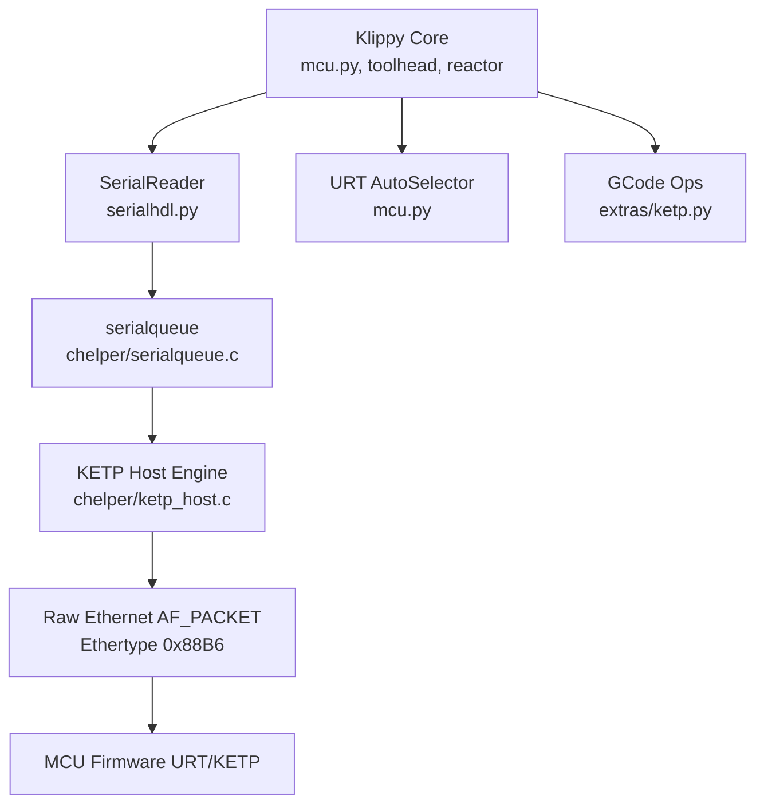
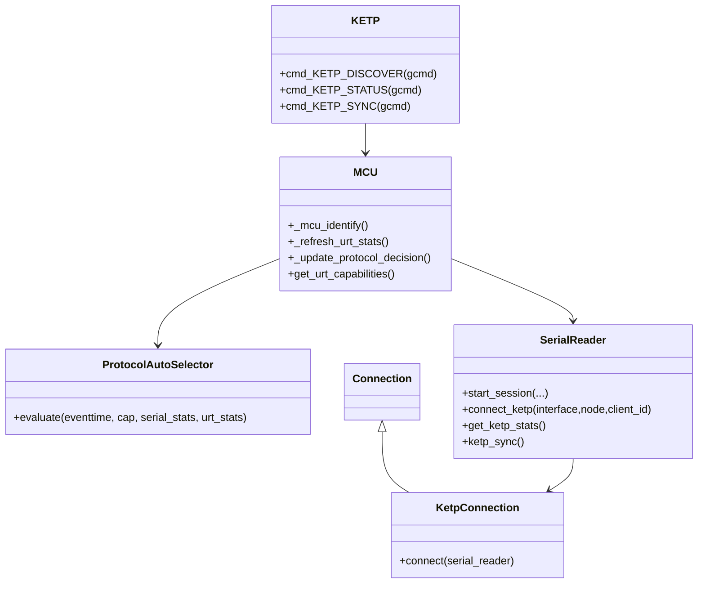
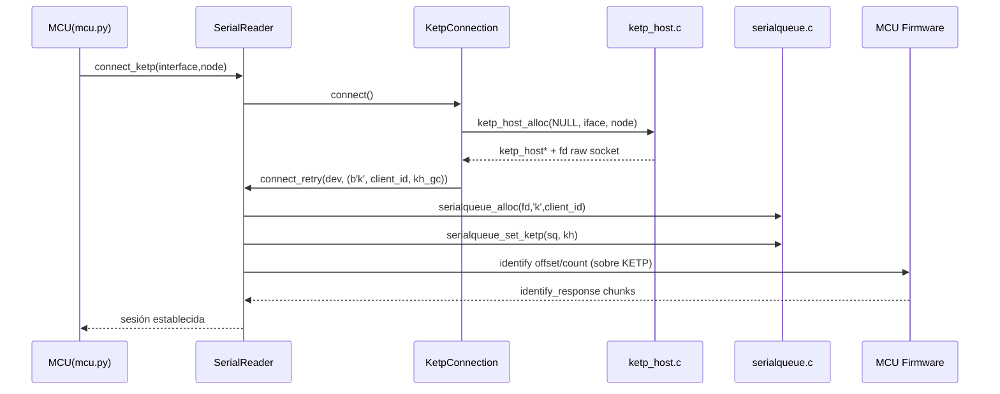
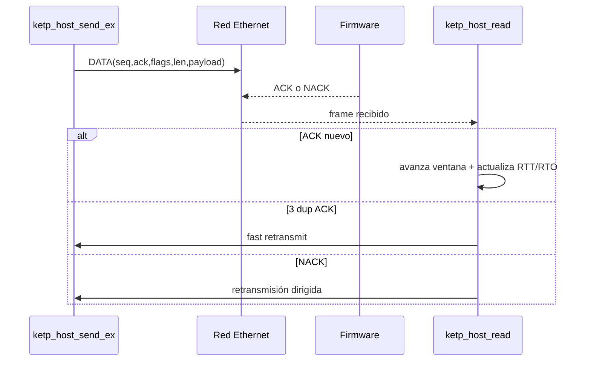
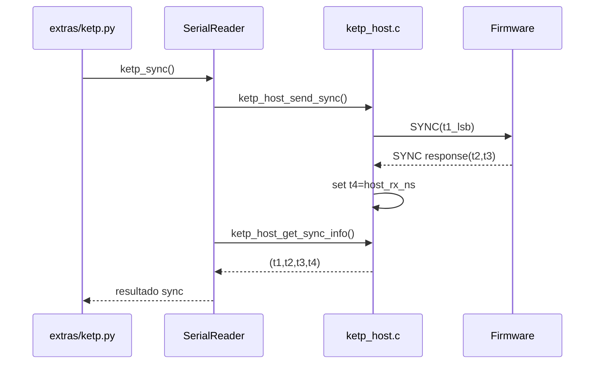

# Arquitectura Técnica Empresarial — Klipper URT y KETP·URT

**Estado**: Borrador técnico para revisión por pares  
**Versión**: 1.0  
**Fecha**: 2026-03-19  
**Ámbito**: Host Klippy + C helper (`c_helper.so`) + interfaz MCU para operación determinista de ultra alto rendimiento

---

## 1. Resumen ejecutivo

Este documento define, con enfoque de arquitectura de software, la especificación funcional y técnica del nuevo marco **Klipper URT** (selección y telemetría de modo ultra real-time) y su transporte asociado **KETP·URT** (Klipper Ethernet Transport Protocol·Ultra Real-Time).  

El objetivo es estandarizar:

- Arquitectura de componentes
- Protocolo de transporte y control
- Formatos de mensaje
- Interfaces API (Python/C/FFI/GCode)
- Consideraciones de determinismo, rendimiento y seguridad
- Compatibilidad retroactiva y plan de migración
- Trazabilidad de requisitos y gobernanza de publicación

---

## 2. Objetivos y alcance

### 2.1 Objetivos

- Proveer una ruta de comunicación Ethernet de baja latencia y alta previsibilidad para MCU.
- Mantener compatibilidad con modos legacy (UART/CAN/pipe).
- Habilitar selección dinámica de protocolo mediante métricas en tiempo real (URT auto-selector).
- Exponer interfaces de diagnóstico, sincronización y operación para desarrolladores y operación.

### 2.2 Alcance incluido

- Host transport (Python + C helper)
- Estructuras on-wire KETP·URT
- Handshake de conexión y discovery
- Sincronización temporal PTP-Lite
- Integración con `serialqueue`
- Telemetría y decisiones de protocolo URT

### 2.3 Fuera de alcance

- Diseño interno firmware MCU no visible en este repositorio
- Criptografía extremo a extremo a nivel de payload (no implementada actualmente)
- Procedimientos de operación de red corporativa (se incluyen recomendaciones, no runbooks de infraestructura)

---

## 3. Arquitectura del sistema

### 3.1 Vista de capas



### 3.2 Componentes principales

- **`mcu.py`**
  - Selección de medio de enlace (`ketp_node`, CAN, UART, pipe).
  - Lectura de capacidades URT (`URT_VERSION`, `URT_CAPS`).
  - Consulta periódica `get_urt_stats` y decisión de protocolo con `ProtocolAutoSelector`.
- **`serialhdl.py`**
  - Clase `KetpConnection` para crear sesión KETP·URT.
  - Clase `SerialReader` para gestión de sesión, cola, stats y sync.
  - API pública `get_ketp_stats()` y `ketp_sync()`.
- **`chelper/serialqueue.c`**
  - Integración de tipo de transporte `SQT_KETP ('k')`.
  - Enrutamiento TX/RX hacia `ketp_host_send` / `ketp_host_read`.
  - Timer dedicado `SQPT_KETP`.
- **`chelper/ketp_host.c/.h`**
  - Implementación del motor KETP·URT.
  - Discovery, ARQ, ACK/NACK, control de congestión, agregación, sincronización temporal y telemetría.
- **`extras/ketp.py`**
  - Comandos GCode: `KETP_DISCOVER`, `KETP_STATUS`, `KETP_SYNC`.
  - Utilidad operativa de diagnóstico y validación en campo.

---

## 4. Modelo de clases (host)



---

## 5. Especificación del protocolo KETP·URT

## 5.1 Parámetros base

- **EtherType**: `0x88B6`
- **Encapsulación**: Ethernet L2 (AF_PACKET/SOCK_RAW en host)
- **Header KETP**: 12 bytes
- **CRC software en frame KETP**: 4 bytes (en implementación actual host se transmite en `0` por compatibilidad; la integridad de trama se apoya en FCS Ethernet HW)
- **Payload máximo**: 1400 bytes

## 5.2 Flags KETP·URT

| Flag | Bit | Propósito |
|---|---:|---|
| `KETP_FLAG_ACK` | 0 | Confirmación explícita |
| `KETP_FLAG_NACK` | 1 | Solicitud de retransmisión |
| `KETP_FLAG_SYNC` | 2 | Trama de sincronización PTP-Lite |
| `KETP_FLAG_RESET` | 3 | Reset lógico de secuencia RX |
| `KETP_FLAG_DATA` | 4 | Datos de aplicación |
| `KETP_FLAG_DISC` | 5 | Discovery/asignación |
| `KETP_FLAG_URGENT` | 6 | Priorización de envío |

## 5.3 Header de datos

Formato on-wire (`struct ketp_header`, packed):

| Campo | Tipo | Tamaño | Descripción |
|---|---|---:|---|
| `seq` | `uint32` | 4 | Número de secuencia TX |
| `ack` | `uint32` | 4 | ACK acumulativo/piggyback |
| `flags` | `uint16` | 2 | Bits de control |
| `len` | `uint16` | 2 | Longitud payload |

## 5.4 Mensajes de discovery

- **REQ**: `KETP_DISC_CMD_REQ (0xA0)`
- **RESP**: `KETP_DISC_CMD_RESP (0xA1)` con MAC/IP/caps/fw/name
- **ASSIGN**: `KETP_DISC_CMD_ASSIGN (0xA2)` con `node_id` de 8 bits y nombre

Notas:
- Si `ketp_node` es MAC válida, el host omite discovery.
- Si `ketp_node` es nombre lógico o `broadcast`, se usa ciclo de discovery con timeout.

## 5.5 Mensaje de sincronización PTP-Lite

Payload (`struct ketp_sync_payload`):

| Campo | Tipo | Descripción |
|---|---|---|
| `t1` | `uint32` | LSB de timestamp host TX en ns |
| `t2` | `uint32` | MCU RX en ciclos |
| `t3` | `uint32` | MCU TX en ciclos |

Estructura de lectura host (`struct ketp_sync_info`):

| Campo | Tipo | Descripción |
|---|---|---|
| `t1` | `uint64` | Host TX ns completo |
| `t2` | `uint32` | MCU RX ciclos |
| `t3` | `uint32` | MCU TX ciclos |
| `t4` | `uint64` | Host RX ns completo |

---

## 6. Diagramas de secuencia

### 6.1 Handshake de conexión KETP·URT



### 6.2 Flujo de datos y confiabilidad



### 6.3 Sincronización PTP-Lite



---

## 7. Handshaking y estados

### 7.1 Máquina de estados simplificada

1. **INIT**: creación de `ketp_host`, socket raw, bind interfaz.
2. **DISCOVERY** (opcional): broadcast REQ y espera RESP.
3. **BOUND**: destino MAC resuelto.
4. **SESSION_BOOTSTRAP**: alta en serialqueue (`serial_fd_type='k'`).
5. **IDENTIFY**: intercambio `identify`/`identify_response`.
6. **READY**: operación regular (datos + control + sync + stats).
7. **DEGRADED**: retransmisiones/rechazos RT elevados.
8. **DISCONNECT**: cierre ordenado y liberación de recursos.

### 7.2 Temporización y reintentos

- Timeout de conexión host: 90 s.
- Timeout identify: 5 s.
- RTO inicial KETP: 25 ms, mínimo 2 ms, máximo 200 ms (motor KETP).
- Poll/timers dedicados en `serialqueue` para retransmisión y eventos KETP.

---

## 8. Mecanismos de rendimiento y determinismo

### 8.1 Estrategias implementadas

- **Pool de paquetes preasignado** (`PACKET_POOL_SIZE=128`) para evitar `malloc` en hot-path.
- **RX frame preasignado** para evitar presión de stack/TLB por frame.
- **Estimación RTT/RTO en entero (µs)** para minimizar jitter por FPU.
- **Control de congestión tipo NewReno**:
  - Slow start
  - Congestion avoidance
  - Fast retransmit / fast recovery
- **Aggregación tipo Nagle acotada** (`KETP_MSS_BE=256`) para reducir HOL blocking en tráfico no urgente.
- **Priorización de control/urgente** (`URGENT`, `NACK`, `SYNC`) mediante inserción al frente de cola.
- **Prevención de busy loops** en timers con retraso mínimo de reactivación.

### 8.2 Métricas expuestas

- Bytes TX/RX
- Retransmisiones
- Errores de cabecera
- RTT/RTO
- Pérdida estimada, paquetes perdidos
- CWND, inflight, ssthresh
- Eventos de agotamiento de pool

### 8.3 Integración con selector URT

El `ProtocolAutoSelector` combina:

- Capacidades URT (`URT_CAPS`)
- Historial global y por bucket
- Presión de latencia/ancho de banda
- Calidad de red (retransmisión)
- Señales de salud URT (`rx_crc_errors`, `seq_gap`, `fallback_legacy`, `rt_window_reject`)

Salida:
- `active` (`legacy` / `ultra_rt`)
- `scores` comparativos
- Parámetros de decisión y estado histórico

---

## 9. Seguridad y hardening

### 9.1 Controles actuales implementados

- **Filtro de MAC origen** en recepción para evitar contaminación de estado por frames de terceros.
- **Validación de longitudes y bounds** en parsing de tramas discovery/data.
- **Validación de rango** en `node_id` de discovery assign (evita truncamiento silencioso).
- **Uso de FCS Ethernet HW** para integridad de enlace.

### 9.2 Riesgos actuales (estado de implementación)

- No existe cifrado de payload KETP·URT.
- No existe autenticación criptográfica de emisor.
- Tráfico en L2 raw requiere controles de segmentación de red.

### 9.3 Recomendaciones empresariales

- VLAN dedicada para tráfico KETP·URT.
- ACL L2/L3 y whitelisting de MAC en switches.
- Protección de puertos (802.1X/MAB según entorno).
- Integración futura de autenticación de sesión (HMAC/tag ligero o extensión segura del protocolo).
- Monitoreo continuo de métricas de pérdida, retransmisión y errores de cabecera.

---

## 10. Compatibilidad hacia atrás

### 10.1 Estrategia de fallback

- Si `URT_VERSION` no está disponible o es `0`, el sistema opera en modo `legacy`.
- El selector puede forzar:
  - `protocol_mode=legacy`
  - `protocol_mode=ultra_rt` (con guardas de capacidad)
  - `protocol_mode=auto`

### 10.2 Compatibilidad de wire format

- `t1` de sync permanece `uint32` en wire para compatibilidad firmware existente.
- Host conserva `t1` y `t4` en 64 bits internamente para precisión temporal sin romper formato.

### 10.3 Convivencia multi-transporte

El host mantiene rutas para:

- UART
- CAN
- Pipe/debug file
- KETP·URT

Lo anterior permite despliegues graduales sin migración masiva en un solo corte.

---

## 11. Guía de implementación para desarrolladores

### 11.1 Configuración mínima en Klipper (ejemplo)

```ini
[mcu]
ketp_node: 02:42:ac:11:00:10
ketp_interface: eth0
protocol_mode: auto
protocol_target_latency_us: 2500
protocol_required_bandwidth_bps: 50000
```

### 11.2 Flujo recomendado de integración

1. Compilar `c_helper.so` con `ketp_host.c` incluido.
2. Configurar `ketp_node` y `ketp_interface`.
3. Validar `identify` exitoso.
4. Verificar `KETP_STATUS`.
5. Ejecutar `KETP_SYNC` para confirmar sincronización temporal.
6. Observar estado de protocolo (`legacy/ultra_rt`) y métricas URT.

### 11.3 API Python de transporte (host)

```python
serial.connect_ketp(ketp_interface, ketp_node, client_id=0)
stats = serial.get_ketp_stats()
sync = serial.ketp_sync()
```

### 11.4 API C helper relevante

```c
struct ketp_host *ketp_host_alloc(struct pollreactor *pr, const char *iface, const char *node_id);
void ketp_host_free(struct ketp_host *kh);
int ketp_host_send(struct ketp_host *kh, uint8_t *data, int len);
int ketp_host_read(struct ketp_host *kh, uint8_t *buf, int max_len);
void ketp_host_get_stats(struct ketp_host *kh, uint64_t *stats, int count);
int ketp_host_send_sync(struct ketp_host *kh);
void ketp_host_get_sync_info(struct ketp_host *kh, struct ketp_sync_info *info);
```

### 11.5 Comandos GCode operativos

- `KETP_DISCOVER`: descubrimiento de nodos
- `KETP_STATUS`: estado de transporte y métricas
- `KETP_SYNC`: prueba de sincronización PTP-Lite

---

## 12. Definición de interfaces API

### 12.1 Interface de configuración

| Clave | Tipo | Descripción |
|---|---|---|
| `ketp_node` | string | MAC o nombre lógico a resolver por discovery |
| `ketp_interface` | string | Interfaz de red host (ej. `eth0`) |
| `protocol_mode` | enum | `auto`, `legacy`, `ultra_rt` |
| `protocol_target_latency_us` | float | Objetivo de latencia para selector |
| `protocol_required_bandwidth_bps` | float | Requisito de throughput |
| `protocol_switch_margin` | float | Histéresis de cambio |
| `protocol_switch_cooldown` | float | Cooldown entre cambios |
| `protocol_learning_rate` | float | Adaptación histórica |

### 12.2 Interface de capacidades MCU

| Constante MCU | Uso |
|---|---|
| `URT_VERSION` | Habilitación de ruta URT |
| `URT_CAPS` | Vector de capacidades (`HW_CRC32`, `RT_WINDOW`, `DELTA_CLOCK`, etc.) |
| `RECEIVE_WINDOW` | Parámetro de capacidad de recepción |

### 12.3 Interface de estadísticas URT

Comando consultado:

- `get_urt_stats`

Respuesta esperada:

- `urt_stats rx_crc_errors=%u seq_gap=%u fallback_legacy=%u rt_window_reject=%u`

### 12.4 Interface de estadísticas KETP host

Índices en array `uint64_t[]`:

| Índice | Métrica |
|---:|---|
| 0 | TX bytes |
| 1 | RX bytes |
| 2 | Retransmits |
| 3 | Header errors |
| 4 | RTT us |
| 5 | RTO us |
| 6 | Loss % |
| 7 | Lost packets |
| 8 | CWND |
| 9 | Inflight |
| 10 | SSThresh |
| 11 | Pool exhausted |

---

## 13. Casos de uso detallados

### CU-01: Conexión inicial por MAC fija

- **Actor**: Integrador de firmware/host
- **Precondición**: Nodo MCU conocido por MAC
- **Flujo**:
  1. Configurar `ketp_node` con MAC.
  2. Host abre socket raw y bindea interfaz.
  3. Serialqueue se inicializa en modo `k`.
  4. Identify completa y sesión pasa a READY.
- **Resultado esperado**: Tráfico estable sin fase discovery.

### CU-02: Discovery por nombre lógico

- **Actor**: Operador de planta
- **Precondición**: Nodos responden `DISC_RESP`
- **Flujo**:
  1. `ketp_node` contiene nombre.
  2. Host envía broadcast `DISC_REQ`.
  3. Host filtra respuestas válidas y selecciona MAC destino.
  4. Conexión continúa a bootstrap.
- **Resultado esperado**: Resolución dinámica de nodo.

### CU-03: Operación con degradación de red

- **Actor**: Runtime automático
- **Flujo**:
  1. Aumentan retransmisiones/errores.
  2. Selector URT penaliza score `ultra_rt`.
  3. En modo `auto`, sistema cambia a `legacy` si supera margen y cooldown.
- **Resultado esperado**: Continuidad operacional ante degradación.

### CU-04: Verificación de sincronización temporal

- **Actor**: Arquitecto de performance
- **Flujo**:
  1. Ejecutar `KETP_SYNC`.
  2. Obtener `(t1,t2,t3,t4)`.
  3. Convertir ciclos MCU por `CLOCK_FREQUENCY`.
  4. Estimar RTT y tiempo de procesamiento MCU.
- **Resultado esperado**: Diagnóstico objetivo de latencia temporal.

---

## 14. Matriz de trazabilidad de requisitos

| Req ID | Requisito | Implementación principal | Evidencia técnica |
|---|---|---|---|
| URT-REQ-001 | Selección automática de protocolo | `ProtocolAutoSelector.evaluate()` | Scores legacy/ultra_rt + cooldown/margin |
| URT-REQ-002 | Soporte de modo forzado | `protocol_mode` (`legacy`,`ultra_rt`,`auto`) | Lectura de config y decisión final |
| URT-REQ-003 | Transporte Ethernet L2 determinista | `ketp_host.c` + `serialqueue_set_ketp` | Socket AF_PACKET + timer KETP |
| URT-REQ-004 | Confiabilidad con ARQ | ACK/NACK + retransmisión + timer RTO | `ketp_host_read`, `ketp_host_timer_event` |
| URT-REQ-005 | Control de congestión | NewReno (ssthresh/cwnd/fast recovery) | Lógica CC en `ketp_host_read` |
| URT-REQ-006 | Baja latencia operativa | Agregación acotada + urgente prioritario | `ketp_host_send_ex`, `flush_tx` |
| URT-REQ-007 | Sync temporal host-MCU | `ketp_host_send_sync` + `ketp_sync()` | Comando `KETP_SYNC` |
| URT-REQ-008 | Telemetría de enlace | `ketp_host_get_stats` + `KETP_STATUS` | 12 métricas de transporte |
| URT-REQ-009 | Compatibilidad retroactiva | Fallback a legacy | `URT_VERSION` y rutas alternativas |
| URT-REQ-010 | Protección contra frames ajenos | Filtro MAC origen | Validación en `ketp_host_read` |

---

## 15. Plan de migración empresarial

### 15.1 Principios

- Cero interrupción operativa.
- Control por etapas con rollback inmediato.
- Métricas objetivas para gate de avance.

### 15.2 Fases

1. **Fase 0 — Preparación**
   - Inventario de nodos y topología L2.
   - Build verificado de `c_helper.so` con KETP.
2. **Fase 1 — Piloto controlado**
   - 1–2 MCU en `protocol_mode=auto`.
   - Baseline de latencia, retransmisión, estabilidad.
3. **Fase 2 — Escalado por lotes**
   - Segmentación por celdas/impresoras.
   - Alertas por umbrales (RTT, retransmit, pool exhaust).
4. **Fase 3 — Operación objetivo**
   - Modo `auto` como estándar.
   - `ultra_rt` forzado solo donde capacidades y red lo soporten consistentemente.
5. **Fase 4 — Optimización continua**
   - Ajuste de pesos del selector URT.
   - Hardening de red y observabilidad.

### 15.3 Criterios de rollback

- Incremento sostenido de `seq_gap` o `fallback_legacy`.
- Degradación de throughput por debajo de SLA.
- Errores de cabecera o pérdida anómalos.

---

## 16. Validación, revisión por pares y aprobación de arquitectura

## 16.1 Checklist de revisión por pares (obligatoria)

- Exactitud técnica de estructuras on-wire y APIs.
- Coherencia entre Python, C helper y operación GCode.
- Consistencia de compatibilidad retroactiva.
- Cobertura de seguridad y límites actuales.
- Claridad de trazabilidad requisito-implementación.

## 16.2 Checklist de validación de arquitectura (obligatoria)

- Cumplimiento de principios de determinismo temporal.
- Alineación con estrategia de migración y operación.
- Aceptación de riesgos residuales de seguridad.
- Definición de KPIs y umbrales de producción.

## 16.3 Flujo de publicación propuesto

1. Autoría técnica completa.
2. Revisión por pares (mínimo 2 revisores: host + firmware/red).
3. Comité de arquitectura (aprobación formal).
4. Publicación como versión controlada.

**Estado actual del entregable**: listo para iniciar revisión por pares y validación de arquitectura.

---

## 17. Glosario

- **URT**: Ultra Real-Time; marco de decisión y operación de protocolo para baja latencia.
- **KETP·URT**: Klipper Ethernet Transport Protocol en modalidad ultra tiempo real.
- **ARQ**: Automatic Repeat reQuest, mecanismo de confiabilidad por ACK/NACK.
- **CWND**: Congestion Window, ventana de congestión para control de flujo.
- **SSTHRESH**: Slow Start Threshold.
- **RTO**: Retransmission Timeout.
- **RTT**: Round-Trip Time.
- **HOL blocking**: Head-of-line blocking.
- **PTP-Lite**: sincronización simplificada inspirada en modelos de timestamping de tiempo.
- **FFI**: Foreign Function Interface entre Python y C.

---

## 18. Referencias técnicas y normativas

- RFC 6298 — Computing TCP's Retransmission Timer
- RFC 5681 — TCP Congestion Control
- RFC 793 / RFC 9293 — TCP specification (base y consolidación)
- RFC 9000 — QUIC (referencia conceptual para transporte moderno)
- IEEE 1588-2019 — Precision Time Protocol (referencia de sincronización temporal)
- IEEE 802.3 — Ethernet
- ISO 11898-1 — CAN Data Link Layer (referencia de coexistencia en stack Klipper)

---

## 19. Anexo A — Ejemplos de operación

### 19.1 Diagnóstico de nodos

```gcode
KETP_DISCOVER
```

### 19.2 Estado de enlace

```gcode
KETP_STATUS
```

### 19.3 Prueba de sincronización

```gcode
KETP_SYNC
```

---

## 20. Anexo B — Recomendaciones de siguiente iteración

- Definir autenticación de sesión KETP·URT sin penalizar determinismo.
- Evaluar timestamping HW NIC/PHC para mayor precisión temporal.
- Añadir exportación estructurada de métricas (JSON/webhooks) para observabilidad externa.
- Formalizar pruebas de conformidad de protocolo (test vectors y fuzzing controlado).

