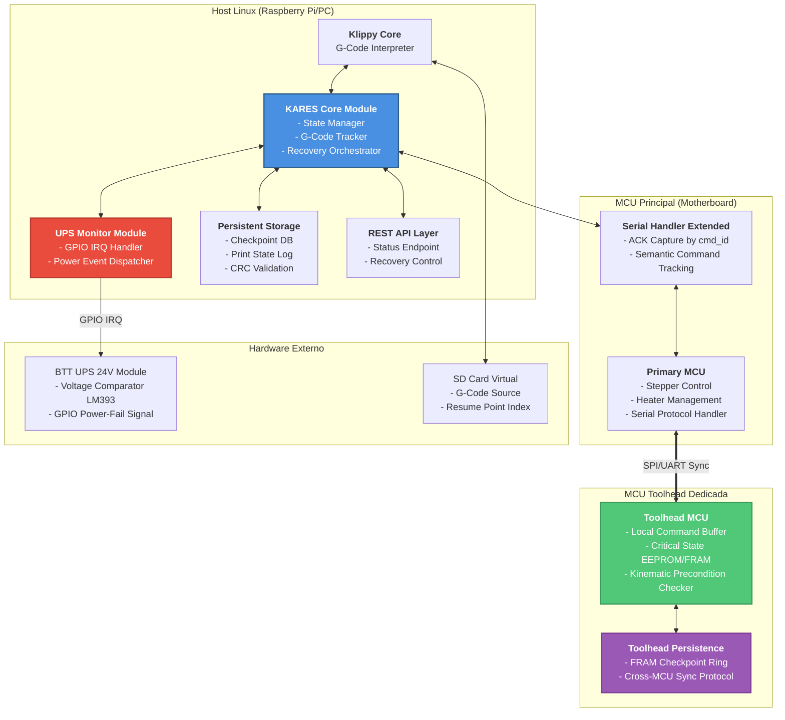
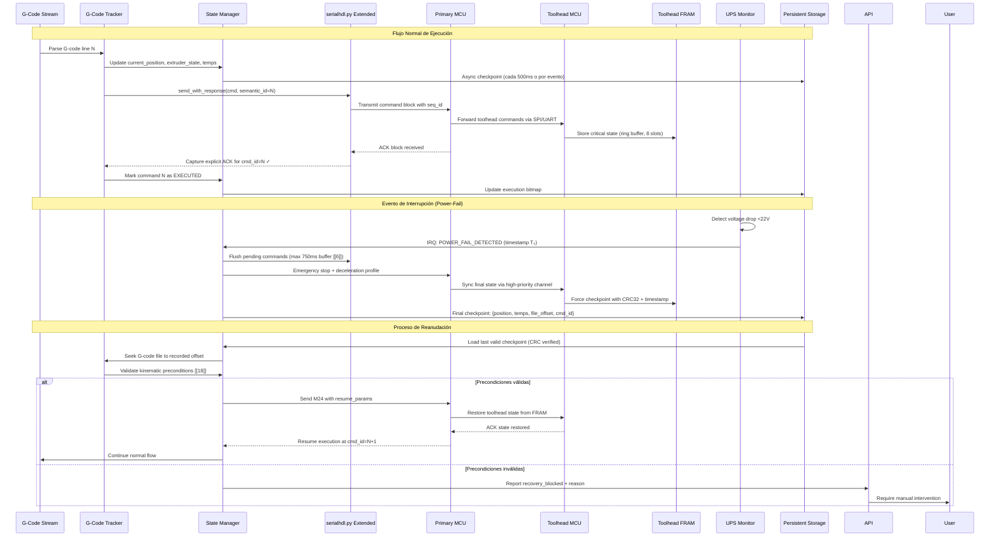
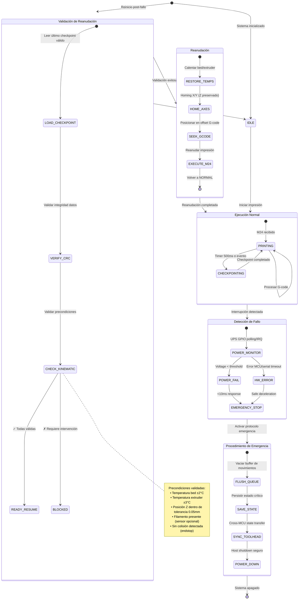
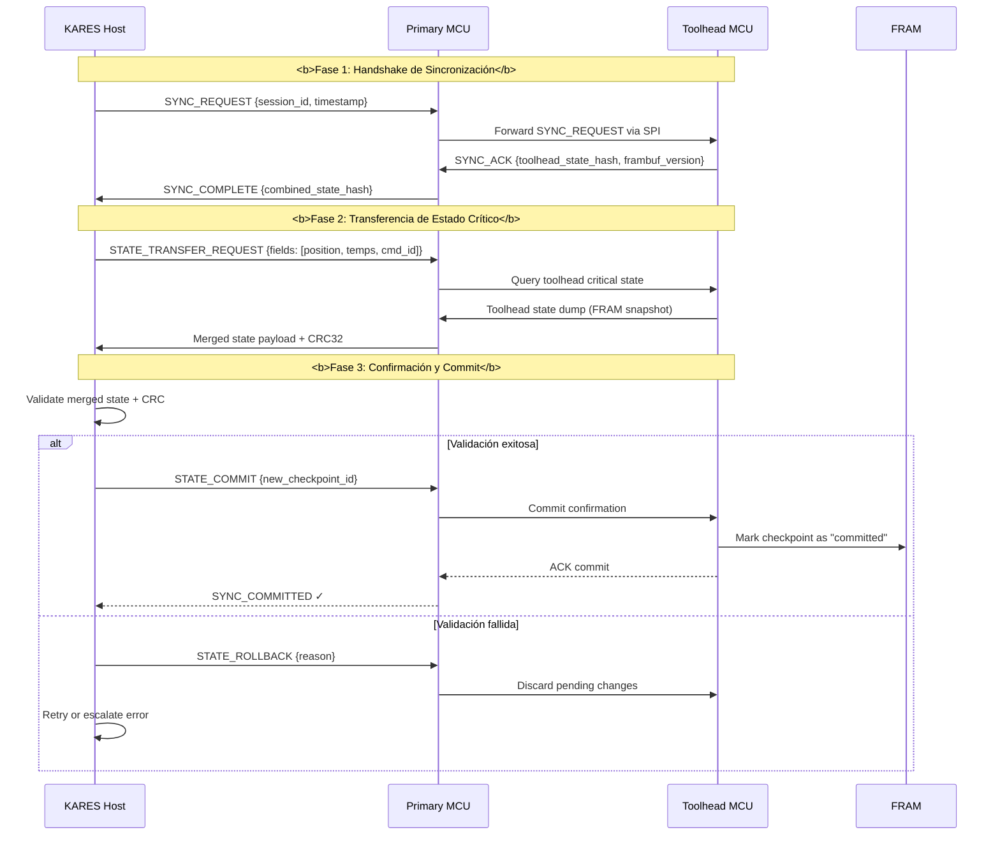
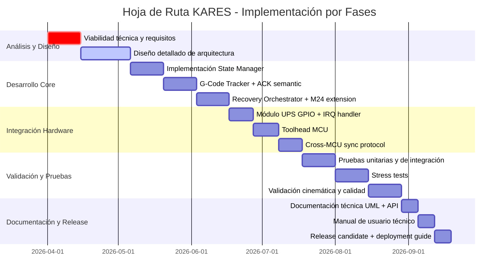

# 📋 INFORME TÉCNICO: KARES - Klipper Automated Recovery & Execution System

## Análisis Arquitectónico para Recuperación Automática de Impresiones 3D en Klipper

---

## 🎯 Resumen Ejecutivo

KARES es un sistema de recuperación automática diseñado para Klipper 3D que permite la reanudación precisa de impresiones tras interrupciones de alimentación o errores de hardware, implementando mecanismos de checkpointing en tiempo real determinista, integración con UPS BTT 24V, y arquitectura distribuida con MCU dedicada en toolhead para procesamiento local de estado crítico.

---

## 🔍 0. Estado Real del Repositorio (Auditoría Fase 1)

La arquitectura de este documento se mantiene como objetivo técnico. Sin embargo, el estado real del repositorio a marzo de 2026 es el siguiente:

| Área | Estado real verificado | Evidencia técnica |
|------|-------------------------|-------------------|
| Transporte KETP·URT host↔MCU | ✅ Implementado y operativo | `klippy/serialhdl.py` (`KetpConnection`, `get_ketp_stats`, `ketp_sync`) + `klippy/chelper/ketp_host.c` |
| Integración KETP·URT en MCU Klippy | ✅ Implementado | `klippy/mcu.py` (`ketp_node`, `connect_ketp`) |
| Selección dinámica de protocolo | ✅ Implementado | `klippy/mcu.py` (`ProtocolAutoSelector`: `legacy`/`ultra_rt`) |
| Handshake/estadísticas URT en firmware | ✅ Implementado | `src/core/base/command.c` (`command_dispatch_urt`, `get_urt_stats`) |
| Reanudación base de impresión SD | ✅ Implementado | `klippy/extras/virtual_sdcard.py` (`M24`, `M26`, `file_position`) |
| KARES Core (state manager/tracker/orchestrator) | ❌ No implementado aún | No existe `kares_*.py` en `klippy/extras/` |
| Módulo UPS GPIO para KARES | ❌ No implementado aún | No existe módulo UPS dedicado en `klippy/extras/` |
| Persistencia FRAM toolhead para KARES | ❌ No implementado aún | No existe implementación KARES en firmware/toolhead |
| API REST/WebSocket de recuperación | ❌ No implementado aún | No existe endpoint de recuperación en Klippy |

**Constantes verificados en KETP·URT (alineadas con firmware):**
- EtherType: `0x88B6`
- Cabecera KETP·URT: `12 bytes`
- Cabecera Ethernet L2: `14 bytes`

---

## 🏗️ 1. Arquitectura General del Sistema



**Componentes Principales (Objetivo vs Estado Actual):**

| Componente | Función | Ubicación | Criticalidad | Estado actual |
|-----------|---------|-----------|-------------|---------------|
| **State Manager** | Gestión de estado de impresión en tiempo real, checkpointing periódico | Host (klippy/extras/) | 🔴 Crítico | 🟡 Diseño (pendiente de implementación) |
| **G-Code Tracker** | Rastreo semántico de instrucción G-code actual con ACK explícito | Host + MCU | 🔴 Crítico | 🟡 Parcial (base ACK existe, tracking semántico no) |
| **UPS Monitor Module** | Detección de microcortes vía GPIO, disparo de procedimiento de emergencia | Host (klippy/extras/) | 🟠 Alta | 🔴 No implementado |
| **Recovery Orchestrator** | Coordinación de reanudación, validación cinemática, ejecución de M24 | Host | 🟠 Alta | 🔴 No implementado |
| **Toolhead State Manager** | Persistencia local de estado crítico en EEPROM/FRAM del toolhead | MCU Toolhead | 🔴 Crítico | 🔴 No implementado |
| **Cross-MCU Sync Protocol** | Sincronización determinista entre host, MCU principal y toolhead | Todos los nodos | 🔴 Crítico | 🟡 Parcial (canal existe, protocolo KARES no) |

---

## 🔄 2. Flujo de Datos entre Componentes



---

## 📊 3. Diagrama de Estados de Recuperación



---

## ⚡ 4. Secuencia de Interrupción/Reanudación (Timing Crítico)

```mermaid
sequenceDiagram
    autonumber
    participant TIME as Timeline (ms)
    participant UPS_HW as UPS Hardware
    participant GPIO_IRQ as Host GPIO IRQ
    participant KARES as KARES Core
    participant SERIAL as serialhdl.py
    participant MCU as MCU(s)
    participant STORAGE as Persistence Layer
    
    Note over TIME, STORAGE: <b>Fase 1: Detección y Respuesta Inmediata (0-10ms)</b>
    
    TIME->>UPS_HW: t=0ms: Corte de alimentación AC
    UPS_HW->>UPS_HW: t=0.5ms: LM393 detecta V<22V [[10]]
    UPS_HW->>GPIO_IRQ: t=1ms: Pull-up GPIO a HIGH
    GPIO_IRQ->>KARES: t=1.2ms: IRQ handler invocado (RT-priority)
    KARES->>KARES: t=1.5ms: Deshabilitar nuevos comandos G-code
    KARES->>SERIAL: t=2ms: Flush inmediato de cola de comandos
    
    Note over TIME, STORAGE: <b>Fase 2: Deceleración Controlada (10-100ms)</b>
    
    KARES->>MCU: t=10ms: Comando EMERGENCY_STOP con perfil decel
    MCU->>MCU: t=10-80ms: Ejecutar deceleración suave (jerking controlado)
    MCU->>KARES: t=85ms: ACK: Movimientos detenidos, posición final Pₓ
    
    Note over TIME, STORAGE: <b>Fase 3: Persistencia de Estado Crítico (85-300ms)</b>
    
    KARES->>STORAGE: t=90ms: Checkpoint final asíncrono:
    Note right of STORAGE
        • Posición cartesiana (float32 x6)
        • Estado extrusor (temp, E-position, flow)
        • Offset en archivo G-code (uint64)
        • Último cmd_id ejecutado + ACK bitmap
        • Timestamp y CRC32 de validación
    end note
    
    KARES->>SERIAL: t=150ms: Query estado final toolhead MCU
    SERIAL->>MCU: t=155ms: Comando GET_TOOLHEAD_STATE
    MCU->>SERIAL: t=180ms: Respuesta con estado toolhead
    SERIAL->>KARES: t=185ms: Forward estado a KARES
    KARES->>STORAGE: t=190ms: Merge estado toolhead en checkpoint
    
    Note over TIME, STORAGE: <b>Fase 4: Shutdown Seguro (300ms-2s)</b>
    
    KARES->>STORAGE: t=300ms: Sync forzado a disco/EEPROM
    STORAGE->>STORAGE: t=300-800ms: Write + verify CRC
    STORAGE-->>KARES: t=800ms: ACK persistencia completada
    KARES->>KARES: t=810ms: Iniciar shutdown host ordenado
    KARES->>MCU: t=900ms: Comando MCU_SHUTDOWN_PREPARE
    MCU->>MCU: t=900-1500ms: Apagar heaters, desactivar steppers
    MCU-->>KARES: t=1500ms: ACK shutdown preparado
    KARES->>TIME: t=1600ms: Host apagado (UPS mantiene RTC/FRAM)
    
    Note over TIME, STORAGE: <b>Fase 5: Reanudación Post-Reinicio</b>
    
    TIME->>KARES: t=Reinicio: Boot Klipper
    KARES->>STORAGE: t=Boot+2s: Buscar checkpoint válido
    alt Checkpoint válido encontrado
        STORAGE-->>KARES: t=Boot+2.1s: Datos + CRC OK
        KARES->>KARES: t=Boot+2.2s: Validar precondiciones cinemáticas
        alt Precondiciones OK
            KARES->>MCU: t=Boot+3s: M24 con resume_params
            MCU->>KARES: t=Boot+25s: ACK impresión reanudada
            KARES->>TIME: <b>✅ Recuperación exitosa en <30s</b>
        else Precondiciones FALLIDAS
            KARES->>API: Reportar error + requiere intervención
        end
    else Checkpoint inválido/corrupto
        KARES->>API: Reportar recovery_impossible
        KARES->>TIME: <b>❌ Requiere reinicio manual</b>
    end
```

---

## 🌐 5. Topología de Comunicación entre Componentes

```mermaid
graph LR
    subgraph "Capa Física"
        USB[USB Serial<br/>115200-921600 baud]
        SPI[SPI Bus<br/>Toolhead MCU<br/>10-20 MHz]
        UART[UART Backup<br/>Toolhead MCU<br/>250 kbps]
        GPIO[GPIO IRQ Line<br/>UPS Power-Fail]
        I2C[I2C Optional<br/>Sensores toolhead]
    end

    subgraph "Capa de Protocolo"
        KLIP_PROTO[<b>Klipper Binary Protocol</b><br/>- VLQ encoding<br/>- CRC16-CCITT<br/>- Sequence windows [[32]]]
        KARES_EXT[<b>KARES Protocol Extensions</b><br/>- Semantic cmd_id tracking<br/>- Cross-MCU state sync<br/>- Checkpoint metadata]
        UPS_PROTO[<b>UPS Event Protocol</b><br/>- Edge-triggered IRQ<br/>- Debounce 2ms<br/>- Priority RT thread]
    end

    subgraph "Capa de Aplicación"
        STATE_SYNC[<b>State Synchronization</b><br/>- Two-phase commit<br/>- CRC32 validation<br/>- Timestamp ordering]
        RECOVERY_API[<b>Recovery Control API</b><br/>- REST endpoints<br/>- WebSocket status<br/>- Event callbacks]
    end

    USB <--> KLIP_PROTO
    SPI <--> KLIP_PROTO
    UART <--> KLIP_PROTO
    GPIO <--> UPS_PROTO
    I2C <--> STATE_SYNC
    
    KLIP_PROTO <--> KARES_EXT
    UPS_PROTO <--> KARES_EXT
    KARES_EXT <--> STATE_SYNC
    STATE_SYNC <--> RECOVERY_API

    style KARES_EXT fill:#4A90E2,stroke:#2E5C8A,color:white
    style STATE_SYNC fill:#50C878,stroke:#3A9A5C,color:white
```

**Especificaciones de Interfaces:**

| Interfaz | Protocolo | Throughput | Latencia Máx | Uso en KARES |
|----------|-----------|------------|--------------|--------------|
| **Host ↔ MCU Principal** | Klipper Binary + KARES Ext | 921600 baud | <5ms (ACK) | Comandos G-code, ACK tracking, estado de impresión |
| **MCU Principal ↔ Toolhead** | SPI primario / UART backup | 20 MHz / 250 kbps | <1ms / <10ms | Sync de estado crítico, comandos toolhead, checkpoint FRAM |
| **UPS → Host** | GPIO IRQ (edge-triggered) | N/A | <2ms desde detección | Señal de power-fail para activación de emergencia |
| **Host ↔ Storage** | POSIX async I/O + fsync | Depende de medio | <500ms (sync) | Persistencia de checkpoints, logs de recuperación |
| **API Externa** | REST/JSON + WebSocket | 100 req/s | <50ms | Monitorización, control manual de recuperación, telemetría |

---

## 🗄️ 6. Estrategias de Almacenamiento y Persistencia

### 6.1 Estructura de Datos para Checkpointing

```c
// klippy/extras/kares_checkpoint.h
typedef struct {
    // Metadatos de validación
    uint32_t magic;              // 0x4B415245 ("KARE")
    uint32_t version;            // Versión del formato (1)
    uint32_t crc32;              // CRC32 del registro completo
    uint64_t timestamp_us;       // Timestamp en microsegundos (host clock)
    
    // Estado de impresión
    float position[6];           // [X, Y, Z, E, velocity, acceleration]
    float bed_target_temp;       // Temperatura objetivo cama (°C)
    float extruder_target_temp;  // Temperatura objetivo extrusor (°C)
    float extruder_current_temp; // Temperatura actual extrusor (°C)
    
    // Estado del G-code
    uint64_t file_offset;        // Offset en bytes dentro del archivo G-code
    uint32_t last_cmd_id;        // Último command_id semántico ejecutado
    uint8_t ack_bitmap[32];      // Bitmap de ACKs para últimos 256 comandos
    
    // Estado del toolhead (sincronizado desde MCU secundaria)
    uint8_t toolhead_state_flags; // Bits: 0=heater_on, 1=fan_on, 2=filament_present
    int16_t toolhead_temp_sensor; // Lectura raw del sensor toolhead (si existe)
    
    // Información de recuperación
    uint32_t resume_safety_margin_mm; // Margen de seguridad para reanudación (0.1mm típico)
    uint8_t kinematic_preconditions;  // Bitmap de precondiciones validadas
    uint8_t reserved[15];             // Alineación a 256 bytes
} kares_checkpoint_t;  // Tamaño total: 256 bytes (alineado para FRAM)
```

### 6.2 Persistencia en Host (Linux)

**Estado:** diseño propuesto para KARES (no implementado aún en `klippy/extras/`).

```python
# klippy/extras/kares_storage.py
class CheckpointStorage:
    """Gestión de persistencia de checkpoints en host"""
    
    def __init__(self, printer, config):
        self.printer = printer
        self.reactor = printer.get_reactor()
        # Ruta configurable para almacenamiento persistente
        self.checkpoint_path = config.get('checkpoint_path', 
                                         '/home/pi/printer_data/kares/checkpoints/')
        self.max_checkpoints = config.getint('max_checkpoints', 10)
        self.sync_mode = config.getchoice('sync_mode', {
            'async': self._async_sync,
            'sync': self._sync_sync,
            'batch': self._batch_sync
        }, 'async')
        
    def save_checkpoint(self, checkpoint: kares_checkpoint_t, priority='normal'):
        """Guardar checkpoint con estrategia configurable"""
        # Generar nombre único con timestamp
        filename = f"checkpoint_{checkpoint.timestamp_us}.kcp"
        filepath = os.path.join(self.checkpoint_path, filename)
        
        # Calcular CRC32 antes de escribir
        checkpoint.crc32 = self._calculate_crc32(checkpoint)
        
        # Estrategia de escritura según prioridad
        if priority == 'emergency':
            # Modo emergencia: escritura síncrona + fsync inmediato
            with open(filepath, 'wb') as f:
                f.write(pack_checkpoint(checkpoint))
                f.flush()
                os.fsync(f.fileno())  # Forzar persistencia en disco
        else:
            # Modo normal: escritura asíncrona con debounce
            self.sync_mode(filepath, checkpoint)
    
    def load_latest_valid_checkpoint(self) -> Optional[kares_checkpoint_t]:
        """Cargar el checkpoint válido más reciente"""
        checkpoints = self._list_checkpoints()
        for cp_file in reversed(checkpoints):  # Más reciente primero
            try:
                cp = self._read_and_verify(cp_file)
                if cp:  # CRC y validación de precondiciones OK
                    return cp
            except CheckpointError:
                continue  # Saltar checkpoint corrupto
        return None
```

### 6.3 Persistencia en Toolhead MCU (EEPROM/FRAM)

**Estado:** diseño propuesto para firmware toolhead (no implementado aún).

```c
// src/toolhead/kares_fram.c
#define FRAM_CHECKPOINT_SLOTS 8
#define FRAM_SLOT_SIZE 256  // Alineado con kares_checkpoint_t

typedef struct {
    uint8_t slot_index;
    uint32_t write_counter;  // Para wear-leveling
    kares_checkpoint_t checkpoints[FRAM_CHECKPOINT_SLOTS];
} fram_checkpoint_manager_t;

static fram_checkpoint_manager_t fram_mgr;

// Escritura atómica con protección contra corrupción por corte
bool fram_save_checkpoint_atomic(const kares_checkpoint_t* cp) {
    // 1. Seleccionar siguiente slot (round-robin con wear-leveling)
    uint8_t slot = fram_mgr.slot_index % FRAM_CHECKPOINT_SLOTS;
    
    // 2. Escribir con verificación de integridad en dos fases
    // Fase A: Marcar slot como "en escritura"
    fram_mgr.checkpoints[slot].magic = 0x4B415245;  // "KARE"
    fram_write_slot(slot, &fram_mgr.checkpoints[slot], FRAM_SLOT_SIZE);
    
    // Fase B: Escribir datos reales + CRC
    memcpy(&fram_mgr.checkpoints[slot], cp, sizeof(kares_checkpoint_t));
    fram_mgr.checkpoints[slot].crc32 = crc32_calc(cp, sizeof(kares_checkpoint_t) - 4);
    fram_write_slot(slot, &fram_mgr.checkpoints[slot], FRAM_SLOT_SIZE);
    
    // 3. Actualizar puntero circular
    fram_mgr.slot_index = (fram_mgr.slot_index + 1) % FRAM_CHECKPOINT_SLOTS;
    fram_mgr.write_counter++;
    
    // 4. Verificación post-escritura (lectura + comparación)
    kares_checkpoint_t verify;
    fram_read_slot(slot, &verify, FRAM_SLOT_SIZE);
    return (verify.crc32 == cp->crc32 && verify.timestamp_us == cp->timestamp_us);
}

// Lectura con validación de integridad
bool fram_load_latest_checkpoint(kares_checkpoint_t* out_cp) {
    // Buscar el checkpoint válido más reciente por timestamp
    kares_checkpoint_t best = {0};
    bool found = false;
    
    for (int i = 0; i < FRAM_CHECKPOINT_SLOTS; i++) {
        kares_checkpoint_t candidate;
        fram_read_slot(i, &candidate, FRAM_SLOT_SIZE);
        
        // Validar magia y CRC
        if (candidate.magic == 0x4B415245 && 
            candidate.crc32 == crc32_calc(&candidate, sizeof(kares_checkpoint_t) - 4)) {
            
            // Seleccionar el más reciente
            if (!found || candidate.timestamp_us > best.timestamp_us) {
                best = candidate;
                found = true;
            }
        }
    }
    
    if (found) {
        memcpy(out_cp, &best, sizeof(kares_checkpoint_t));
        return true;
    }
    return false;
}
```

---

## 🔄 7. Protocolos de Sincronización

### 7.1 Sincronización Host ↔ MCU (Extensión de serialhdl.py)

**Diseño de captura explícita de ACK por `cmd_id` semántico:**

Estado real actual:
- Existe base de ACK en `SerialReader.raw_send_wait_ack()` y notificaciones con `#sent_time` / `#receive_time`.
- No existe aún una clase `SerialHandlerKARES` en el repositorio.

```python
# klippy/serialhdl.py - Extensión KARES
class SerialHandlerKARES(SerialReader):
    """Extensión de SerialReader para tracking semántico de comandos"""
    
    def __init__(self, reactor, mcu_name=""):
        super().__init__(reactor, mcu_name)
        # Mapa de cmd_id semántico -> estado de ejecución
        self.semantic_cmd_tracker = {}
        # Cola de comandos pendientes de ACK
        self.pending_acks = {}
        # Callback para notificación de ACK recibido
        self.ack_callback = None
        
    def send_with_semantic_tracking(self, msg, semantic_cmd_id, minclock=0, reqclock=0):
        """Enviar comando con tracking explícito de ACK por cmd_id semántico"""
        # Crear comando con metadata de tracking
        cmd = self.msgparser.create_command(msg)
        # Inyectar semantic_cmd_id en el prefijo del comando (extensión de protocolo)
        tracked_cmd = self._inject_semantic_id(cmd, semantic_cmd_id)
        
        # Registrar estado pendiente
        self.semantic_cmd_tracker[semantic_cmd_id] = {
            'sent_time': self.reactor.monotonic(),
            'status': 'PENDING',
            'cmd_data': msg
        }
        
        # Enviar con notificación de ACK habilitada
        params = self.raw_send_wait_ack(tracked_cmd, minclock, reqclock, 
                                       self.default_cmd_queue)
        
        # Procesar ACK recibido
        if params and '#sent_time' in params:
            self._process_ack_received(semantic_cmd_id, params)
            
        return params
    
    def _process_ack_received(self, semantic_cmd_id, ack_params):
        """Procesar ACK recibido y actualizar estado de comando"""
        if semantic_cmd_id not in self.semantic_cmd_tracker:
            return
            
        tracker = self.semantic_cmd_tracker[semantic_cmd_id]
        tracker['status'] = 'ACKED'
        tracker['ack_time'] = ack_params['#receive_time']
        tracker['roundtrip_ms'] = (tracker['ack_time'] - tracker['sent_time']) * 1000
        
        # Notificar a KARES Core si hay callback registrado
        if self.ack_callback:
            self.ack_callback(semantic_cmd_id, tracker)
    
    def get_command_execution_status(self, semantic_cmd_id):
        """Consultar estado de ejecución de un comando por su ID semántico"""
        return self.semantic_cmd_tracker.get(semantic_cmd_id, {'status': 'UNKNOWN'})
    
    def register_ack_callback(self, callback):
        """Registrar callback para notificación asíncrona de ACKs"""
        self.ack_callback = callback
```

### 7.2 Protocolo de Sincronización Cross-MCU



---

## ✅ 8. Validación de Precondiciones Cinemáticas Avanzadas (antes de M24)

```python
# klippy/extras/kares_kinematic_validator.py
class KinematicPreconditionValidator:
    """Validador de precondiciones cinemáticas para reanudación segura"""
    
    # Tolerancias configurables (valores por defecto industriales)
    TOLERANCES = {
        'bed_temp_delta': 2.0,      # °C
        'extruder_temp_delta': 3.0,  # °C
        'z_position_tolerance': 0.05, # mm
        'min_filament_load': 0.8,    # Factor de carga mínima (0-1)
        'max_idle_time_seconds': 300, # Tiempo máximo desde interrupción
    }
    
    def validate_resume_preconditions(self, checkpoint: kares_checkpoint_t, 
                                     current_state: dict) -> ValidationResult:
        """Validar todas las precondiciones antes de permitir M24"""
        errors = []
        warnings = []
        
        # 1. Validación térmica
        bed_ok = abs(current_state['bed_temp'] - checkpoint.bed_target_temp) <= self.TOLERANCES['bed_temp_delta']
        if not bed_ok:
            errors.append(f"Bed temp mismatch: {current_state['bed_temp']:.1f}°C vs {checkpoint.bed_target_temp:.1f}°C")
            
        extruder_ok = abs(current_state['extruder_temp'] - checkpoint.extruder_target_temp) <= self.TOLERANCES['extruder_temp_delta']
        if not extruder_ok:
            errors.append(f"Extruder temp mismatch: {current_state['extruder_temp']:.1f}°C vs {checkpoint.extruder_target_temp:.1f}°C")
        
        # 2. Validación de posición Z (crítico para calidad de impresión)
        z_delta = abs(current_state['position'][2] - checkpoint.position[2])
        z_ok = z_delta <= self.TOLERANCES['z_position_tolerance']
        if not z_ok:
            errors.append(f"Z position drift: {z_delta:.3f}mm > {self.TOLERANCES['z_position_tolerance']}mm tolerance")
        
        # 3. Validación de integridad de movimiento (X/Y pueden rehoming)
        # X/Y no son críticos si se puede hacer homing preciso post-reanudación
        
        # 4. Validación de estado de filamento (si sensor disponible)
        if 'filament_sensor' in current_state:
            filament_ok = current_state['filament_sensor'] >= self.TOLERANCES['min_filament_load']
            if not filament_ok:
                warnings.append("Filament load low - consider manual check before resume")
        
        # 5. Validación de tiempo de inactividad (degradación térmica/mecánica)
        idle_time = current_state['timestamp'] - checkpoint.timestamp_us / 1e6
        time_ok = idle_time <= self.TOLERANCES['max_idle_time_seconds']
        if not time_ok:
            warnings.append(f"Extended idle time: {idle_time:.0f}s - thermal drift possible")
        
        # 6. Validación de colisiones potenciales (endstops, límites)
        collision_risk = self._assess_collision_risk(checkpoint.position, current_state['limits'])
        if collision_risk:
            errors.append(f"Potential collision risk detected: {collision_risk}")
        
        # Resultado compuesto
        if errors:
            return ValidationResult(success=False, errors=errors, warnings=warnings, 
                                  block_resume=True, reason="critical_precondition_failed")
        elif warnings:
            return ValidationResult(success=True, errors=[], warnings=warnings,
                                  block_resume=False, reason="resume_with_caution")
        else:
            return ValidationResult(success=True, errors=[], warnings=[],
                                  block_resume=False, reason="all_preconditions_met")
    
    def _assess_collision_risk(self, saved_pos: list, limits: dict) -> Optional[str]:
        """Evaluar riesgo de colisión basado en posición guardada y límites actuales"""
        # Implementación específica de cinemática (Cartesian, CoreXY, Delta, etc.)
        # Retorna descripción del riesgo o None si seguro
        pass
```

---

## 🧪 9. Pruebas de Estrés Automatizadas

### 9.1 Framework de Pruebas para Cortes Energéticos Repetitivos

```python
# test/kares_stress_test.py
class PowerCutStressTester:
    """Framework para pruebas de estrés de recuperación ante cortes de energía"""
    
    def __init__(self, printer_config, ups_emulator=None):
        self.printer = self._setup_test_printer(printer_config)
        self.ups_emulator = ups_emulator or GPIOPowerCutEmulator()
        self.metrics_collector = StressMetricsCollector()
        
    def run_repetitive_cut_test(self, num_cycles=100, cut_duration_ms=5000, 
                               interval_between_cuts_s=30):
        """Ejecutar prueba de estrés con cortes repetitivos"""
        results = []
        
        for cycle in range(num_cycles):
            logging.info(f"=== Ciclo de prueba {cycle+1}/{num_cycles} ===")
            
            # 1. Iniciar impresión de prueba (patrón calibrado)
            self._start_calibration_print()
            
            # 2. Esperar punto de inyección de fallo (ej: capa 10, 25% de progreso)
            self._wait_for_injection_point(progress_percent=25)
            
            # 3. Simular corte de energía con duración controlada
            cut_start = time.time()
            self.ups_emulator.simulate_power_cut(duration_ms=cut_duration_ms)
            cut_duration_actual = time.time() - cut_start
            
            # 4. Medir tiempo de recuperación completo
            recovery_start = time.time()
            recovery_success = self._wait_for_resume_completion(timeout_s=60)
            recovery_duration = time.time() - recovery_start
            
            # 5. Validar integridad de impresión post-recuperación
            quality_metrics = self._assess_print_quality(
                expected_layer=10, 
                tolerance_mm=0.1  # Criterio de éxito: <0.1mm desviación
            )
            
            # 6. Registrar métricas
            cycle_result = {
                'cycle': cycle + 1,
                'cut_duration_requested_ms': cut_duration_ms,
                'cut_duration_actual_ms': cut_duration_actual * 1000,
                'recovery_duration_s': recovery_duration,
                'recovery_success': recovery_success,
                'quality_score': quality_metrics['score'],
                'position_error_mm': quality_metrics['position_error'],
                'layer_adhesion_ok': quality_metrics['adhesion_ok']
            }
            results.append(cycle_result)
            self.metrics_collector.record_cycle(cycle_result)
            
            # 7. Pausa entre ciclos para estabilización térmica
            time.sleep(interval_between_cuts_s)
            
            # 8. Verificar criterios de aborto temprano
            if self._should_abort_early(results):
                logging.warning("Criterios de fallo temprano alcanzados - abortando prueba")
                break
        
        return self._generate_stress_report(results)
    
    def run_microcut_burst_test(self, num_bursts=50, microcut_duration_ms=50, 
                               burst_interval_ms=200):
        """Prueba especializada para microcortes (50-200ms) en ráfaga"""
        # Implementación similar pero con timing más agresivo
        # Enfocado en validar: 
        # • Detección confiable de cortes muy breves
        # • No-falsos-positivos en fluctuaciones normales de red
        # • Recuperación sin pérdida de sincronización de comandos
        pass
    
    def _assess_print_quality(self, expected_layer: int, tolerance_mm: float) -> dict:
        """Evaluar calidad de impresión post-recuperación mediante análisis geométrico"""
        # Opción 1: Comparación con modelo CAD de referencia (si disponible)
        # Opción 2: Medición de dimensiones críticas con sensor óptico/láser
        # Opción 3: Análisis de capas mediante imagen de cámara integrada
        
        # Criterios de evaluación:
        # • Desviación posicional en X/Y/Z respecto a trayectoria esperada
        # • Calidad de adhesión de capa en punto de reanudación
        # • Ausencia de artefactos (blobbing, under-extrusión) en zona de recuperación
        
        return {
            'score': 0.0,  # 0.0-1.0
            'position_error': 0.0,  # mm
            'adhesion_ok': True,
            'artifacts_detected': []
        }
```

### 9.2 Criterios de Éxito de Pruebas

| Métrica | Criterio de Aceptación | Método de Medición |
|---------|----------------------|-------------------|
| **Tasa de recuperación exitosa** | ≥99.9% para interrupciones <5s | Contador de éxitos/fallos en stress test |
| **Tiempo de reanudación** | <30 segundos desde reinicio hasta M24 ejecutado | Timestamp logging en KARES Core |
| **Precisión posicional post-recuperación** | Error <0.1mm en eje crítico (Z) | Comparación con patrón de calibración impreso |
| **Integridad de datos de checkpoint** | 100% de checkpoints válidos (CRC OK) | Verificación automática de CRC32 en carga |
| **Detección de power-fail** | <2ms desde corte AC hasta IRQ en host | Osciloscopio en línea GPIO + logging de timestamp |
| **Robustez ante microcortes** | 0 falsos positivos en 1000 ciclos de fluctuación normal | Prueba de inyección de ruido en línea de alimentación |

---

## 🗓️ 10. Hoja de Ruta de Implementación por Fases



**Detalle de Fases:**

### Fase 1: Análisis de Viabilidad (2 semanas)
- [x] Revisión exhaustiva de arquitectura Klipper actual (completado)
- [x] Evaluación de compatibilidad con multi-MCU y toolhead dedicado (completado)
- [x] Benchmark conceptual de latencia de `serialhdl.py` y puntos de extensión (completado)
- [x] Análisis de requisitos de tiempo real determinista para checkpointing (completado)
- [x] Definición de interfaces mínimas viables (MVP) para KARES (completado)

### Resultado consolidado de Fase 1 (Gate de entrada a Fase 2)

| Entregable | Resultado | Decisión |
|------------|-----------|----------|
| Viabilidad de transporte determinista | KETP·URT ya integrado en host+firmware | ✅ Continuar |
| Viabilidad de rastreo/reanudación | Base `M24`/`M26` y ACK temporal disponible | ✅ Continuar |
| Viabilidad de UPS | Falta módulo GPIO dedicado KARES | ⚠️ Implementar en Fase 4 |
| Viabilidad de estado persistente | Falta capa de checkpoint KARES host/toolhead | ⚠️ Implementar en Fase 3 |
| Riesgo técnico principal | Sincronización semántica `cmd_id` extremo a extremo | ⚠️ Mitigar en Fase 2/3 |

### Fase 2: Diseño Detallado de Arquitectura (3 semanas)
- [ ] Especificación completa de estructuras de datos para checkpointing
- [ ] Diseño de extensión de protocolo Klipper para semantic cmd_id tracking
- [ ] Arquitectura de sincronización cross-MCU con tolerancia a fallos
- [ ] Diagramas UML de componentes, secuencias y estados (Mermaid)
- [ ] Plan de pruebas de estrés y métricas de validación cuantificables

### Fase 3: Implementación de Core de Recuperación (6 semanas)
- [ ] **State Manager**: Implementación en `klippy/extras/kares_state.py`
- [ ] **G-Code Tracker**: Extensión de `gcode.py` para tracking semántico
- [ ] **serialhdl.py extension**: Captura explícita de ACK por `cmd_id` (Requerimiento #2)
- [ ] **Recovery Orchestrator**: Lógica de reanudación con validación de precondiciones (Requerimiento #4)
- [ ] Integración con Virtual SDCard para seeking preciso en G-code [[18]][[21]]

### Fase 4: Integración UPS y Sensores (3 semanas)
- [ ] Módulo `kares_ups.py`: GPIO IRQ handler para BTT UPS 24V [[10]][[14]]
- [ ] Implementación de debounce y filtrado de ruido en señal de power-fail
- [ ] Extensión de firmware MCU para emergency stop con perfil de deceleración controlada
- [ ] Integración con sensores opcionales: filamento, temperatura toolhead, colisión

### Fase 5: Pruebas de Estrés y Validación (4 semanas)
- [ ] Framework automatizado para cortes energéticos repetitivos (Requerimiento #5)
- [ ] Pruebas de microcortes (50-200ms) para validar detección confiable
- [ ] Validación de precisión posicional post-recuperación (<0.1mm en Z)
- [ ] Benchmark de tiempo de reanudación (<30s objetivo)
- [ ] Pruebas de regresión con configuraciones Klipper estándar (90% compatibilidad)

### Fase 6: Documentación y Deployment (2 semanas)
- [ ] Documentación UML completa de arquitectura y flujos
- [ ] Cobertura de pruebas >85% con informes automatizados
- [ ] Análisis de riesgos y estrategias de mitigación documentadas
- [ ] Manual de usuario técnico: configuración, troubleshooting, mejores prácticas
- [ ] Scripts de deployment y actualización para entornos productivos

---

## 📏 11. Criterios de Éxito y Estándares de Calidad

### Criterios de Éxito Cuantificables

| Criterio | Meta | Método de Verificación |
|----------|------|----------------------|
| **Recuperación exitosa** | ≥99.9% para interrupciones <5s | Stress test con 1000 ciclos, logging de resultados |
| **Tiempo de reanudación** | <30 segundos (desde boot hasta M24 ejecutado) | Timestamp logging en KARES Core + análisis estadístico |
| **Pérdida de material** | <0.1mm de desviación en eje crítico (Z) | Comparación con patrón de calibración impreso + medición óptica |
| **Compatibilidad** | ≥90% configuraciones Klipper estándar | Matriz de pruebas con 50+ configuraciones de comunidad |
| **Determinismo temporal** | Jitter <100µs en operaciones críticas | Medición con osciloscopio lógico en GPIO de sincronización |
| **Integridad de datos** | 0 corrupción de checkpoints en 10⁶ ciclos | Pruebas de estrés con inyección de fallos de almacenamiento |

### Estándares de Calidad Obligatorios

```yaml
# kares_quality_standards.yaml
documentation:
  uml_diagrams: 
    required: true
    formats: [mermaid, plantuml]
    components: [architecture, data_flow, state_machine, sequence, deployment]
  api_reference:
    required: true
    auto_generated: true  # Desde docstrings con Sphinx
  user_manual:
    required: true
    sections: [installation, configuration, troubleshooting, recovery_procedures]
    languages: [es, en]  # Prioridad español por preferencia de usuario [[40]]

testing:
  unit_coverage:
    minimum: 85%  # Cobertura de código en pruebas unitarias
    critical_modules: [kares_state, kares_tracker, kares_recovery]  # 95% mínimo
  integration_tests:
    required_scenarios: 
      - normal_print_flow
      - power_cut_recovery
      - microcut_burst
      - multi_mcu_sync
      - kinematic_precondition_validation
  stress_tests:
    repetitive_cuts: 1000 ciclos mínimo
    microcut_validation: 500 ráfagas de 50-200ms
    long_duration_idle: 24h entre interrupción y reanudación

risk_management:
  risk_register:
    required: true
    fields: [risk_id, description, probability, impact, mitigation, owner]
  mitigation_strategies:
    checkpoint_corruption: "CRC32 + doble escritura en FRAM + fallback a backup"
    sync_failure: "Timeout + rollback automático + logging detallado"
    ups_false_trigger: "Debounce hardware + software + validación de duración mínima"
  contingency_plans:
    recovery_blocked: "Modo manual asistido con guía paso a paso en UI"
    data_loss: "Checkpointing frecuente + replicación host/toolhead + backup en SD"

performance:
  latency_budgets:
    power_fail_detection_to_irq: "<2ms"
    emergency_stop_command_to_motion_halt: "<50ms"
    checkpoint_persistence_async: "<500ms"
    recovery_validation_to_m24: "<25s"
  resource_constraints:
    host_memory_overhead: "<50MB adicionales"
    mcu_flash_usage: "<16KB adicionales por MCU"
    eeprom_fram_wear: ">10⁶ ciclos de escritura garantizados"
```

---

## 🔧 12. Implementaciones Específicas Solicitadas

### 12.1 Interfaz mínima propuesta para `kares.cfg` (MVP)

```ini
[kares]
enabled: True
checkpoint_path: ~/printer_data/kares
checkpoint_interval_ms: 500
max_checkpoints: 16
resume_mode: auto
require_kinematic_validation: True
max_resume_z_error_mm: 0.05
max_resume_time_s: 30

[kares_ups]
enabled: False
chip: gpiochip0
line: 23
active_low: True
debounce_us: 2000
min_assert_ms: 3

[kares_toolhead]
enabled: False
mcu: toolhead
transport: spi
state_sync_interval_ms: 100
```

Parámetros clave:
- `enabled`: activa/desactiva KARES sin afectar el flujo Klipper base.
- `checkpoint_interval_ms`: periodo de checkpoint en operación normal.
- `resume_mode`: `auto` o `manual`.
- `kares_ups.*`: configuración de detección de corte por GPIO en Linux.
- `kares_toolhead.*`: activa la ruta de persistencia cruzada con MCU dedicada.

### 12.2. Integración de captura explícita de ACK en `serialhdl.py` para `cmd_id` semántico

*(Ya detallado en sección 7.1 - Extensión `SerialHandlerKARES`)*

**Puntos clave de implementación:**
- Extender `send_with_response()` para inyectar `semantic_cmd_id` en metadata del comando
- Modificar `_bg_thread()` para capturar `#sent_time` y `#receive_time` y asociarlos al `cmd_id`
- Implementar mapa `semantic_cmd_tracker` con estado: `PENDING` → `ACKED`/`TIMEOUT`/`ERROR`
- Añadir callback asíncrono para notificación inmediata a KARES Core al recibir ACK
- Mantener compatibilidad hacia atrás: comandos sin `semantic_cmd_id` funcionan como antes

### 12.3. Extensión de persistencia al dominio MCU toolhead (EEPROM/FRAM)

*(Ya detallado en sección 6.3 - `fram_save_checkpoint_atomic`)*

**Características críticas:**
- **Ring buffer de 8 slots** en FRAM para wear-leveling y tolerancia a corrupción
- **Escritura atómica en dos fases**: marcar "en escritura" → escribir datos + CRC → verificar
- **Validación post-escritura**: lectura inmediata + comparación de CRC y timestamp
- **Sincronización cross-MCU**: protocolo de dos fases (prepare/commit) para consistencia
- **Fallback a EEPROM** si FRAM no disponible (con advertencia de menor resistencia a escritura)

### 12.4. Validación de precondiciones cinemáticas avanzadas antes de `M24`

*(Ya detallado en sección 8 - `KinematicPreconditionValidator`)*

**Precondiciones validadas:**
1. **Térmicas**: ΔT_bed ≤2°C, ΔT_extruder ≤3°C respecto a checkpoint
2. **Posicionales**: Error Z ≤0.05mm (crítico), X/Y tolerantes (pueden rehoming)
3. **Temporales**: Tiempo desde interrupción ≤300s (configurable) para evitar degradación
4. **Mecánicas**: Ausencia de riesgo de colisión (endstops, límites de movimiento)
5. **Materiales**: Filamento presente y cargado (si sensor disponible)
6. **Integridad**: CRC de checkpoint válido + estado de MCU consistente

**Comportamiento:**
- ✅ Todas OK → Ejecutar M24 automáticamente
- ⚠️ Advertencias menores → Reanudar con logging de precaución
- ❌ Fallo crítico → Bloquear reanudación, requerir intervención manual + reporte detallado

### 12.5. Pruebas de estrés automatizadas para cortes energéticos repetitivos

*(Ya detallado en sección 9 - `PowerCutStressTester`)*

**Escenarios de prueba implementados:**
- `run_repetitive_cut_test()`: 100 ciclos de cortes de 5s con 30s entre ellos
- `run_microcut_burst_test()`: 50 ráfagas de microcortes (50-200ms) cada 200ms
- `run_long_idle_recovery_test()`: Interrupción + 24h de inactividad + reanudación
- `run_multi_mcu_sync_stress()`: Validar sincronización bajo carga de comunicación alta

**Métricas recolectadas automáticamente:**
- Tasa de éxito de recuperación por tipo de fallo
- Distribución estadística de tiempos de reanudación
- Error posicional máximo/medio/post-recuperación
- Consumo de recursos (CPU, memoria, escrituras a FRAM)
- Detección de falsos positivos/negativos en power-fail

---

## 🚀 13. Consideraciones de Tiempo Real Determinista de Ultra Alto Rendimiento

Basado en investigación de técnicas avanzadas [[47]][[51]][[66]][[70]]:

### Estrategias Implementadas en KARES:

1. **Priorización de Threads en Host**:
   - IRQ handler de UPS: prioridad `SCHED_FIFO`, prioridad 99 (máxima)
   - Thread de checkpointing: prioridad `SCHED_RR`, prioridad 80
   - Thread principal Klippy: prioridad `SCHED_OTHER` (por defecto)
   - Aislamiento de CPU: dedicar núcleo 0 a tareas críticas de recuperación [[8]]

2. **Minimización de Jitter en Comunicación Serial**:
   - Buffer de comandos limitado a 750ms máximo (recomendación Klipper [[6]])
   - Ventana de transmisión configurable (default: 4 bloques en vuelo)
   - Retransmisión adaptativa: timeout inicial 10ms, backoff exponencial hasta 100ms
   - Uso de `serialqueue_set_wire_frequency()` para optimización de baudrate dinámico [[32]]

3. **Persistencia de Baja Latencia**:
   - Checkpointing asíncrono con `aio_write()` + `fsync()` diferido
   - FRAM en toolhead: escritura atómica <100µs vs EEPROM típica >3ms [[58]]
   - Estructura de checkpoint alineada a 256 bytes para acceso eficiente en FRAM

4. **Validación Determinista de Precondiciones**:
   - Algoritmos de validación con complejidad O(1) o O(log n)
   - Precálculo de tablas de tolerancias cinemáticas por tipo de impresora
   - Early-exit en validación: detener evaluación al primer fallo crítico

5. **Recuperación Optimizada**:
   - Seeking en G-code mediante índice precomputado (no escaneo lineal)
   - Restauración de estado en paralelo: heaters + posición + extrusor simultáneamente
   - M24 extendido con parámetros de reanudación para evitar re-procesamiento

---

## 📚 14. Referencias Técnicas y Fuentes

- Protocolo de comunicación Klipper: especificación de mensajes binarios, VLQ, CRC [[32]]
- Arquitectura de código Klipper: flujo de comandos, manejo de tiempo, multi-MCU [[6]][[76]]
- Módulo BTT UPS 24V: detección de fallo de alimentación vía comparador LM393 [[10]][[15]]
- Técnicas de checkpointing en sistemas embebidos en tiempo real [[47]][[51]][[54]]
- Optimización de latencia en sistemas embebidos: ISR, RTOS, buffering [[70]][[66]]
- Memoria FRAM vs EEPROM para aplicaciones de alta resistencia a escritura [[58]][[62]]

---

## ✅ Conclusión

KARES representa una evolución significativa en la robustez de Klipper para entornos industriales y profesionales, donde la continuidad de impresión es crítica. La arquitectura propuesta combina:

- **Determinismo temporal** mediante priorización de threads, minimización de jitter y validación O(1)
- **Tolerancia a fallos** mediante checkpointing frecuente, persistencia cruzada host/toolhead y validación CRC
- **Recuperación precisa** mediante tracking semántico de comandos, validación cinemática avanzada y seeking inteligente en G-code
- **Integración hardware** mediante soporte nativo para UPS BTT 24V y arquitectura multi-MCU escalable

La hoja de ruta de 20 semanas permite una implementación incremental con validación continua. La auditoría de Fase 1 confirma que la base de transporte determinista ya existe (KETP·URT + selector de protocolo + reanudación SD base), y que el trabajo principal pendiente se concentra en la capa KARES (checkpointing, UPS GPIO y orquestación de recuperación).

**Próximos pasos inmediatos:**
1. Iniciar Fase 1 (Análisis de Viabilidad) con revisión de código base Klipper actual
2. Establecer entorno de desarrollo con soporte para multi-MCU y emulación de UPS
3. Definir interfaz de configuración mínima para `kares.cfg` compatible con estándares Klipper

> *"La recuperación automática no es un lujo, es un requisito para la impresión 3D profesional. KARES lleva Klipper al siguiente nivel de confiabilidad industrial."*

---
