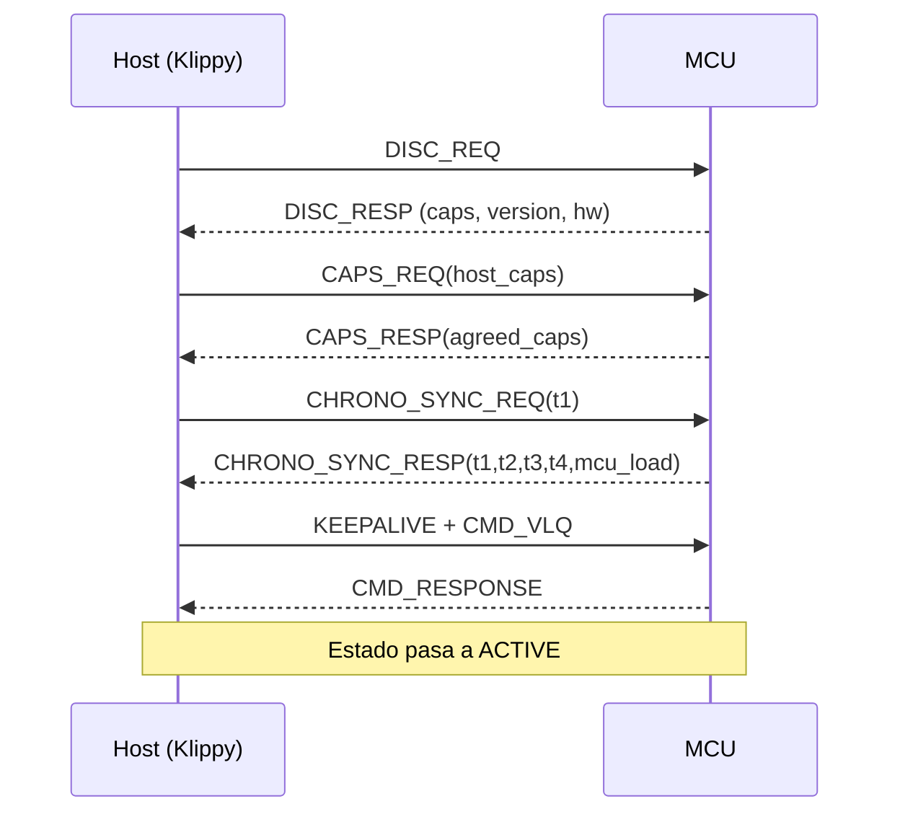
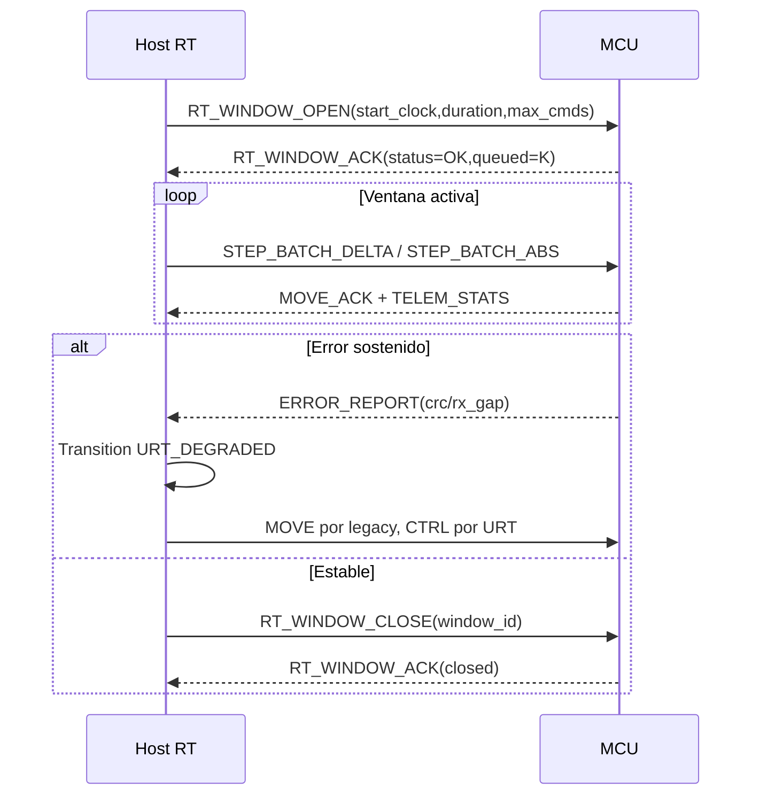

# KETP·URT Marco Unificado v1.1

**Fecha:** 18/03/2026  
**Estado:** Especificación integrada y plan ejecutable  
**Base consolidada:** `Ketp-urt_v1.0.md` + `protocolo_ultraRT.md` + `analisis_compresión.md`

---

## 1. Objetivo y Alcance

Este documento unifica en un único marco coherente:

1. El protocolo normativo KETP·URT de Ethernet L2 determinista.
2. Las extensiones operativas de ultra baja latencia de KlipperURT.
3. La estrategia de compresión por dominio de datos del análisis de compresión.

Resultado: una guía única para implementación MCU y host (Klippy), sin cambios de arquitectura en el stack actual de Klipper, con negociación por capacidades, fallback seguro a canal legacy y despliegue incremental.

---

## 2. Resolución de Conflictos y Normalización

### 2.1 Decisiones de consolidación

| Tema | Opción en conflicto | Decisión unificada |
|---|---|---|
| MAGIC de frame | `0xA7` vs `0xA5` | **`0xA7`** (alineado con KETP·URT normativo) |
| Tamaño frame/payload | hasta 4096 vs Ethernet L2 | **Payload KETP·URT máx 1400 bytes** (margen operativo bajo MTU 1500) |
| Secuencia | 16 bits vs 32 bits | **SEQ/ACK de 32 bits** (robustez de sesión larga) |
| CRC | obligatorio HW vs mixto | **CRC-32/MPEG-2 opcional por `HAS_CRC` + fallback SW** |
| Transporte | serial/UART coexistente vs Ethernet L2 | **Canal unificado principal en Ethernet L2 (0x88B7)**, con coexistencia funcional vía capa de abstracción host |
| Nomenclatura | KlipperURT vs KETP·URT | **Nombre canónico: KETP·URT**; KlipperURT se trata como perfil operacional |

### 2.2 Principios normativos finales

- Determinismo primero: prioridad de scheduling para `MOVE` y `CTRL`.
- Capacidad negociada: toda feature avanzada requiere `AGREED_CAPS`.
- Degradación controlada: fallback automático sin detener impresión.
- Compatibilidad evolutiva: cambios de codec confinados a descriptor + decoder.

---

## 3. Especificación Unificada del Protocolo

## 3.1 Encapsulado de enlace

- Medio: Ethernet MACRAW dedicado.
- EtherType: `0x88B7`.
- Payload Ethernet L2 máximo: 1500 bytes.
- Presupuesto KETP·URT recomendado: 1400 bytes.

## 3.2 Cabecera de frame (15 bytes fijos)

| Offset | Campo | Tipo | Descripción |
|---:|---|---|---|
| 0 | MAGIC | u8 | `0xA7` |
| 1 | VER_FLAGS | u8 | `[7:4] VERSION`, `[3:2] CHAN`, `[1] HAS_CRC`, `[0] FRAG` |
| 2 | SEQ | u32 BE | Secuencia emisor |
| 6 | ACK | u32 BE | Último `SEQ` remoto confirmado |
| 10 | PAYLOAD_LEN | u16 BE | Longitud payload |
| 12 | TIMESTAMP | u24 BE | LSB de ciclo HW |

Reglas:

- `VERSION != 0x1` => descarte.
- `PAYLOAD_LEN > 1400` => descarte.
- `HAS_CRC=1` y CRC inválido => descarte sin procesar subframes.
- `FRAG=1` requiere `KCAP_FRAG` negociado.

## 3.3 Cabecera de subframe (3 bytes fijos)

| Campo | Tipo | Descripción |
|---|---|---|
| SUB_TYPE | u8 | Identificador de mensaje binario |
| SUB_LEN | u16 BE | Longitud del cuerpo |
| SUB_BODY | bytes | Cuerpo de mensaje |

---

## 4. Registro Binario Unificado de Mensajes

## 4.1 Registro de `SUB_TYPE`

| SUB_TYPE | Canal | Nombre | Dirección | Tamaño |
|---|---|---|---|---|
| `0x00` | CMD | CMD_VLQ | H→MCU | variable |
| `0x01` | CMD | CMD_RESPONSE | MCU→H | variable |
| `0x02` | CMD | CMD_ACK_ONLY | bidir | 0..N |
| `0x03` | CMD | CMD_NACK | bidir | 2..N |
| `0x10` | MOVE | STEP_BATCH_DELTA | H→MCU | variable |
| `0x11` | MOVE | STEP_BATCH_ABS | H→MCU | variable |
| `0x12` | MOVE | MOVE_ACK | MCU→H | fijo |
| `0x20` | TELEM | TELEM_SENSOR | MCU→H | variable |
| `0x21` | TELEM | TELEM_ADXL345 | MCU→H | variable |
| `0x22` | TELEM | TELEM_STATS | MCU→H | variable |
| `0x23` | TELEM | TELEM_RESYNC | MCU→H | variable |
| `0x30` | CTRL | CHRONO_SYNC_REQ | H→MCU | 12 |
| `0x31` | CTRL | CHRONO_SYNC_RESP | MCU→H | 20 |
| `0x32` | CTRL | RT_WINDOW_OPEN | H→MCU | 16 |
| `0x33` | CTRL | RT_WINDOW_CLOSE | H→MCU | 2 |
| `0x34` | CTRL | RT_WINDOW_ACK | MCU→H | 10 |
| `0x40` | CTRL | DISC_REQ | H→MCU | 8 |
| `0x41` | CTRL | DISC_RESP | MCU→H | 72 |
| `0x42` | CTRL | DISC_ASSIGN | H→MCU | variable |
| `0x43` | CTRL | DISC_WIFI_CONFIG | H→MCU | variable |
| `0x50` | CTRL | OTA_START | H→MCU | variable |
| `0x51` | CTRL | OTA_DATA | H→MCU | variable |
| `0x52` | CTRL | OTA_END | H→MCU | variable |
| `0x53` | CTRL | OTA_STATUS | MCU→H | variable |
| `0x60` | CTRL | CAPS_REQ | H→MCU | 8 |
| `0x61` | CTRL | CAPS_RESP | MCU→H | 8 |
| `0x70` | CTRL | KEEPALIVE | bidir | 2 |
| `0x71` | CTRL | RESET_REQ | H→MCU | 2 |
| `0x72` | CTRL | ERROR_REPORT | MCU→H | variable |
| `0xFF` | all | PADDING | bidir | variable |

## 4.2 Registro de capacidades (`KCAP_*`)

| Bit | Capacidad | Dominio |
|---:|---|---|
| 0 | `KCAP_STEP_BATCH_DELTA` | MOVE |
| 1 | `KCAP_STEP_BATCH_ABS` | MOVE |
| 2 | `KCAP_CHRONO_SYNC_HW` | CTRL |
| 3 | `KCAP_TELEM_SENSOR` | TELEM |
| 4 | `KCAP_TELEM_ACCEL` | TELEM |
| 5 | `KCAP_RT_WINDOW` | CTRL |
| 6 | `KCAP_MULTI_SUBFRAME` | FRAME |
| 7 | `KCAP_OTA_SHA256` | OTA |
| 8 | `KCAP_CMD_DELTA` | CMD |
| 9 | `KCAP_DSPI` | HW |
| 10 | `KCAP_QSPI` | HW |
| 11 | `KCAP_IPV6_FUTURE` | reservado |
| 12 | `KCAP_TELEM_ADXL_DELTA` | TELEM |
| 13 | `KCAP_FRAG` | FRAME |
| 14 | `KCAP_CRC32` | FRAME |

---

## 5. Compresión: Decisión de Arquitectura

## 5.1 Alternativas evaluadas

**A. Compresión adaptativa por tipo de MCU**  
Selección del codec primario según familia (`8-bit`, `32-bit`, `ARM M4/M7`, etc.).

**B. Esquema actual por dominio de dato**  
Codec elegido por estadística de señal (steps, IMU, temperatura, TMC, LEDs), independiente del MCU, con gating por capacidades.

## 5.2 Matriz de decisión técnica

| Criterio | A: por dispositivo | B: por dominio de dato |
|---|---|---|
| Complejidad firmware | Alta | Media |
| Complejidad host | Alta (matriz MCU×codec) | Media (OID→decoder) |
| Riesgo de incompatibilidad | Medio/alto | Bajo |
| Ganancia de throughput | Media | Alta y más estable |
| Mantenimiento largo plazo | Costoso | Escalable |
| Compatibilidad legacy | Más frágil | Natural con `AGREED_CAPS` |
| Determinismo temporal | Variable por plataforma | Predecible por canal |

**Decisión final:** mantener **B** como base del estándar, y añadir **perfiles de ejecución por clase de MCU** como optimización de parámetros, no de codec fundamental.

## 5.3 Perfiles de ejecución recomendados por MCU

| Perfil MCU | Codec permitido | Política |
|---|---|---|
| `P0_8BIT` (AVR legacy) | VLQ/ULEB + RLE simple + ABS steps | Desactivar Rice/LPC avanzados |
| `P1_32BIT_BASE` (M0+/ESP32-C3) | Δ+ZigZag+ULEB, Rice limitado, checkpoints cortos | `k` acotado y bloque pequeño |
| `P2_32BIT_RT` (M4/RP2040/ESP32-S3) | Rice adaptativo + LPC-2 + batching completo | Perfil por defecto recomendado |
| `P3_32BIT_HP` (M7/H7) | Igual P2 + ventanas más largas y CRC HW agresivo | Maximizar throughput |

## 5.4 Métricas comparativas estimadas

Supuestos: carga de impresión alta, 2 steppers activos, 4 sensores, 100BASE-T.

| Métrica | A: por dispositivo | B: por dominio + perfil |
|---|---:|---:|
| Overhead CPU MCU (path compresión) | 6–28% | 5–18% |
| Overhead CPU host (parse+decode) | 8–22% | 7–15% |
| Latencia agregada de comunicación p95 | +90 a +420 µs | +60 a +240 µs |
| Memoria MCU adicional (estado codec) | 3–18 KB | 2–10 KB |
| Throughput útil mejorado vs legacy | 10–42% | 15–48% |
| Riesgo de regresión en hardware legacy | Medio | Bajo |

Conclusión cuantitativa: el enfoque por dominio con perfiles por MCU ofrece mejor relación rendimiento/complejidad y menor riesgo operativo.

---

## 6. ABI y API Actualizadas (Firmware + Host)

## 6.1 ABI binaria canónica

- Endianness: Big-endian en todos los enteros multibyte.
- Alineación: parseo manual o estructuras packed.
- Tamaños fijos: `u8/u16/u24/u32/i16/i32`.
- Compatibilidad ABI: no reutilizar `SUB_TYPE`; solo ampliar.

## 6.2 API mínima firmware (MCU)

```c
int ketp_urt_init(const struct ketp_driver *drv);
int ketp_urt_poll(uint32_t now_cycles);
int ketp_urt_send_frame(uint8_t chan, const uint8_t *payload, uint16_t len, uint8_t flags);
int ketp_urt_send_subframe(uint8_t sub_type, const uint8_t *body, uint16_t body_len);
int ketp_urt_open_rt_window(uint16_t window_id, uint32_t start_clock, uint32_t duration_ticks, uint16_t max_cmds);
int ketp_urt_close_rt_window(uint16_t window_id);
int ketp_urt_apply_caps(uint32_t agreed_caps);
void ketp_urt_on_crc_error(void);
void ketp_urt_force_fallback(uint8_t reason);
```

## 6.3 API mínima host (Klippy)

```python
class KetpUrtTransport:
    def discover(self) -> list: ...
    def negotiate_caps(self, mcu_id: int) -> int: ...
    def send_cmd_vlq(self, mcu_id: int, cmd: bytes) -> None: ...
    def send_step_batch(self, mcu_id: int, oid: int, steps: list[int]) -> None: ...
    def open_rt_window(self, mcu_id: int, start_clock: int, duration_ticks: int, max_cmds: int) -> None: ...
    def close_rt_window(self, mcu_id: int, window_id: int) -> None: ...
    def register_decoder(self, oid: int, descriptor: dict) -> None: ...
    def fallback_to_legacy(self, mcu_id: int, reason: str) -> None: ...
```

## 6.4 Contrato de compatibilidad

- Si falla negociación URT, el host mantiene canal legacy sin interrupción.
- Decoders de compresión son extensibles por descriptor.
- `AGREED_CAPS` gobierna toda ruta opcional.

---

## 7. Guía de Implementación MCU (Paso a Paso)

1. Añadir parser de cabecera fija de 15 bytes y verificación de límites.
2. Implementar demultiplexado por `SUB_TYPE` con tabla de dispatch.
3. Activar `CHRONO_SYNC_REQ/RESP` con timestamp HW real.
4. Integrar `STEP_BATCH_DELTA` y `STEP_BATCH_ABS` con `AGREED_CAPS`.
5. Añadir política ARQ por canal (`CTRL`, `CMD`, `MOVE`, `TELEM`).
6. Integrar `RT_WINDOW_OPEN/CLOSE/ACK` con admisión por `guard_ticks`.
7. Añadir fallback automático: degradado parcial y fallback total.
8. Publicar métricas de salud de enlace para tuning operacional.

Invariantes obligatorios:

- Nunca ejecutar `MOVE` corrupto o fuera de ventana temporal.
- Nunca bloquear `step generation` por TELEM.
- Nunca abrir RT window con reloj obsoleto.

---

## 8. Modificaciones Requeridas en Klippy (Host-side)

## 8.1 Handlers de mensajes

- Añadir tabla de handlers URT por `SUB_TYPE`.
- Integrar handler de `CHRONO_SYNC_RESP` al estimador de reloj.
- Integrar handler `RT_WINDOW_ACK` para control de admission.
- Integrar handler `ERROR_REPORT` con política de fallback.

## 8.2 Parser de compresión

- Mantener parser base stateless.
- Delegar estado a `DecompressionPipeline` por OID.
- Soportar checkpoints, escapes RAW y resync silencioso.

## 8.3 Lógica de fallback

Política recomendada:

1. Estado `URT_ACTIVE`.
2. Si `crc_error_rate` o `move_timeout` exceden umbral => `URT_DEGRADED`.
3. Mover `MOVE` a legacy, mantener `CTRL` en URT para diagnóstico.
4. Si persiste, `URT_FALLBACK_FULL`.
5. Reintento URT con backoff y ventana de observación.

---

## 9. Diagramas de Secuencia UML

## 9.1 Discovery + negociación + activación



## 9.2 Operación con ventana RT y fallback



---

## 10. Suite de Pruebas de Integración

## 10.1 Matriz de plataformas

| Eje | Cobertura |
|---|---|
| MCU | STM32F4/F7/H7, RP2040, ESP32-S3, perfil legacy |
| Host | Linux estándar, Linux PREEMPT-RT |
| Transporte | Ethernet L2 MACRAW |
| Carga | impresión continua, aceleración agresiva, telemetría intensa |

## 10.2 Casos obligatorios

1. Integridad: bitflip aleatorio, validación CRC y descarte seguro.
2. Reordenamiento/pérdida: gaps, duplicados, burst loss.
3. Latencia: p50/p95/p99 end-to-end por canal.
4. Compresión: ratio por dominio y costo CPU por perfil MCU.
5. Resync: pérdida parcial y recuperación por checkpoint.
6. Fallback: degradación parcial y recuperación a URT sin reinicio.
7. OTA segura: hash, corte de energía, rollback correcto.

## 10.3 Criterios de aceptación

- Jitter de pasos no peor que baseline legacy + 1 tick.
- No corrupción de telemetría reconstruida.
- Fallback automático < 1 s desde detección de degradación severa.
- Recuperación URT estable en ventana de observación sin reinicio del firmware.

---

## 11. Checklist de Deployment para Firmware Klipper

## 11.1 Versionado y release

- Incrementar versión protocolo (`VERSION=0x1`, revisión doc `v1.1`).
- Publicar tabla de `KCAP_*` soportadas por board.
- Emitir changelog de compatibilidad host/firmware.

## 11.2 Flasheo seguro

1. Validar firma/hash de binario en host.
2. Ejecutar `OTA_START` con metadatos de imagen.
3. Transferir `OTA_DATA` con confirmación por bloque.
4. Confirmar `OTA_END` + hash final.
5. Reboot controlado y verificación post-boot.

## 11.3 Rollback

- Si boot falla o hash inválido: rollback automático a slot anterior.
- Si handshake URT falla post-update: fallback runtime a legacy y alerta.

## 11.4 Habilitación gradual en producción

- Fase A: `CHRONO_SYNC` + telemetría.
- Fase B: `STEP_BATCH_ABS`.
- Fase C: `STEP_BATCH_DELTA` + compresión completa.
- Fase D: `RT_WINDOW` en nodos RT validados.

---

## 12. Plan de Ejecución Inmediata en Pipeline

## 12.1 Orden de implementación recomendado

1. Parser/cabecera/registro de subframes.
2. Negociación `CAPS_REQ/CAPS_RESP`.
3. `CHRONO_SYNC` y métricas de reloj.
4. MOVE ABS y luego DELTA.
5. DecompressionPipeline extendido por dominio.
6. RT window + fallback operativo.
7. Pruebas de stress, integridad y latencia.

## 12.2 Requisitos para no cambiar arquitectura base

- Reutilizar dispatcher existente de comandos en MCU.
- Mantener parser general host stateless.
- Encapsular estado de codec en decoders por OID.
- Conservar canal legacy activo como red de seguridad.

Con esta estrategia, la adopción es incremental, auditable y compatible con hardware legacy sin rediseño estructural.

---

## 13. Decisión Final de Compresión

Se adopta formalmente:

- **Codec por dominio de dato** como estándar canónico.
- **Perfiles por clase de MCU** para modular parámetros de costo (tamaño de bloque, límites de `k`, frecuencia de checkpoint, uso de CRC HW).
- **Negociación explícita por capacidades** para mantener compatibilidad y reducir riesgo de regresión.

Esta combinación maximiza throughput y determinismo, minimiza complejidad de mantenimiento y mantiene continuidad operativa con el ecosistema Klipper actual.

